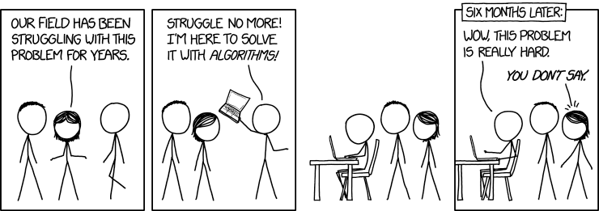

layout: true

<div class="my-footer">
  <span style="text-align:center">
    <span> 
      
    </span>
    <a href="https://therbootcamp.github.io/">
      <span style="padding-left:82px"> 
        <font color="#7E7E7E">
          www.therbootcamp.com
        </font>
      </span>
    </a>
    <a href="https://therbootcamp.github.io/">
      <font color="#7E7E7E">
      Maschinelles Lernen mit R | Oktober 2020
      </font>
    </a>
    </span>
  </div> 

---

```{r, eval = TRUE, echo = FALSE, warning=F,message=F}
require(caret)
require(tidyverse)
# Code to knit slides
#bas = read_csv('1_Data/basel.csv')
bas = read_csv('1_Data/basel.csv') %>% na.omit()

print2 <- function(x, nlines=10,...)
   cat(head(capture.output(print(x,...)), nlines), sep="\n")

sel = apply(bas, 1, function(x) any(is.na(unlist(x))))
bas = bas[!sel,]

bas = bas %>% 
  mutate_if(is.character, as.factor)

preprocesssing = preProcess(bas)
bas = predict(preprocesssing, bas)


bas <- bas %>%
  sample_n(1000)

bas <- bas %>% select_if(is.numeric)
basel = bas

fitControl_cv <- trainControl(
  method = "cv",
  number = 1)

train_index = createDataPartition(bas$einkommen, p = .8, list = FALSE)
bas_train = bas %>% slice(train_index)
bas_test = bas %>% slice(-train_index)

einkommen_lm = train(einkommen ~ . - id, 
           method = 'lm', 
           data = bas_train)

einkommen_lm_short = train(einkommen ~ alter + essen + alkohol + glueck + fitness + datause + tattoos + gewicht + kinder + groesse, 
           method = 'lm', 
           data = bas_train)

```


```{r setup, include=FALSE}
options(htmltools.dir.version = FALSE)
# see: https://github.com/yihui/xaringan
# install.packages("xaringan")
# see: 
# https://github.com/yihui/xaringan/wiki
# https://github.com/gnab/remark/wiki/Markdown
options(width=110)
options(digits = 4)
```

```{r, echo = FALSE ,message = FALSE, warning = FALSE}
knitr::opts_chunk$set(comment=NA, fig.width=6, fig.height=6, echo = TRUE, eval = TRUE, 
                      message = FALSE, warning = FALSE, fig.align = 'center', dpi = 200)
library(tidyverse)
#library(basel)
library(ggthemes)
```


.pull-left45[

# Feature Probleme

<ul>
  <li class="m1"><span><b>Zu viele Features</b></span></li>
  <ul class="level">
    <li><span>Fluch der <high>Dimensionalität</high></span></li>
    <li><span>Feature <high>Wichtigkeit</high></span></li>
  </ul><br>
  <li class="m2"><span><b>Falsche Features</b>
  <ul class="level">
    <li><span><high>Skalierung</high> der Features</span></li>
    <li><span><high>Korrelation</high> der Features</span></li>
    <li><span><high>Qualität</high> der Features</span></li>
  </ul>
  <li class="m3"><span><b>Neue Features kreieren</b>
  <ul class="level">
    <li><span><high>"Engineerig"</high> der Features</span></li>
  </ul>
  </span></li>
</ul>

]

.pull-right45[

<br><br>

<p align="center">
<br>
<font style="font-size:10px">from <a href="https://xkcd.com/1838/">xkcd.com</a></font>
</p>

]

---

# Fluch der Dimensionalität

.pull-left45[

<ul>
  <li class="m1"><span><b>Dichte</b></span></li>
  <ul class="level">
    <li><span>Die Menge der Fälle, die notwendig sind um den <high>Datenraum abzudecken</high> steigt exponentiell mit der Menge der Features.</span></li>
  </ul><br>
  <li class="m2"><span><b>Redundanz</b></span></li>
  <ul class="level">
    <li><span>Redundanz zwischen den Features steigt i.a.R. mit der Anzahl der Features, was zu <high>Unsicherheiten</high> in der Schätzung führt.</span></li>
  </ul><br>
  <li class="m3"><span><b>Effizienz</b></span></li>
  <ul class="level">
    <li><span>Mit der Menge der Feature steigt i.a.R die Anzahl der <high>Parameter</high> und damit auch i.a.R die benötigten <high>komputationalen Ressourcen</high>.</span></li>
  </ul>
  </span></li>
</ul>

]

.pull-right45[

<br><br><br><br>

<p align="center">
<br>
<font style="font-size:10px">from <a href="https://medium.freecodecamp.org/the-curse-of-dimensionality-how-we-can-save-big-data-from-itself-d9fa0f872335?gi=6e6735e00188">medium.freecodecamp.org</a></font>
</p>


]

---

# Wie Dimensionalität reduzieren?

.pull-left45[

<ul>
  <li class="m1"><span><b>Manuelle Selektion</b></span></li>
  <ul class="level">
    <li><span>Features können manuell auf Basis <high>statistischer oder theoretischer Gesichtspunkte</high> ausgewählt werden.</span></li>
  </ul><br>
  <li class="m2"><span><b>Automatische Selektion</b></span></li>
  <ul class="level">
    <li><span>Verwende <high>Modelle</high> die automatisch Features selegieren, z.B., Lasso Regression, oder Algorithmen für Featureselektion</span></li>
  </ul><br>
  <li class="m3"><span><b>Automatische Reduktion</b></span></li>
  <ul class="level">
    <li><span><high>Komprimiere die Dimensionalität</high> mit Methoden der Dimensionsreduktion, z.B. mit Principal Component Analysis (PCA).</span></li>
  </ul>
  </span></li>
</ul>

]

.pull-right45[

<br>

<p align = "center">

<font style="font-size:10px">from <a href="">Interstellar</a></font>
</p>

]

---

# Feature Wichtigkeit

.pull-left4[


<ul>
  <li class="m1"><span>Die Feature Wichtigkeit ist ein Mass für die <high>Bedeutung eines Features für Fit/Vorhersage der Daten</high>.</span></li>
  <li class="m2"><span><mono>caret</mono> berechnet die Feature Wichtigkeit <high>Modell-spezifisch und skaliert</high> sie auf Werte innerhalb <mono>[0, 100]</mono></span></li>
  <li class="m3"><span><b>Strategien</b></span></li>
  <ul class="level">
    <li><span><high>1-Feature</high> Modelle (z.B. <mono>LOESS</mono>)</span></li>
    <li><span>Loss durch <high>Scrambling</high></span></li>
    <li><span>Wichtigkeit in <high>komplexen Modellen</high> (z.B. Random Forest)</span></li>
    <li><span>etc.</span></li>
  </ul>
</ul>


]

.pull-right5[
```{r, eval = FALSE}
# Plotte Feature Wichtigkeit für lm(einkommen ~ .)
plot(varImp(einkommen_lm))
```

```{r, echo = FALSE, fig.height=5.2, fig.width=8}
plot(varImp(einkommen_lm),col='#EA4B68',cex=1.3,scales = list(cex=1.3,lineheight=1.3),xlab=list(cex=1.5))
```

]

---

# `varImp()`

.pull-left45[

<ul>
  <li class="m1"><span>Die <mono>varImp()</mono> Funktion liefert <high>Modell-spezifische Schätzungen</high> der Feature Wichtigkeit</span></li>
</ul>

```{r eval = FALSE}
varImp(einkommen_lm)
```

```{r echo = F}
print2(varImp(einkommen_lm_short), 11)
```

]

.pull-right5[
```{r, eval = FALSE}
# Plotte Feature Wichtigkeit für lm(einkommen ~ .)
plot(varImp(einkommen_lm))
```

```{r, echo = FALSE, fig.height=5.2, fig.width=8}
plot(varImp(einkommen_lm),col='#EA4B68',cex=1.3,scales = list(cex=1.3,lineheight=1.3),xlab=list(cex=1.5))
```

]

---

.pull-left35[

# `rfe()`

<ul>
  <li class="m1"><span>Die rekursive Featureselektion <mono>rfe()</mono> verwendet <high>Cross-Validation</high> um die besten <i>n</i> Features zu identifizieren.</span></li>
  <li class="m2"><span><b>Algorithmus</b></span></li>
  <ol>
    <li><span><high>Kandidatenset</high> <mono>n = [2, 3, 5, 10]</mono>.</span></li>
    <li><span>Wiederholtes <high>Resampling</high> und Aufteilen der Daten.</span></li>
    <li><span>Evaluiere <high>Vorhersageleistung</high> für jeweils die besten <mono>n</mono> Features.</span></li>
    <li><span>Selegiere bestes <mono>n</mono> auf Basis der <high>aggregierten Vorhersageleistung</high>.</span></li>
  </ol>
</ul>

]

.pull-right55[

<br><br>

```{r, eval = F}
# Rekursive Featureselektion
rfe(x = ..., y = ..., 
    sizes = c(3, 4, 5, 10), # Kandidaten für N
    rfeControl = rfeControl(functions = lmFuncs))
```

```{r, echo = F}
# Rekursive Featureselektion
out = rfe(x = bas_train %>% select(-einkommen), 
    y = bas_train$einkommen,
    sizes = c(3, 4, 5, 10),   
    rfeControl = rfeControl(
      functions = lmFuncs,
      verbose = FALSE))
print2(out, 20)
```

]

---

# Principal component analysis

.pull-left4[

<ul>
  <li class="m1"><span>Das <high>Standardmodell</high> für Dimensionsreduktion.</span></li><br>
  <li class="m2"><span>Verwendet ein lineares Modell (Regression) um die Features in einem <high>neuen, kleineren Featureraum</high> zu re-repräsentieren.</span></li><br>
  <li class="m3"><span>Der neue Featureraum wird so gewählt, dass er die <high>maximal mögliche Varianz</high> an den ursprünglichen Features präserviert.</span></li>
</ul>

]


.pull-right5[

<p align = "center">

<font style="font-size:10px">from <a href="https://blog.umetrics.com/what-is-principal-component-analysis-pca-and-how-it-is-used
">blog.umetrics.com</a></font>
</p>


]

---

# `preProc = c('pca')`

.pull-left45[

```{r fig.height=5.1, fig.width=8, eval = F}
# Trainiere Modell OHNE PCA
model = train(einkommen ~ ., method = 'lm', 
           data = bas_train)

plot(varImp(model))
```

```{r fig.height=5.1, fig.width=8, echo = F}
# Trainiere Modell OHNE PCA
model = train(einkommen ~ . -id, method = 'lm', 
              data = bas_train)

plot(varImp(model, scale=F),col='#EA4B68',cex=1.3,scales = list(cex=1.3,lineheight=1.3),xlab=list(cex=1.5))
```


]

.pull-right45[

```{r fig.height=5.1, fig.width=8, eval = F}
# Trainiere Modell MIT PCA
model = train(einkommen ~ ., method = 'lm', 
              data = bas_train,
              preProc = c('pca'))
plot(varImp(model))
```

```{r fig.height=5.1, fig.width=8, echo = F}
# Trainiere Modell MIT PCA
model = train(einkommen ~ . -id, method = 'lm', 
              data = bas_train,
              preProc = c('pca'),
              trControl = trainControl(preProcOptions = list(thresh = 0.75)))
plot(varImp(model, scale=F),col='#EA4B68',cex=1.3,scales = list(cex=1.3,lineheight=1.3),xlab=list(cex=1.5))
```

]

---

# Andere, einfache Feature Probleme

.pull-left45[

### Multikollinearität

<ul>
  <li class="m1"><span>Multikollinearität bedeutet, dass Features zu stark korreliert sind, was in schädlicher Redundanz, <high>instabilen Fits resultiert</high>, und zu <high>schlechteren Vorhersagen führt</high>.</span></li>
</ul>

```{r}
# Identifiziere redundante Features
findCorrelation(cor(basel))

# Entferne redundante Features
remove <- findCorrelation(cor(basel))
basel <- basel %>%
  select(-remove)

```

]

.pull-right45[

### Ungleiche oder zu niedrige Varianz

<ul>
  <li class="m2"><span>Ungleiche Varianzen <high>verzerren</high> Methoden, die gleiche Varianz erwarten (z.B. LASSO).</span></li>
</ul>

```{r, eval = F}
# Standardisiere Features
train(..., preProc = c("center", "scale"))
```

<ul>
  <li class="m3"><span>Features ohne "Varianz" tragen nicht zur Vorhersage bei, aber <high>vergrössern die Komplexität des Modells.</span></li>
</ul>

```{r}
# Identifiziere Feature ohne Varianz
nearZeroVar(basel)
```

]


---

# Schwierige Feature Probleme

<br>
.pull-left35[

<ul>
  <li class="m1"><span><b>Triviale Features</b></span></li>
  <ul>
    <li><span>Erfolgreiche Vorhersage bedeutet nicht, dass ein <high>bedeutsames Muster</high> identifiziert wurde</span></li>
  </ul><br>
  <li class="m2"><span><b>Fehlende Features</b></span></li>
  <ul>
    <li><span>Erfolgreiche Vorhersage basiert i.d.R. auf der Entwicklung <high>neuer, relvanterer Features</high>.</span></li><br>
  </ul>
</ul>

]


.pull-right55[
<br>

<p align = "center">
<br>
<font style="font-size:10px">from <a href="https://xkcd.com/1831/">xkcd.com</a></font>
</p>


]

---

# Triviale Features

.pull-left3[

<u><a href="https://www.gwern.net/Tanks">Ein urban myth?!</a></u>

"The Army trained a program to differentiate American tanks from Russian tanks with 100% accuracy. Only later did analysts realize that the American tanks had been photographed on a sunny day and the Russian tanks had been photographed on a cloudy day. The computer had learned to detect brightness."<br><br>
New York Times <a href="https://www.nytimes.com/2017/10/09/science/stanford-sexual-orientation-study.html" style="font-size:8px">[Full text]</a>

]

.pull-right6[

<p align = "center">

<font style="font-size:10px">from <a href="https://en.wikipedia.org/wiki/British_heavy_tanks_of_World_War_I#/media/File:Mark_I_series_tank.jpg">wikipedia.org</a></font>
</p>


]


---

# Triviale Features

In 2012 sagte [Nate Silver](https://en.wikipedia.org/wiki/Nate_Silver) die Ausgänge der Präsidentschaftswahlen in 50 Staaten voraus, nachdem er dies für 49 Staaten in 2008 getan hat. <high>Wie ist dieser Erfolg zu bewerten?</high>

.pull-left5[

<p align = "center">
<br>
<font style="font-size:10px">from <a href="https://www.vox.com/policy-and-politics/2016/11/8/13563106/election-map-historical-vote">vox.com</a></font>
</p>

]

.pull-right5[

<p align = "center">
<br>
<font style="font-size:10px">from <a href="https://www.vox.com/policy-and-politics/2016/11/8/13563106/election-map-historical-vote">vox.com</a></font>
</p>


]

---

# (Immer!) fehlende Features


.pull-left85[

<i>"…some machine learning projects succeed and some fail. What makes the difference? <high>Easily the most important factor is the features used</high>."</i>

[Pedro Domingos](https://en.wikipedia.org/wiki/Pedro_Domingos)

<br>

<i>"The algorithms we used are very standard for Kagglers. […] <high>We spent most of our efforts in feature engineering</high>. [...] We were also very careful to discard features likely to expose us to the risk of over-fitting our model."</i>

[Xavier Conort]()

<br>

<i>"Coming up with features is difficult, time-consuming, requires expert knowledge. <high>Applied machine learning is basically feature engineering</high>."</i>

[Andrew Ng](https://en.wikipedia.org/wiki/Andrew_Ng)

]

---

# Feature Engineering

.pull-left45[

<br>

<i>“Feature engineering is the process of <high>transforming raw data</high> into features that <high>better represent the underlying problem</high> to the predictive models, resulting in improved model accuracy on unseen data.”</i>

[Jason Brownlee]()

<br>

<i>"...while avoiding the <high>curse of dimensionality</high>."</i>

[duw]()

]

.pull-right45[

<p align = "center">
<br>
<font style="font-size:10px">from <a href="http://www.open.edu/openlearncreate/mod/oucontent/view.php?id=80245&section=1">open.edu</a></font>
</p>


]

---

class: middle, center

<h1><a href="https://therbootcamp.github.io/ML_2020Apr/_sessions/Features/Features_practical.html">Practical</a></h1>

