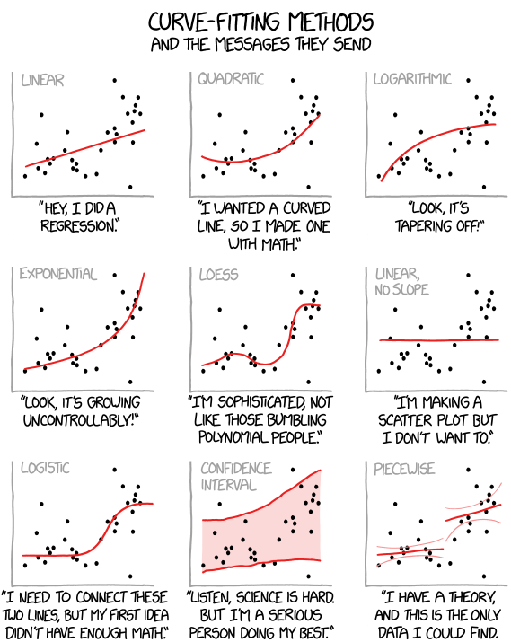
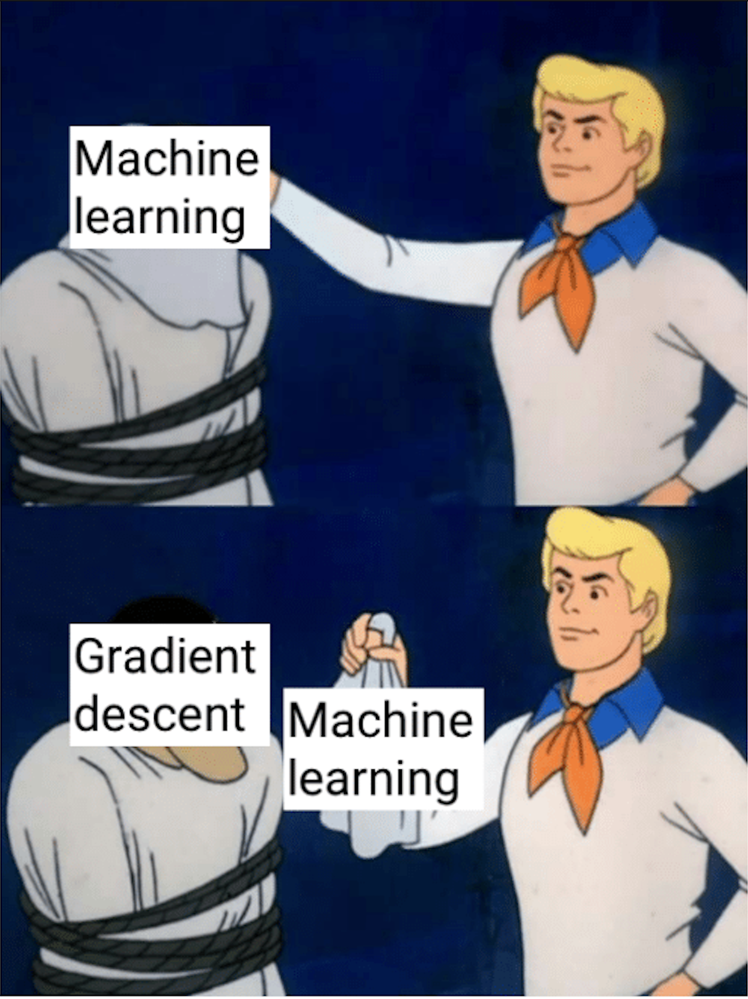
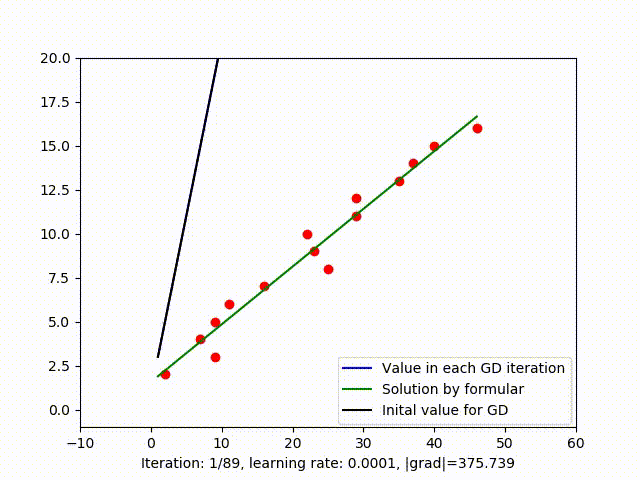
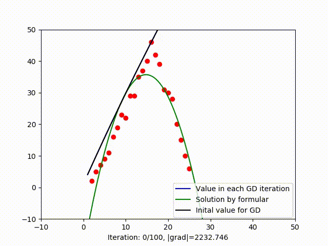
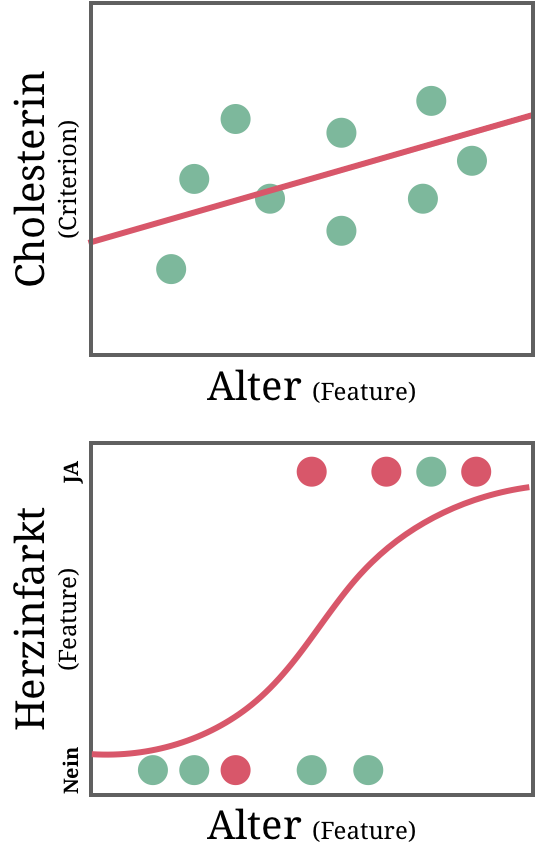
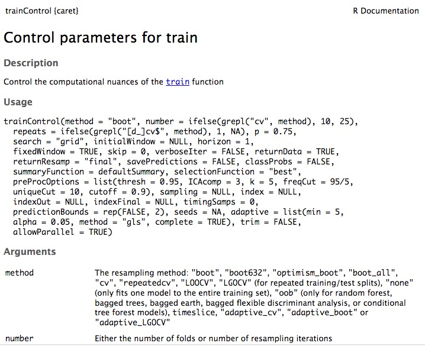

layout: true

<div class="my-footer">
  <span style="text-align:center">
    <span>
      
    </span>
    <a href="https://therbootcamp.github.io/">
      <span style="padding-left:82px">
        <font color="#7E7E7E">
          www.therbootcamp.com
        </font>
      </span>
    </a>
    <a href="https://therbootcamp.github.io/">
      <font color="#7E7E7E">
       Maschinelles Lernen mit R | Oktober 2020
      </font>
    </a>
    </span>
  </div>

---


```{r setup, include=FALSE}
options(htmltools.dir.version = FALSE)
# see: https://github.com/yihui/xaringan
# install.packages("xaringan")
# see:
# https://github.com/yihui/xaringan/wiki
# https://github.com/gnab/remark/wiki/Markdown
options(width=110)
options(digits = 4)

# Get color palette functions

source("https://raw.githubusercontent.com/therbootcamp/ML_2019Oct/master/_materials/code/baselrbootcamp_palettes.R")
```


```{r, echo = FALSE ,message = FALSE, warning = FALSE}

knitr::opts_chunk$set(comment=NA, fig.width=6, fig.height=6, echo = TRUE, eval = TRUE,
                      message = FALSE, warning = FALSE, fig.align = 'center', dpi = 200)
library(tidyverse)
library(ggthemes)
library(ggpubr)
library(caret)
library(ISLR)

basel <- read_csv("1_Data/basel.csv") %>%  drop_na()

set.seed(102)
x <- rnorm(10)
y <- .7 * x + rnorm(10, sd = .3) + 2

data <- data.frame(x, y)

mod <- lm(y ~ x, data = data)

great_intercept <- mod$coefficients[1]
great_slope <- mod$coefficients[2]

bad_intercept <- 3.5
bad_slope <- -.5

x0 = x
x1 = x
y0 = y
y1 = great_intercept + great_slope * x

yhat_regression  = y1

dat_great <- data.frame(x0, x1, y0, y1)

x0 = x
x1 = x
y0 = y
y1 = bad_intercept + bad_slope * x

dat_bad <- data.frame(x0, x1, y0, y1)

library(tidyverse)

raw <- ggplot(dat_great, aes(x = x0, y = y0)) + geom_point(col = baselrbootcamp_cols("grey"), size = 2) +
  theme_minimal() +
  xlim(c(-2, 3)) +
  ylim(c(0, 5)) +
  labs(title = "Rohdaten",
       x = "Feature", y = "Kriterium")

great_raw <- ggplot(dat_great, aes(x = x0, y = y0)) + geom_point(col = baselrbootcamp_cols("grey"), size = 2) +
  geom_abline(slope = great_slope, intercept = great_intercept, size = .5, linetype = 3) +
  theme_minimal() +
  xlim(c(-2, 3)) +
  ylim(c(0, 5)) +
  labs(title = "Modell B",
              subtitle = paste0("B0 = ", round(great_intercept, 2), ", B1 = ", round(great_slope, 2)),

       x = "Feature", y = "Kriterium")

bad_raw <- ggplot(dat_bad, aes(x = x0, y = y0)) + geom_point(col = baselrbootcamp_cols("grey")) +
  geom_abline(slope = bad_slope, intercept = bad_intercept, size = .5, linetype = 3) +
  theme_minimal() +
  xlim(c(-2, 3)) +
  ylim(c(0, 5)) +
   labs(title = "Modell A",
        subtitle = paste0("B0 = ", round(bad_intercept, 2), ", B1 = ", round(bad_slope, 2)),
       x = "Feature", y = "Kriterium")

great_err <- great_raw +
  geom_linerange(data = dat_great, aes(x = x0, ymin = y0, ymax = y1), col = baselrbootcamp_cols("magenta")) +
  geom_point(data = dat_great, aes(x = x0, y = y1, size = 2), col = baselrbootcamp_cols("green"), pch = "X", size = 4) +
    labs(title = "Modell B",
       x = "Feature", y = "Kriterium")

bad_err <- bad_raw +
    geom_linerange(data = dat_bad, aes(x = x0, ymin = y0, ymax = y1), col = baselrbootcamp_cols("magenta")) +
    geom_point(data = dat_bad, aes(x = x0, y = y1, size = 2), col = baselrbootcamp_cols("green"), pch = "X", size = 4) +
   labs(title = "Modell A",
       x = "Feature", y = "Kriterium")


set.seed(103)
x <- rnorm(10)
y <- round(1 / (1 + exp(rnorm(10,0,1)+x-1)))

data <- data.frame(x, y)
mod <- glm(y ~ x, data = data, family='binomial')

great_intercept <- mod$coefficients[1]
great_slope <- mod$coefficients[2]

x0 = x
x1 = x
y0 = y
y1 = 1/(1+exp(-(great_intercept + great_slope * x)))

dat_great <- data.frame(x0, x1, y0, y1)


logreg1 = ggplot(dat_great, aes(x = x0, y = y0)) + geom_point(col = baselrbootcamp_cols("grey"), size = 2) +
  theme_minimal() +
  labs(x = "Feature", y = "Kriterium")

logreg2 = logreg1 +
  geom_line(aes(x0,y1), size = .5, linetype = 3) +
  geom_linerange(data = dat_great, aes(x = x0, ymin = y0, ymax = y1), col = baselrbootcamp_cols("magenta")) +
  geom_point(data = dat_great, aes(x = x0, y = y1, size = 2), col = baselrbootcamp_cols("green"), pch = "X", size = 4)

```


.pull-left45[

# Fitting

<p style="padding-top:1px"></p>

<ul>
<li class="m1"><span>Jedes Modell beinhaltet <high>mehrere Versionen</high>, die sich durch spezifische Parameterkombination auszeichnen</span></li>
<li class="m2"><span>Ein Modell zu fitten bedeutet, diejenige Version zu <high>identifizieren, die die Daten am besten beschreibt</high>.</span></li>
</ul>

]

.pull-right45[

<br><br>

<p align = "center">
<br>
<font style="font-size:10px">angepasst von <a href="https://www.explainxkcd.com/wiki/index.php/2048:_Curve-Fitting">explainxkcd.com</a></font>
</p>

]

---

# Welches Modelle ist besser?

```{r, echo = FALSE, fig.width = 6, fig.height = 3, dpi = 300, out.width = "90%"}
ggarrange(bad_raw, great_raw, ncol = 2, nrow = 1)
```


---

# Welches Modelle ist besser?

```{r, echo = FALSE, fig.width = 6, fig.height = 3, dpi = 300, out.width = "90%"}
ggarrange(bad_err, great_err, ncol = 2, nrow = 1)
```


---

# Loss function

.pull-left45[

<ul>
<li class="m1"><span><high>Zentrales Konzepte</high> in Statistik und maschinellem Lernen.</span></li>
<li class="m2"><span>Eine <high>Zusammenfassung</high> der durch ein Modell begangenen <high>Fehler</high>.</span></li>
</ul>
<p style="padding-top:7px">

$$\Large Loss = f(Fehler)$$

<p style="padding-top:7px">

<u>Zwei Zwecke</u>

<table style="cellspacing:0; cellpadding:0; border:none;">
<tr>
  <td>
    <b>Zweck</b>
  </td>
  <td>
    <b>Beschreibung</b>
  </td>
</tr>
<tr>
  <td bgcolor="white">
    Fitting
  </td>
  <td bgcolor="white">
    Finde Parameter, die die Verlustfunktion minimieren.
  </td>
</tr>
<tr>
  <td>
    Evaluation
  </td>
  <td>
    Berechne den Fehler eines gefitteten Modells.
  </td>
</tr>
</table>

]


.pull-right45[

```{r, echo = FALSE, fig.width = 3, fig.height = 3, dpi = 200, out.width = "90%"}
bad_err + labs(title=element_blank(),subtitle = element_blank())
```


]

---

class: center, middle

<high><h1>Regression</h1></high>

<font color = "gray"><h1>Decision Trees</h1></font>

<font color = "gray"><h1>Random Forests</h1></font>


---

# Regression

.pull-left45[

In der [Regression](https://de.wikipedia.org/wiki/Regressionsanalyse), wird ein <high>Kriterium</high> $y$ modelliert, als <high>Summe</high> der <high>Features</high> $x_1, x_2, ...$ <high>mal Gewichte</high> $b_1, b_2, ...$ plus $b_0$, der sogenannte Intercept oder Ordinatenabschnitt.

<p style="padding-top:10px"></p>


$$\large \hat{y} =  b_{0} + b_{1} \times x_1 + b_{2} \times x2 + ...$$

<p style="padding-top:10px"></p>

Ein Regressionskoeffizient $b_{i}$ gibt an, wie stark sich $\hat{y}$ <high>verändert</high>, wenn sich $x_{i}$ um 1 verändert.

Ceteris paribus, je <high>extremer</high> $b_{i}$, desto <high>wichtiger</high> ist $x_{i}$ für die Vorhersage von $y$ <font style="font-size:12px">(Cave: die Skala von $x_{i}$ beeinflusst $b_i$!).</font>

Wenn $b_{i} = 0$, heisst das, $x_{i}$ <high>bringt keinen Zusatznutzen</high> bei der Vorhersage von $y$.

]

.pull-right45[

```{r, echo = FALSE, fig.width = 3, fig.height = 3, dpi = 200, out.width = "90%"}
bad_err + labs(title=element_blank(),subtitle = element_blank())
```


]


---

# Fehler in der Regression

.pull-left45[

<p>

<ul style="margin-bottom:-20px">
  <li class="m1"><span><b>Mean Squared Error (MSE)</b>
  <br><br>
  <ul class="level">
    <li><span><high>Mittlere Quadratsumme der Abweichungen</high> zwischen vorhergesagten und tatsächlichen Werten.</span></li>
  </ul>
  </span></li>
</ul>

$$ MSE = \frac{1}{n}\sum_{i \in 1,...,n}(y_{i} - \hat{y}_{i})^{2}$$

<ul>
  <li class="m2"><span><b>Mean Absolute Error (MAE)</b>
  <br><br>
  <ul class="level">
    <li><span><high>Mittlere absolute Abweichungen</high> zwischen vorhergesagten und tatsächlichen Werten.</span></li>
  </ul>
  </span></li>
</ul>

$$ MAE = \frac{1}{n}\sum_{i \in 1,...,n} \lvert y_{i} - \hat{y}_{i} \rvert$$


</p>

]

.pull-right45[

```{r, echo = FALSE, fig.width = 3, fig.height = 3, dpi = 200, out.width = "90%"}
bad_err + labs(title=element_blank(),subtitle = element_blank())

```


]


---

.pull-left45[
# Fitting

<p style="margin-top:20px">
<ul style="margin-bottom:-20px">
  <li class="m1"><span><b>Analytisch</b>
  <br><br>
  <ul class="level">
    <li><span>Manchmal können die Parameterwerte <high>direkt berechnet</high> werden, z.B., mit der <i>Normalgleichung</i>:</span></li>
  </ul>
  </span></li>
</ul>
<br>
$$ \large \boldsymbol b = (\boldsymbol X^T\boldsymbol X)^{-1}\boldsymbol X^T\boldsymbol y$$

<ul>
  <li class="m2"><span><b>Numerisch</b>
  <br><br>
  <ul class="level">
    <li><span>Meistens müssen die Parameter mittels <high>gerichtetem trial and error</high> Verfahren gefunden werden, z.B., mittels <i>gradient descent</i>:</span></li>
  </ul>
  </span></li>
</ul>
<br>
$$ \large \boldsymbol b_{n+1} = \boldsymbol b_{n}+\gamma \nabla F(\boldsymbol b_{n})$$

</p>
]

.pull-right45[
<br><br>
<p align = "center">
<br>
<font style="font-size:10px">angepasst von <a href="https://me.me/i/machine-learning-gradient-descent-machine-learning-machine-learning-behind-the-ea8fe9fc64054eda89232d7ffc9ba60e">me.me</a></font>
</p>

]


---

.pull-left45[
# Fitting

<p style="margin-top:20px">
<ul style="margin-bottom:-20px">
  <li class="m1"><span><b>Analytisch</b>
  <br><br>
  <ul class="level">
    <li><span>In gewissen Fällen, können die Parameterwerte <high>direkt berechnet</high> werden, z.B., mit der <i>Normalgleichung</i>:</span></li>
  </ul>
  </span></li>
</ul>
<br>
$$ \large \boldsymbol b = (\boldsymbol X^T\boldsymbol X)^{-1}\boldsymbol X^T\boldsymbol y$$

<ul>
  <li class="m2"><span><b>Numerisch</b>
  <br><br>
  <ul class="level">
    <li><span>In den meisten Fällen, müssen die Parameter jedoch mittels <high>gerichtetem trial and error</high> Verfahren gefunden werden, z.B., mittels <i>gradient descent</i>:</span></li>
  </ul>
  </span></li>
</ul>
<br>
$$ \large \boldsymbol b_{n+1} = \boldsymbol b_{n}+\gamma \nabla F(\boldsymbol b_{n})$$

</p>
]

.pull-right45[

<br><br2>

<p align = "center">
<br>
<font style="font-size:10px">angepasst von <a href="https://dunglai.github.io/2017/12/21/gradient-descent/
">dunglai.github.io</a></font><br>
<br>
<font style="font-size:10px">angepasst von <a href="https://dunglai.github.io/2017/12/21/gradient-descent/
">dunglai.github.io</a></font>
</p>

]

---


# Zwei Problemtypen

.pull-left5[

<ul>
  <li class="m1"><span><b>Regression</b></span></li>
  <br>
  <ul class="level">
    <li><span>Vorhersage eines <high>numerischen, kontinuierlichen Kriteriums</high>.</span></li><br>
    <li><span><i>Vorhersage des Cholesterinspiegels mit Alter</i></span></li>
  </ul><br>
  <li class="m2"><span><b>Klassifikation</b></span></li>
  <br>
  <ul class="level">
    <li><span>Vorhersage eines <high>kategorialen, diskreten Kriteriums</high>.</span></li><br>
    <li><span><i>Vorhersage, ob Herzinfarkt ja oder nein</i></span></li>
  </ul><br>
</ul>

]


.pull-right4[

<p align = "center">
<br>
</p>

]

---

# Logistische Regression

.pull-left45[

<ul style="margin-bottom:-20px">
  <li class="m1"><span>Die <a href="https://de.wikipedia.org/wiki/Logistische_Regression">logistische Regression</a>, modelliert eine binäre Variable <font style="font-size:22px"><mono>y &isin; (0,1)</mono></font> als <high>gewichtete Summe der Features</high>, wobei die Vorhersage mit einer <high>logistischen Linkfunktion</high> transformiert wird:</span></li>
</ul>

<p style="padding-top:10px"></p>

$$\large \hat{y} =  logistisch(b_{0} + b_{1} \times x_1 + ...)$$

<p style="padding-top:10px"></p>

<ul style="margin-bottom:-20px">
  <li class="m2"><span>Die logistische Funktion <high>bildet Vorhersagen auf den Bereich von 0 und 1</high> – die beiden Kategorien – ab.</span></li>
</ul>

<p style="padding-top:10px"></p>

$$ logistisch(x) = \frac{1}{1+exp(-x)}$$

]

.pull-right45[

```{r, echo = FALSE, fig.width = 3, fig.height = 3, dpi = 200, out.width = "90%"}
logreg1
```

]

---

# Logistische Regression

.pull-left45[

<ul style="margin-bottom:-20px">
  <li class="m1"><span>Die <a href="https://de.wikipedia.org/wiki/Logistische_Regression">logistische Regression</a>, modelliert eine binäre Variable <font style="font-size:22px"><mono>y &isin; (0,1)</mono></font> als <high>gewichtete Summe der Features</high>, wobei die Vorhersage mit einer <high>logistischen Linkfunktion</high> transformiert wird:</span></li>
</ul>

<p style="padding-top:10px"></p>

$$\large \hat{y} =  logistisch(b_{0} + b_{1} \times x_1 + ...)$$

<p style="padding-top:10px"></p>

<ul style="margin-bottom:-20px">
  <li class="m2"><span>Die logistische Funktion <high>bildet Vorhersagen auf den Bereich von 0 und 1</high> – die beiden Kategorien – ab.</span></li>
</ul>

<p style="padding-top:10px"></p>

$$ logistisch(x) = \frac{1}{1+exp(-x)}$$

]

.pull-right45[

```{r, echo = FALSE, fig.width = 3, fig.height = 3, dpi = 200, out.width = "90%"}
logreg2
```

]

---

# Fehler in Klassifikation

.pull-left45[

<ul style="margin-bottom:-20px">
  <li class="m1"><span><b>Distanz</b></span></li>
  <ul class="level">
  <li><span>LogLoss wird i.A. <high>zum Fitten von Parametern</high>, verwendet, und wie MSE und MAE auch zur Evaluation.</span></li>
  </ul>
</ul>

$$\small LogLoss = -\frac{1}{n}\sum_{i}^{n}(log(\hat{y})y+log(1-\hat{y})(1-y))$$
$$\small MSE = \frac{1}{n}\sum_{i}^{n}(y-\hat{y})^2; \: MAE = \frac{1}{n}\sum_{i}^{n} \lvert y-\hat{y} \rvert$$


<ul>
  <li class="m2"><span><b>Übereinstimmung</b></span></li>
  <ul class="level">
    <li><span>0-1 loss evaluiert wie genau <high>vorhergesagte und tatsächliche Klassen </high> übereinstimmmen.</span></li>
  </ul>
</ul>

$$\small Loss_{01}=\frac{1}{n}\sum_i^n I(y \neq \lfloor \hat{y} \rceil)$$

]

.pull-right45[

```{r, echo = FALSE, fig.width = 3, fig.height = 3, dpi = 200, out.width = "90%"}
logreg2
```

]

<!---

# Wahrheitsmatrix

.pull-left45[

<ul style="margin-bottom:-20px">
  <li class="m1"><span>Die Wahrheitsmatrix (<i>confusion matrix</i>) <high>enthält die Anzahl einer bestimmten Klasse zugeordneter Werte</high> als Funktion der tatsächlichen Klasse.</span></li>
  <li class="m2"><span>Anhand der Wahrheitsmatrix können unterschiedliche <high>statistische Gütekriterien</high> berechnet werden.</span></li>
</ul>

<br>

<u> Wahrheitsmatrix</u>

<font style="font-size:22px">
<table style="cellspacing:0; cellpadding:0; border:none;">
<col width=20%>
<col width=40%>
<col width=40%>
<tr>
  <td>
  </td>
  <td>
    <eq><b>y = 1</b></eq>
  </td>
  <td>
    <eq><b>y = 0</b></eq>
  </td>
</tr>
<tr>
  <td bgcolor="white">
    <eq><b>y&#770; = 1</b></eq>
  </td>
  <td bgcolor="white">
    <font color="#6ABA9A"> Richtig positiv (RP)</font>
  </td>
  <td bgcolor="white">
    <font color="#EA4B68"> Falsch positiv (FP)</font>
  </td>
</tr>
<tr>
  <td>
    <eq><b>y&#770; = 0</b></eq>
  </td>
  <td>
    <font color="#EA4B68"> Falsch negativ (FN)</font>
  </td>
  <td>
    <font color="#6ABA9A"> Richtig negativ (RN)</font>
  </td>
</tr>
</table>

</font>
]

.pull-right45[


<b>Genauigkeit</b>: Prozentsatz richtiger Vorhersagen <i>über alle Fälle hinweg</i>.

$$\small Richt. = \frac{RP + RN}{ RP + RN + FN + FP} = 1-Loss_{01}$$

<p style="padding-top:10px"></p>

<b>Sensitivität</b>: Prozentsatz richtiger Vorhersagen <i>über tatsächlich positive Fälle hinweg</i>.

$$\small Sensitivität = \frac{RP}{ RP +FN }$$

<b>Spezifität</b>: Prozentsatz richtiger Vorhersagen <i>über tatsächlich negative Fälle hinweg</i>.

<p style="padding-top:10px"></p>

$$\small Spezifität = \frac{RN}{ RN + FP }$$

]


# Wahrheitsmatrix

.pull-left45[

<ul style="margin-bottom:-20px">
  <li class="m1"><span>Die Wahrheitsmatrix (<i>confusion matrix</i>) <high>enthält die Anzahl einer bestimmten Klasse zugeordneter Werte</high> als Funktion der tatsächlichen Klasse.</span></li>
  <li class="m2"><span>Anhand der Wahrheitsmatrix können unterschiedliche <high>statistische Gütekriterien</high> berechnet werden.</span></li>
</ul>

<br>

<u> Wahrheitsmatrix</u>

<font style="font-size:22px">
<table style="cellspacing:0; cellpadding:0; border:none;">
<col width=20%>
<col width=40%>
<col width=40%>
<tr>
  <td>
  </td>
  <td>
    <eq><b>Krank</b></eq>
  </td>
  <td>
    <eq><b>Gesund</b></eq>
  </td>
</tr>
<tr>
  <td bgcolor="white">
    <eq><b>"Krank"</b></eq>
  </td>
  <td bgcolor="white">
    <font color="#6ABA9A"> RP = 3</font>
  </td>
  <td bgcolor="white">
    <font color="#EA4B68"> FP = 1</font>
  </td>
</tr>
<tr>
  <td>
    <eq><b>"Gesund"</b></eq>
  </td>
  <td>
    <font color="#EA4B68"> FN = 1</font>
  </td>
  <td>
    <font color="#6ABA9A"> RN = 2</font>
  </td>
</tr>
</table>

</font>

]

.pull-right45[


<b>Genauigkeit</b>: Prozentsatz richtiger Vorhersagen <i>über alle Fälle hinweg</i>.

$$\small Richt. = \frac{RP + RN}{ RP + RN + FN + FP} = 1-Loss_{01}$$

<p style="padding-top:10px"></p>

<b>Sensitivität</b>: Prozentsatz richtiger Vorhersagen <i>über tatsächlich positive Fälle hinweg</i>.

$$\small Sensitivität = \frac{RP}{ RP +FN }$$

<b>Spezifität</b>: Prozentsatz richtiger Vorhersagen <i>über tatsächlich negative Fälle hinweg</i>.

<p style="padding-top:10px"></p>

$$\small Spezifität = \frac{RN}{ RN + FP }$$

]

--->

---

class: center,  middle

<br><br>

<h1><a>Fitten in <mono>caret</mono></h1>


```{r, echo = FALSE}
library(caret)
data(cars)
```


---

# `caret`s Haupfunktionen

.pull-left45[

<table style="cellspacing:0; cellpadding:0; border:none;">
<tr>
  <td>
  <b>Funktion</b>
  </td>
  <td>
    <b>Beschreibung</b>
  </td>
</tr>
<tr>
  <td bgcolor="white">
    <mono>trainControl()</mono>
  </td>
  <td bgcolor="white">
    Wähle Spezifiziert wie das Modell gefittet werden soll.
  </td>
</tr>
<tr>
  <td>
    <mono>train()</mono>
  </td>
  <td>
    Fittet das Modell: findet die <i>besten</i> Parameterschätzwerte.
  </td>
</tr>
<tr>
  <td bgcolor="white">
    <mono>postResample()</mono>
  </td>
  <td bgcolor="white">
    Evaluiert den Fehler für Regressionsprobleme.
  </td>
</tr>
<tr>
  <td>
    <mono>confusionMatrix()</mono>
  </td>
  <td bgcolor="white">
    Evaluiere Fehler für Klassifikationsprobleme.
  </td>
</tr>
</table>

]

.pull-right45[

```{r, eval = FALSE}
# Schritt 1: Definiere Kontrollparameter
#   trainControl()

ctrl <- trainControl(...)

# Schritt 2: Fitte und exploriere Modell
#   train()

mod <- train(...)
summary(mod)
mod$finalModel   # bestes Modell

# Schritt 3: Beurteile Fit
#   predict(), postResample(),
#   confusionMatrix()

fit <- predict(mod)
postResample(fit, truth)
confusionMatrix(fit, truth)

```


<!-- Caret documentation: [http://topepo.github.io/caret/](http://topepo.github.io/caret/) -->

<!-- <iframe src="http://topepo.github.io/caret/" height="480px" width = "500px"></iframe> -->

]

---

# `trainControl()`

.pull-left45[

<ul>
  <li class="m1"><span>Spezifiziert <high>wie <mono>caret</mono> ein Modell fittet</high>.</span></li>
  <li class="m2"><span>Wir verwenden bis zur Session <b>Optimisierung</b> <highm>method = "none"</highm>.</span></li>
</ul>

<br>

```{r}
# Fitte das Modell ohne fortgeschrittene
#  Tuningmethoden der Parameter

ctrl <- trainControl(method = "none")

# zeige Dokumentation
?trainControl

```

]

.pull-right45[


```{r, echo = FALSE, out.width = "100%"}

```

]

---

# `train()`

.pull-left4[

<ul>
  <li class="m1"><span><mono>caret</mono>'s <high>Zugpferd</high>, wenn es um Fitting geht. Erlaubt die Spezifikation von <high>über 200 Modellen</high>.</span></li>
</ul>

<table style="cellspacing:0; cellpadding:0; border:none;">
<tr>
  <td>
  <b>Argument</b>
  </td>
  <td>
    <b>Beschreibung</b>
  </td>
</tr>
<tr>
  <td bgcolor="white">
    <mono>form</mono>
  </td>
  <td bgcolor="white">
    Modellformel, zur Spezifikation von Kriterium und Features.
  </td>
</tr>
<tr>
  <td>
    <mono>data</mono>
  </td>
  <td>
    Datensatz für die Parameterschätzung.
  </td>
</tr>
<tr>
  <td bgcolor="white">
    <mono>method</mono>
  </td>
  <td bgcolor="white">
    Der Modellalgorithmus.
  </td>
</tr>
<tr>
  <td>
    <mono>trControl</mono>
  </td>
  <td bgcolor="white">
    Kontrollparameter für den Fittingprozess.
  </td>
</tr>
<tr>
  <td bgcolor="white">
    <mono>tuneGrid</mono>, <mono>preProcess</mono>
  </td>
  <td bgcolor="white">
    Coole Dinge für später.
  </td>
</tr>
</table>

]


.pull-right5[
```{r, echo = TRUE, out.width = "90%", eval = TRUE, warning = FALSE}
# Fitte eine Regression zur Vorhersage des 
# Einkommens

eink_mod <-
  train(form = einkommen ~ ., # Formel
        data = basel,         # Daten
        method = "glm",       # Regression
        trControl = ctrl)     # Kontroll-
                              # parameter
eink_mod
```


]


---

# `train()`

.pull-left4[
<ul>
  <li class="m1"><span><mono>caret</mono>'s <high>Zugpferd</high>, wenn es um Fitting geht. Erlaubt die Spezifikation von <high>über 200 Modellen</high>.</span></li>
</ul>

<table style="cellspacing:0; cellpadding:0; border:none;">
<tr>
  <td>
  <b>Argument</b>
  </td>
  <td>
    <b>Beschreibung</b>
  </td>
</tr>
<tr>
  <td bgcolor="white">
    <mono>form</mono>
  </td>
  <td bgcolor="white">
    Modellformel, zur Spezifikation von Kriterium und Features.
  </td>
</tr>
<tr>
  <td>
    <mono>data</mono>
  </td>
  <td>
    Datensatz für die Parameterschätzung.
  </td>
</tr>
<tr>
  <td bgcolor="white">
    <mono>method</mono>
  </td>
  <td bgcolor="white">
    Der Modellalgorithmus.
  </td>
</tr>
<tr>
  <td>
    <mono>trControl</mono>
  </td>
  <td bgcolor="white">
    Kontrollparameter für den Fittingprozess.
  </td>
</tr>
<tr>
  <td bgcolor="white">
    <mono>tuneGrid</mono>, <mono>preProcess</mono>
  </td>
  <td bgcolor="white">
    Coole Dinge für später.
  </td>
</tr>
</table>


]


.pull-right5[

```{r, echo = TRUE, out.width = "90%", eval = TRUE, warning = FALSE}
# Fitte random forest zur Vorhersage von 
# Einkommen

eink_mod <-
  train(form = einkommen ~ ., # Formel
        data = basel,         # Daten
        method = "rf",        # Random Forest
        trControl = ctrl)     # Kontroll-
                              # parameter
eink_mod
```

]


---

.pull-left4[

# `train()`

<ul>
  <li class="m1"><span><mono>caret</mono>'s <high>Zugpferd</high>, wenn es um Fitting geht. Erlaubt die Spezifikation von <high>über 200 Modellen</high>.</span></li>
  <li class="m2"><span>Alle 200+ Modelle findest du <a href="http://topepo.github.io/caret/available-models.html">hier</a>.</span></li>
</ul>

]


.pull-right5[

<br><br>

<iframe width="600" height="480" src="https://topepo.github.io/caret/available-models.html" frameborder="0"></iframe>


]

---

# `train()`

.pull-left4[

<ul style="margin-bottom:-20px">
  <li class="m1"><span>Das Kriterium muss die richtige Klasse haben:
  <br><br>
  <ul class="level">
    <li><span><high><mono>numeric</mono></high> Kriterium &rarr; <high>Regression</high><br></span></li>
    <li><span><high><mono>factor</mono></high> Kriterium &rarr; <high>Klassifkation</high><br></span></li>
  </ul>
  </span></li>
</ul>

<br>

```{r, echo = FALSE}
Loans <- tibble::tibble(Ausfall = c(0, 1, 0, 1, 1),
              Alter = c(45, 36, 76, 25, 36),
             Geschlecht = c("M", "F", "F", "M", "F"),
             Karten = c(3, 2, 5, 2, 3),
             Bildung = c(11, 14, 12, 17, 12)
             )

Loans
```

]

.pull-right5[

```{r, eval = FALSE}
# Regressionsproblem

loan_mod <- train(form = Ausfall ~ .,
                  data = Loans,
                  method = "glm",
                  trControl = ctrl)

# Klassifikationsproblem

load_mod <- train(form = factor(Ausfall) ~ .,
                  data = Loans,
                  method = "glm",
                  trControl = ctrl)
```

]


---

# <mono>.$finalModel</mono>

.pull-left4[

<ul>
  <li class="m1"><span><mono>train()</mono> gibt eine Liste zurück, die das <mono>finalModel</mono> Element mit dem <high>besten gefitteten Modell</high> beinhaltet.</span></li>
  <li class="m2"><span><mono>.$finalModel</mono> <high>extrahiert das Modell</high>, welches anschliessend folgenden Funktionen exploriert werden kann:</span></li>
</ul>

<br>

<table style="cellspacing:0; cellpadding:0; border:none;">
<tr>
  <td>
  <b>Funktion</b>
  </td>
  <td>
    <b>Beschreibung</b>
  </td>
</tr>
<tr>
  <td bgcolor="white">
    <mono>summary()</mono>
  </td>
  <td bgcolor="white">
    Überblick über die wichtigsten Resultate.
  </td>
</tr>
<tr>
  <td bgcolor="white">
    <mono>names()</mono>
  </td>
  <td bgcolor="white">
    Zeige Namen aller benannten Elemente (häufig mit `$` ansteuerbar).
  </td>
</tr>
</table>

]

.pull-right5[

```{r, echo = F}
options(width=60, max.print=6)
```


```{r}
# Fitte Regressionsmodell
eink_mod <-
  train(form = einkommen ~ alter + groesse,
        data = basel,       # Daten
        method = "glm",    # Regression
        trControl = ctrl)  # Kontrollparameter

# Zeige benannte Elemente
names(eink_mod$finalModel)
```

]

---

# <mono>.$finalModel</mono>

.pull-left4[

<ul>
  <li class="m1"><span><mono>train()</mono> gibt eine Liste zurück, die das <mono>finalModel</mono> Element mit dem <high>besten gefitteten Modell</high> beinhaltet.</span></li>
  <li class="m2"><span><mono>.$finalModel</mono> <high>extrahiert das Modell</high>, welches anschliessend folgenden Funktionen exploriert werden kann:</span></li>
</ul>

<br>

<table style="cellspacing:0; cellpadding:0; border:none;">
<tr>
  <td>
  <b>Funktion</b>
  </td>
  <td>
    <b>Beschreibung</b>
  </td>
</tr>
<tr>
  <td bgcolor="white">
    <mono>summary()</mono>
  </td>
  <td bgcolor="white">
    Überblick über die wichtigsten Resultate.
  </td>
</tr>
<tr>
  <td bgcolor="white">
    <mono>names()</mono>
  </td>
  <td bgcolor="white">
    Zeige Namen aller benannten Elemente (häufig mit `$` ansteuerbar).
  </td>
</tr>
</table>

]

.pull-right5[

```{r, echo = F}
options(width=60, max.print=6)
```

```{r}
# Fitte Regressionsmodell
eink_mod <-
  train(form = einkommen ~ alter + groesse,
        data = basel,       # Daten
        method = "glm",    # Regression
        trControl = ctrl)  # Kontrollparameter

# Zugriff auf spezifische Elemente
eink_mod$finalModel$coefficients
```

]

---

# <mono>.$finalModel</mono>

.pull-left4[

<ul>
  <li class="m1"><span><mono>train()</mono> gibt eine Liste zurück, die das <mono>finalModel</mono> Element mit dem <high>besten gefitteten Modell</high> beinhaltet.</span></li>
  <li class="m2"><span><mono>.$finalModel</mono> <high>extrahiert das Modell</high>, welches anschliessend folgenden Funktionen exploriert werden kann:</span></li>
</ul>

<br>

<table style="cellspacing:0; cellpadding:0; border:none;">
<tr>
  <td>
  <b>Funktion</b>
  </td>
  <td>
    <b>Beschreibung</b>
  </td>
</tr>
<tr>
  <td bgcolor="white">
    <mono>summary()</mono>
  </td>
  <td bgcolor="white">
    Überblick über die wichtigsten Resultate.
  </td>
</tr>
<tr>
  <td bgcolor="white">
    <mono>names()</mono>
  </td>
  <td bgcolor="white">
    Zeige Namen aller benannten Elemente (häufig mit `$` ansteuerbar).
  </td>
</tr>
</table>

]

.pull-right55[

```{r, echo = F}
options(width=70, max.print=6)
```

```{r}
# Zeige Modelloutput
summary(eink_mod)
```

]

---

# `predict()`

.pull-left5[

<ul>
  <li class="m1"><span><high>Generiert Vorhersagen des Modells</high> auf Basis des Modellobjekts.</span></li>
</ul>

<br>

```{r, echo = F}
options(width=60, max.print=30)
```

```{r}
# Extrahiere gefittete Werte
glm_fits <- predict(object = eink_mod)
glm_fits[1:8]
```

]

.pull-right45[


```{r, echo = FALSE, fig.width = 3, fig.height = 3, dpi = 200, out.width = "90%"}
great_err + labs(title=element_blank(),subtitle = element_blank())
```

]

---

# `postResample()`

.pull-left45[

<ul>
  <li class="m1"><span><high>Erstellt eine einfache Zusammenfassung</high> der Modellperformanz bei <high>Regressionsproblemen</high>.</span></li>
  <li class="m2"><span>Vorhergesagten und tatsächlichen Werte sind zu spezifizieren.</span></li>
</ul>

<br>

```{r}
# Evaluiere Modellperformanz
postResample(glm_fits,
             basel$einkommen)
```

]

.pull-right45[

```{r, echo = FALSE, fig.width = 3, fig.height = 3, dpi = 200, out.width = "90%"}
great_err + labs(title=element_blank(),subtitle = element_blank())
```

]

---

.pull-left5[

<p style="padding-top:10px"></p>

## `confusionMatrix()`

<p style="padding-top:10px"></p>

<ul>
  <li class="m1"><span><high>Erstellt eine einfache Zusammenfassung</high> der Modellperformanz bei <high>Klassifikationsproblemen</high>.</span></li>
  <li class="m2"><span>Vorhergesagten und tatsächlichen Werte sind zu spezifizieren.</span></li>
</ul>

<br>


```{r, eval = F}
# Regressionsmodell zur Klassifikation
sehhilfe_mod <-
  train(form = factor(sehhilfe) ~ alter + geschlecht,
        data = basel,   
        method = "glm",   
        trControl = ctrl)

# Evaluiere Modellperformanz
confusionMatrix(predict(sehhilfe_mod),
                basel$sehhilfe)
```

```{r, echo = F}
# sehhilfe zu factor
basel$sehhilfe <- factor(basel$sehhilfe)
basel$geschlecht <- factor(basel$geschlecht)

# Regressionsmodell zur Klassifikation
sehhilfe_mod <-
  train(form = sehhilfe ~ alter + geschlecht,
        data = basel,   
        method = "glm",   
        trControl = ctrl)

# Evaluiere Modellperformanz
res <- confusionMatrix(predict(sehhilfe_mod),
                basel$sehhilfe)
```

]

.pull-right4[

<br><br>

```{r, echo  = F}
res
```


]

---

class: middle, center

<h1><a href=https://raw.githubusercontent.com/therbootcamp/ML_2020Oct/main/TheRBootcamp.zip>Project</a></h1>

---

class: middle, center

<h1><a href=https://therbootcamp.github.io/ML_2020Apr/_sessions/Fitting/Fitting_practical.html>Practical</a></h1>
