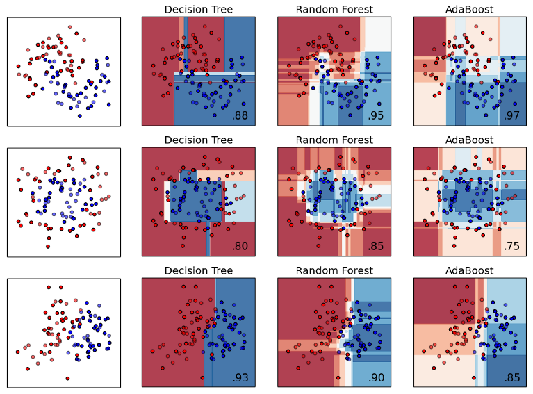

layout: true

<div class="my-footer">
  <span style="text-align:center">
    <span> 
      
    </span>
    <a href="https://therbootcamp.github.io/">
      <span style="padding-left:82px"> 
        <font color="#7E7E7E">
          www.therbootcamp.com
        </font>
      </span>
    </a>
    <a href="https://therbootcamp.github.io/">
      <font color="#7E7E7E">
      Maschinelles Lernen mit R | Oktober 2020
      </font>
    </a>
    </span>
  </div> 

---

```{r, eval = TRUE, echo = FALSE, warning=F,message=F}
# Code to knit slides
#baselers <- readr::read_csv("../_data/baselers.csv")
```


```{r setup, include=FALSE}
options(htmltools.dir.version = FALSE)
# see: https://github.com/yihui/xaringan
# install.packages("xaringan")
# see: 
# https://github.com/yihui/xaringan/wiki
# https://github.com/gnab/remark/wiki/Markdown
options(width=110)
options(digits = 4)
```

```{r, echo = FALSE ,message = FALSE, warning = FALSE}
knitr::opts_chunk$set(comment=NA, fig.width=6, fig.height=6, echo = TRUE, eval = TRUE, 
                      message = FALSE, warning = FALSE, fig.align = 'center', dpi = 200)
library(tidyverse)
#library(baselers)
library(ggthemes)

source("https://raw.githubusercontent.com/therbootcamp/ML_2019Oct/master/_materials/code/baselrbootcamp_palettes.R")
```


# There is no free lunch

.pull-left35[

<i>"The no-free-lunch theorem of optimization is an impossibility theorem telling us that a general-purpose, universal optimization strategy is impossible. The only way one strategy can outperform another is if it is specialized to the structure of the specific problem
under consideration."</i>

<a href="https://link.springer.com/article/10.1023/A:1021251113462">Ho & Pepyne, 1997</a>
<a href="https://ti.arc.nasa.gov/m/profile/dhw/papers/78.pdf">Wolpert & Macready, 1997</a>

]

.pull-right55[

<p align = "center">
  <br>
  <font style="font-size:10px">from <a href="http://christianfunnypictures.com/2016/02/theres-no-such-thing-as-a-free-lunch-or-is-there.html">christianfunnypictures.com</a></font>
</p>

]

---

.pull-left4[

# Bias-Variance Dilemma

<br>

$$\large Error = Bias + Variance\;(+ Noise)$$


<ul style="margin-top:40px">
  <li class="m1"><span><b>Bias</b></span></li>
  <ul class="level">
    <li><span>Ensteht, wenn <high>Modellannahmen</high> nicht mit dem Problem übereinstimmen.</span></li>
  </ul><br>
  <li class="m2"><span><b>Variance</b></span></li>
  <ul class="level">
    <li><span>Ensteht, wenn <high>Modellflexibilität</high> zu hoch ist.</span></li>
  </ul><br>
  <li class="m3"><span><b>Noise</b></span></li>
  <ul class="level">
    <li><span>(Absolut) zufälliges Rauschen.</span></li>
  </ul>
</ul>

]

.pull-right45[

<p align="left">
  <br>
  
</p>

]

---

class: center, middle

<h1><a>Kenne dein Problem</a></h1>

---

.pull-left4[
# Linear oder Nicht-linear

<ul>
  <li class="m1"><span><b>Lineare Modelle</b></span></li>
  <ul class="level">
    <li><span>Machen die Annahme, dass die Welt linear ist. Stimmt selten, führt jedoch zu <high>weniger overfitting</high>.</span></li>
  </ul><br>
  <li class="m2"><span><b>Nicht-lineare Modelle</b></span></li>
  <ul class="level">
    <li><span>Beinhaltet (meist) lineare Modelle als Spezialfall und neigen damit zu <high>mehr overfitting</high>. Lohnt sich i.A. nur, wenn lineare Modelle das Problem schlecht approximieren. </span></li>
  </ul>
</ul>


]

.pull-right5[
  <br><br><br>
  
<p align = "center">
  <br>
  <font style="font-size:10px">from <a href="https://scikit-learn.org/stable/auto_examples/classification/plot_classifier_comparison.html">scikit-learn.org</a></font>
</p>

]


---

.pull-left45[

# Kernel Trick

<ul>
  <li class="m1"><span>Transformiert ursprünglichen Featurespace in einen neuen, der damit z.B. das Trennen von Klassen ermöglicht.</span></li><br>
  <li class="m2"><span>Verwendet z.B. in <high>Support Vector Machines</high> (z.B. <mono>method = "svmRadial"</mono>) meist unter Verwendung einer <high>radial basis function</high> (rdf).</span></li>
</ul>

<br>

<p align="center">
  
</p>

]


.pull-right5[

  <br><br><br>
<p align = "center">
  <br>
  <font style="font-size:10px">from <a href="https://scikit-learn.org/stable/auto_examples/classification/plot_classifier_comparison.html">scikit-learn.org</a></font>
</p>


]

---

# Automatische Featureentwicklung

.pull-left3[

<br>

<ul>
  <li class="m1"><span><high>Deep learning</high> (insbesondere Convolutional Neural Networks) sind besonders gut darin, <high>Features selber zu entwickeln</high>.</span></li><br>
  <li class="m2"><span>Das <mono>tensorflow</mono> Paket bietet Zugang zu Google's mächtiger <high>Tensorflow</high> Library für Deep Learning.</span></li><br>
</ul>

]

.pull-right6[

<br>

<p align = "center">
  <br>
  <font style="font-size:10px">from <a href="https://towardsdatascience.com/cnn-application-on-structured-data-automated-feature-extraction-8f2cd28d9a7e">towardsdatascience.com</a></font>
</p>


]


---

class: center, middle

<h1><a>Bleibe robust</a></h1>

---

# Robustheit

.pull-left4[

<ul>
  <li class="m1"><span>Es gibt eine Reihe von <high>Tricks</high> um Modelle robuster zu machen, d.h. um den <i>Variance</i> Fehler zu minimieren.</span></li><br>
</ul>

<p align = "center">
  <br>
  <font style="font-size:10px">from <a href="https://www.istockphoto.com/ch/grafiken/kraftathlet?sort=mostpopular&mediatype=illustration&assetfiletype=eps&phrase=kraftathlet">istockphoto.com</a></font>
</p>

]


.pull-right55[
<table style="cellspacing:0; cellpadding:0; border:none;">
  <col width="210">
  <col width="210">
  <col width="210">
<tr>
  <th>Approach</th>
  <th>Implementation</th>
  <th>Examples</th>
</tr>
<tr style="background-color:#ffffff">
  <td align="center"><i>Tolerance</i></td>
  <td align="center">Vergrössert Fehlertoleranz</td>
  <td align="center"><mono>svmRadial</mono></td>
</tr>
<tr style="background-color:#ffffff">
  <td align="center"><i>Regularization</i></td>
  <td align="center">Strafe für Komplexität</td>
  <td align="center"><mono>lasso</mono>, <mono>ridge</mono>, <mono>elasticnet</mono></td>
</tr>
<tr style="background-color:#ffffff">
  <td align="center"><i>Ensemble</i></td>
  <td align="center">Bagging</td>
  <td align="center"><mono>treebag</mono>, <mono>randomGLM</mono>, <mono>randomForest</mono></td>
</tr>
<tr style="background-color:#ffffff">
  <td align="center"><i>Ensemble</i></td>
  <td align="center">Boosting</td>
  <td align="center"><mono>adaboost</mono>, <mono>xgbTree</mono></td>
</tr>
<tr style="background-color:#ffffff">
  <td align="center"><i>Feature selection</i></td>
  <td align="center">Regularization</td>
  <td align="center"><mono>lasso</mono></td>
</tr>
<tr style="background-color:#ffffff">
  <td align="center"><i>Feature selection</i></td>
  <td align="center">Importance</td>
  <td align="center"><mono>random forest</mono></td>
</tr>
</table>

]


---

# Regularization

.pull-left45[

<ul>
  <li class="m1"><span>Regularisierung bestraft den Fit für die <high> modell-spezifische Komplexität</>.</span></li><br>
</ul>

<br2>
<p align = 'center'><font size=5><high>Loss</high> = <high>Misfit</high> + <high>Penalty</high></font></p>
<br>

<table style="cellspacing:0; cellpadding:0; border:none;">
  <col width="160">
  <col width="160">
  <col width="160">
<tr>
  <th>Name</th>
  <th>Penalty</th>
  <th>`caret`</th>
</tr>
<tr style="background-color:#ffffff">
  <td align="center"><high>AIC/BIC</high></td>
  <td align="center"></td>
  <td align="center">-</td>
</tr>
<tr style="background-color:#ffffff">
  <td align="center"><high>Lasso</high></td>
  <td align="center"></td>
  <td align="center">`method = "glmnet"`</td>
</tr>
<tr style="background-color:#ffffff">
  <td align="center"><high>Ridge</high></td>
  <td align="center"></td>
  <td align="center">`method = "glmnet"`</td>
</tr>
<tr style="background-color:#ffffff">
  <td align="center"><high>Elastic Net</high></td>
  <td align="center"></td>
  <td align="center">`method = "glmnet"`</td>
</tr>
</table>

]


.pull-right5[

```{r, fig.width = 6, fig.height = 5, echo = FALSE, eval = TRUE, warning = FALSE}
set.seed(5)

N <- 40

iv <- rnorm(N, mean = 10, sd = 2)
truth <- iv 
noise <- rnorm(N, mean = 0, sd = 2)
obs <- truth + noise

data <- data.frame(iv, obs)


poly_pred <- map_dfc(.x = c(1, 19), .f = function(degree) {
  
  output <- data.frame(lm(obs ~ poly(iv, degree), data = data)$fitted.values)
  
  names(output) <- paste0("d", degree)
  
  return(output)

}) %>% mutate(id = 1:N,
              x = iv,
              obs = obs) %>%
  gather(Degree, pred, -id, -x, -obs) %>%
  mutate(`Fitting` = abs(pred - obs))


poly_pred <- poly_pred %>%
  mutate(Degree = case_when(Degree == "d1" ~ "Simple",
                            TRUE ~ "Complex"))


overfit_gg <- ggplot(poly_pred, aes(x = x, y = pred, col = Degree)) + 
  geom_line(size = 1.5) +
  geom_point(aes(x = x, y = obs), col = "black", pch = 21) +
  annotate("segment", x = 5, y = 5, xend = 15, yend = 15, col = "black", linetype = 4, size = 1) +
  xlim(5, 15) +
  ylim(5, 15) +
  labs(title = "Model overfitting",
       subtitle = "Dashed line is TRUE model") +
  theme_bw() +
    theme(legend.position="bottom") +
    scale_color_baselrbootcamp()
 
overfit_gg

```

]

---

.pull-left45[

# Bagging

<ul>
  <li class="m1"><span><high>Aggregieren</high> der Vorhersagen multipler Modelle, die auf Basis von <high>Stichproben</high> aus den Daten gefitted werden.</span></li><br>
  <li class="m2"><span>Besonders nützlich bei Modellen mit moderat guter, varierender Performanz.</span></li><br>
  <li class="m3"><span><b>Algorithmus</b>:</span></li>
  <ol>
      <li><span><high>Stichprobe</high> aus den Daten mit zurücklegen</span></li>
      <li><span><high>Fitte</high> Modelle zu Stichproben</span></li>
      <li><span><high>Mittele</high> die Vorhersage</span></li>
  </ol>
</ul>

]

.pull-right45[
<br><br><br>
<p align = "center">
  <br>
  <font style="font-size:10px">from <a href="https://en.wikipedia.org/wiki/M%C3%BCnchhausen_trilemma">wikipedia.org</a></font>
</p>


]

---

# Boosting

.pull-left4[

<ul>
  <li class="m1"><span>Eine Art iteratives Bagging auf Basis einer <high>adaptiven Gewichtung</high> der Daten.</span></li><br>
  <li class="m2"><span>Variante Extreme Gradient Boosting <mono>xgbTree</mono> zählt zu den <high>besten verfügbaren Modellen</high>.</span></li><br>
  <li class="m3"><span><b>Algorithmus</b>:</span></li>
  <ol>
      <li><span><high>Gewichte</high> alle Datenpunkte gleich.</span></li>
      <li><span><high>Fitte</high> ein moderat flexibles Modell.</span></li>
      <li><span><high>Erhöhe</high> Gewicht schlecht vorhergesagter Punkte.</span></li>
      <li><span><high>Wiederhole</high> iterativ.</span></li>
      <li><span><high>Mittele</high> Vorhersage proportional zum Modellfit.</span></li>
  </ol>
</ul>

]


.pull-right5[

<p align = "center">
  <br>
  <font style="font-size:10px">from <a href="https://scikit-learn.org/stable/auto_examples/classification/plot_classifier_comparison.html">scikit-learn.org</a></font>
</p>

]

---

# Automatische Featureselektion

.pull-left45[

<ul>
  <li class="m1"><span><b>LASSO</b></span></li><br>
  <ul>
    <li><span>Schätzt oft <high><mono>beta = 0</mono></high>, was effektiv das Feature aus dem Modell eliminiert.</span></li>
  </ul><br><br>
  <li class="m2"><span><b>Decision Tree / Random forests</b></span></li><br>
  <ul>
    <li><span>Features müssen nicht für die Vorhersage verwendet werden (bei hohem <mono>mtry</mono>).</span></li>
  <ul>
</ul>

]


.pull-right45[

<p align="center">
  
  <br>
<font style="font-size:10px">from <a href="https://medium.com/@dkwok94/machine-learning-for-my-grandma-ca242e97ef62">medium.com</a></font>
  
</p>

]

---

<p align = "center">
<br>
</p>


---

# Erinnere

.pull-left45[

<br>

<i>"…some machine learning projects succeed and some fail. What makes the difference? <high>Easily the most important factor is the features used</high>."</i>

[Pedro Domingos](https://en.wikipedia.org/wiki/Pedro_Domingos)

<br>

<i>"The algorithms we used are very standard for Kagglers. […] <high>We spent most of our efforts in feature engineering.</high> [...] We were also very careful to discard features likely to expose us to the risk of over-fitting our model."</i>

[Xavier Conort]()

]

.pull-right45[

<p align="center">
  <br>
<font style="font-size:10px">from <a href="http://www.open.edu/openlearncreate/mod/oucontent/view.php?id=80245&section=1">open.edu</a></font>
</p>

]


---

class: middle, center

<h1><a href="https://therbootcamp.github.io/ML_2020Oct/_sessions/Models/Models_practical.html">Practical</a></h1>


