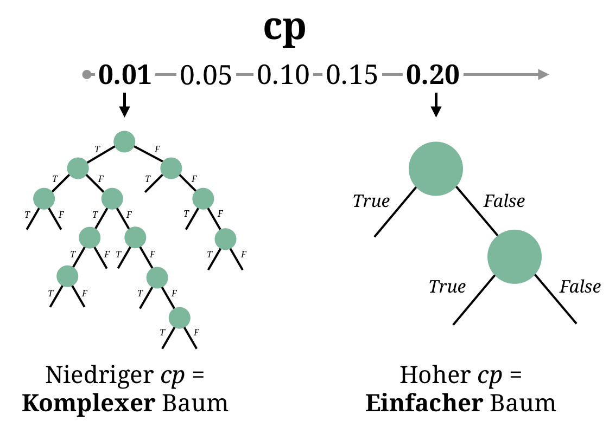

layout: true

<div class="my-footer">
  <span style="text-align:center">
    <span> 
      
    </span>
    <a href="https://therbootcamp.github.io/">
      <span style="padding-left:82px"> 
        <font color="#7E7E7E">
          www.therbootcamp.com
        </font>
      </span>
    </a>
    <a href="https://therbootcamp.github.io/">
      <font color="#7E7E7E">
      Maschinelles Lernen mit R | Oktober 2020
      </font>
    </a>
    </span>
  </div> 

---

```{r, eval = TRUE, echo = FALSE, warning=F,message=F}
# Code to knit slides

require(tidyverse)
basel <- readr::read_csv("1_Data/basel.csv") %>% na.omit()

source("code/baselrbootcamp_palettes.R")
```


```{r setup, include=FALSE}
options(htmltools.dir.version = FALSE)
# see: https://github.com/yihui/xaringan
# install.packages("xaringan")
# see:
# https://github.com/yihui/xaringan/wiki
# https://github.com/gnab/remark/wiki/Markdown
options(width=110)
options(digits = 4)


```

```{r, echo = FALSE ,message = FALSE, warning = FALSE}
knitr::opts_chunk$set(comment=NA, fig.width=6, fig.height=6, echo = TRUE, eval = TRUE,
                      message = FALSE, warning = FALSE, fig.align = 'center', dpi = 200)
library(tidyverse)
#library(basel)
library(ggthemes)
library(caret)


print2 <- function(x, nlines=10,...)
   cat(head(capture.output(print(x,...)), nlines), sep="\n")

set.seed(5)

N <- 40

iv <- rnorm(N, mean = 10, sd = 2)
truth <- iv
noise <- rnorm(N, mean = 0, sd = 2)
obs <- truth + noise

data <- data.frame(iv, obs)


poly_pred <- map_dfc(.x = c(1, 19), .f = function(degree) {

  output <- data.frame(lm(obs ~ poly(iv, degree), data = data)$fitted.values)

  names(output) <- paste0("d", degree)

  return(output)

}) %>% mutate(id = 1:N,
              x = iv,
              obs = obs) %>%
  gather(Degree, pred, -id, -x, -obs) %>%
  mutate(`Training` = abs(pred - obs))


poly_pred <- poly_pred %>%
  mutate(Degree = case_when(Degree == "d1" ~ "Simple",
                            TRUE ~ "Complex"))


overfit_gg <- ggplot(poly_pred, aes(x = x, y = pred, col = Degree)) +
  geom_line(size = 1.5) +
  geom_point(aes(x = x, y = obs), col = "black", pch = 21) +
  annotate("segment", x = 5, y = 5, xend = 15, yend = 15, col = "black", linetype = 4, size = 1) +
  xlim(5, 15) +
  ylim(5, 15) +
  labs(title = "Model overfitting",
       subtitle = "Dashed line is TRUE model") +
  theme_bw() +
    theme(legend.position="bottom") +
  scale_color_baselrbootcamp()

poly_pred <- poly_pred %>% mutate(

  obs_new = x + rnorm(1, mean = 0, sd = 2),
  `Testing` = abs(obs_new - pred)

)


poly_pred <- poly_pred %>%
  select(Degree, `Training`, `Testing`) %>%
  gather(phase, Error, -Degree)

agg <- poly_pred %>%
  group_by(Degree, phase) %>%
  summarise(Error = mean(Error)) %>%
  ungroup() %>%
  mutate(phase = factor(phase, levels = c("Training", "Testing"), ordered = TRUE))

fit_gg <- ggplot(agg, aes(x = phase, y = Error, fill = Degree)) +
  geom_bar(position = "dodge", stat = "identity") +
  labs(title = "Fitting versus Prediction Error",
       subtitle = "Smaller values are better!",
       x = "Modelling Phase") +  
  scale_y_continuous(limits=c(.75,1.25),oob = scales::rescale_none) +
  theme_bw() +
    theme(legend.position="bottom") +
  scale_fill_baselrbootcamp()

```


.pull-left4[
<br><br><br>
# Overfitting vermeiden

<ul>
  <li class="m1"><span>Overfitting tritt ein, wenn ein Modell die <high>Daten zu genau fitted</high> und deswegen <high>keine guten Vorhersagen</high> liefert</span></li><br>
  <li class="m2"><span>Gute Performanz im Training bedeutet also nicht unbedingt <high>gute Performanz im Test</high>.</span></li>
</ul>

]


.pull-right55[

<br><br>

<p align = "center">
<br>
<font style="font-size:10px">adapted from <a href="">victoriarollison.com</a></font>
</p>

]

---

# Tuning durch Validation-Daten

.pull-left45[

<ul>
  <li class="m1"><span>Die meisten ML Modelle besitzen Tuning Parameter, die die <high>Modellkomplexität</high> kontrollieren</span></li><br>
  <li class="m2"><span>Um diese Tuning Parameter zu fitten wird ein <high>Validationsdatensatz</high> kreiert.</span></li><br>
  <li class="m3"><span><b>Vorgehen</b></span></li>  
  <ol>
    <li><span>Fitte Modell mit <high>verschiedenen Tuning Parameter</high> Werte</span></li>
    <li><span>Auf Basis des <high>Validationsdatensatzes</high> wähle die besten Tuning Parameter</span></li>
    <li><span>Fitte Modell für <high>gesamten Traningsdatensatz</high>.</span></li>
  </ol>
</ul>

]

.pull-right45[

<p align = "center" style="padding-top:0px">

</p>

]

---

# Resampling Methoden

.pull-left4[

<ul>
  <li class="m1"><span>Resampling-Methoden <high>automatisieren</high> und generalisieren das Tuning der Modelle.</span></li><br>
</ul>

<table style="cellspacing:0; cellpadding:0; border:none;">
  <col width="30%">
  <col width="70%">
<tr>
  <td bgcolor="white">
    <b>Methode</b>
  </td>
  <td bgcolor="white">
    <b>Beschreibung</b>
  </td>  
</tr>
<tr>
  <td bgcolor="white">
    <i>k-fold cross-validation</i>
  </td>
  <td bgcolor="white">
    Trennt die Daten in <i>k</i>-Teile, verwendet <high>jeden Teil einmal</high> als Validationsset, während die restlichen Teile <i>k-1</i> als Trainingsset dienen. 
  </td>  
</tr>
<tr>
  <td bgcolor="white">
    <i>Bootstrap</i>
  </td>
  <td bgcolor="white">
    Über <i>B</i> Bootstrap Runden ziehe <high>Zufallsstrichproben mit Zurücklegen</high> aus den Daten und trenne die Stichprobe in Training und Validation auf.
  </td>  
</tr>
</table>
]

.pull-right5[

<p align = "center" style="padding-top:0px">

</p>

]

---

# Resampling Methoden

.pull-left4[

<ul>
  <li class="m1"><span>Resampling-Methoden <high>automatisieren</high> und generalisieren das Tuning der Modelle</span></li><br>
</ul>

<table style="cellspacing:0; cellpadding:0; border:none;">
  <col width="30%">
  <col width="70%">
<tr>
  <td bgcolor="white">
    <b>Methode</b>
  </td>
  <td bgcolor="white">
    <b>Beschreibung</b>
  </td>  
</tr>
<tr>
  <td bgcolor="white">
    <i>k-fold cross-validation</i>
  </td>
  <td bgcolor="white">
    Trennt die Daten in <i>k</i>-Teile, verwendet <high>jeden Teil einmal</high> als Validationsset, während die restlichen Teile <i>k-1</i> als Trainingsset dienen. 
  </td>  
</tr>
<tr>
  <td bgcolor="white">
    <i>Bootstrap</i>
  </td>
  <td bgcolor="white">
    Über <i>B</i> Bootstrap Runden ziehe <high>Zufallsstrichproben mit Zurücklegen</high> aus den Daten und trenne die Stichprobe in Training und Validation auf.
  </td>  
</tr>
</table>
]

.pull-right5[

<p align = "center" style="padding-top:0px">

</p>

]

---

# Resampling Methoden

.pull-left4[

<ul>
  <li class="m1"><span>Resampling-Methoden <high>automatisieren</high> und generalisieren das Tuning der Modelle</span></li><br>
</ul>

<table style="cellspacing:0; cellpadding:0; border:none;">
  <col width="30%">
  <col width="70%">
<tr>
  <td bgcolor="white">
    <b>Methode</b>
  </td>
  <td bgcolor="white">
    <b>Beschreibung</b>
  </td>  
</tr>
<tr>
  <td bgcolor="white">
    <i>k-fold cross-validation</i>
  </td>
  <td bgcolor="white">
    Trennt die Daten in <i>k</i>-Teile, verwendet <high>jeden Teil einmal</high> als Validationsset, während die restlichen Teile <i>k-1</i> als Trainingsset dienen. 
  </td>  
</tr>
<tr>
  <td bgcolor="white">
    <i>Bootstrap</i>
  </td>
  <td bgcolor="white">
    Über <i>B</i> Bootstrap Runden ziehe <high>Zufallsstrichproben mit Zurücklegen</high> aus den Daten und trenne die Stichprobe in Training und Validation auf.
  </td>  
</tr>
</table>
]

.pull-right5[

<p align = "center" style="padding-top:0px">

</p>

]

---

class: center, middle

<high><h1>Decision Trees</h1></high>

<font color = "gray"><h1>Random Forests</h1></font>

<font color = "gray"><h1>Regression</h1></font>

---

# Decision trees

.pull-left4[

<ul>
  <li class="m1"><span>Der Tuning Parameter in Decision Trees heisst <mono>cp</mono> (<high>complexity parameter</high>).</span></li>
  </ul>
</ul>

<p style="padding-top:3px"></p>

$$
\large
\begin{split}
Loss = & Impurity\,+\\
&cp*(n\:terminal\:nodes)\\
\end{split}
$$
<p style="padding-top:3px"></p>

<u><mono>tuneGrid</mono> Einstellungen</u>

<table style="cellspacing:0; cellpadding:0; border:none;">
<tr>
  <td bgcolor="white">
    <b>Parameter</b>
  </td>
  <td bgcolor="white">
    <b>Beschreibung</b>
  </td> 
</tr>
<tr>
  <td bgcolor="white">
    Niedriger <mono>cp</mono>, z.B. <mono>cp<.01</mono>
  </td>
  <td bgcolor="white">
    Niedrige Strafe, die zu <high>komplexen Bäumen</high> führt.
  </td> 
</tr>
<tr>
  <td bgcolor="white">
    Hoher <mono>cp</mono>, z.B. <mono>cp<.20</mono>
  </td>
  <td bgcolor="white">
    Hohe Strafe, die zu <high>einfachen Bäumen</high> führt.
  </td> 
</tr>
</table>

]


.pull-right5[

<p align = "center">
  
</p>


]


---

# Decision trees

.pull-left4[

<ul>
  <li class="m1"><span>Der Tuning Parameter in Decision Trees heisst <mono>cp</mono> (<high>complexity parameter</high>).</span></li>
  </ul>
</ul>

<p style="padding-top:3px"></p>

$$
\large
\begin{split}
Loss = & Impurity\,+\\
&cp*(n\:terminal\:nodes)\\
\end{split}
$$
<p style="padding-top:3px"></p>

<u><mono>tuneGrid</mono> Einstellungen</u>

<table style="cellspacing:0; cellpadding:0; border:none;">
<tr>
  <td bgcolor="white">
    <b>Parameter</b>
  </td>
  <td bgcolor="white">
    <b>Beschreibung</b>
  </td> 
</tr>
<tr>
  <td bgcolor="white">
    Niedriger <mono>cp</mono>, z.B. <mono>cp<.01</mono>
  </td>
  <td bgcolor="white">
    Niedrige Strafe, die zu <high>komplexen Bäumen</high> führt.
  </td> 
</tr>
<tr>
  <td bgcolor="white">
    Hoher <mono>cp</mono>, z.B. <mono>cp<.20</mono>
  </td>
  <td bgcolor="white">
    Hohe Strafe, die zu <high>einfachen Bäumen</high> führt.
  </td> 
</tr>
</table>

]

.pull-right5[

```{r, eval = FALSE}
# Decision Tree mit cp = .01
train(form = einkommen ~ .,
      data = basel,
      method = "rpart", 
      trControl = ctrl,
      tuneGrid = 
        expand.grid(cp = .01))

# Decision Tree mit cp = .2
train(form = einkommen ~ .,
      data = basel,
      method = "rpart", 
      trControl = ctrl,
      tuneGrid = 
        expand.grid(cp = .2))
```

]

---

class: center, middle

<font color = "gray"><h1>Decision Trees</h1></font>

<high><h1>Random Forests</h1></high>

<font color = "gray"><h1>Regression</h1></font>

---

# Random Forest

.pull-left4[

<ul>
  <li class="m1"><span>Der Tuning Parameter in Random Trees heisst <mono>mtry</mono> und kontrolliert die <high>Diversität</high>.</span></li>
  <li class="m2"><span><mono>mtry</mono> bestimmt <high>wie viele Feature</high> für den Split eines Knoten herangezogen werden.</span></li>
  </ul>
</ul>

<u><mono>tuneGrid</mono> Einstellungen</u>

<table style="cellspacing:0; cellpadding:0; border:none;">
<tr>
  <td bgcolor="white">
    <b>Parameter</b>
  </td>
  <td bgcolor="white">
    <b>Beschreibung</b>
  </td> 
</tr>
<tr>
  <td bgcolor="white">
    Niedriges <mono>mtry</mono>, z.B., <mono>mtry = 1</mono>
  </td>
  <td bgcolor="white">
    <high>Diverser Wald.</high> Auf eine Weise, weniger komplex.
  </td> 
</tr>
<tr>
  <td bgcolor="white">
    Hohes <mono>mtry</mono>, z.B., <mono>mtry = 5</mono>
  </td>
  <td bgcolor="white">
    <high>Monotoner Wald.</high> Auf eine Weise, komplexer.
  </td> 
</tr>
</table>

]

.pull-right5[

<p align = "center">
  
</p>

]

---

# Random Forest

.pull-left4[

<ul>
  <li class="m1"><span>Der Tuning Parameter in Random Trees heisst <mono>mtry</mono> und kontrolliert die <high>Diversität</high>.</span></li>
  <li class="m2"><span><mono>mtry</mono> bestimmt <high>wie viele Feature</high> für den Split eines Knoten herangezogen werden.</span></li>
  </ul>
</ul>

<u><mono>tuneGrid</mono> Einstellungen</u>

<table style="cellspacing:0; cellpadding:0; border:none;">
<tr>
  <td bgcolor="white">
    <b>Parameter</b>
  </td>
  <td bgcolor="white">
    <b>Beschreibung</b>
  </td> 
</tr>
<tr>
  <td bgcolor="white">
    Niedriges <mono>mtry</mono>, z.B., <mono>mtry = 1</mono>
  </td>
  <td bgcolor="white">
    <high>Diverser Wald.</high> Auf eine Weise, weniger komplex.
  </td> 
</tr>
<tr>
  <td bgcolor="white">
    Hohes <mono>mtry</mono>, z.B., <mono>mtry = 5</mono>
  </td>
  <td bgcolor="white">
    <high>Monotoner Wald.</high> Auf eine Weise, komplexer.
  </td> 
</tr>
</table>

]

.pull-right5[

```{r, eval = FALSE}
# Random forest mit mtry = 2
train(form = einkommen ~ .,
      data = basel,
      method = "rf",  
      trControl = ctrl,
      tuneGrid = 
        expand.grid(mtry = 2)) 

# Random forest mit mtry = 5
train(form = einkommen ~ .,
      data = basel,
      method = "rf",  
      trControl = ctrl,
      tuneGrid = 
        expand.grid(mtry = 5)) 
```

]


---

class: center, middle

<font color = "gray"><h1>Decision Trees</h1></font>

<font color = "gray"><h1>Random Forests</h1></font>

<high><h1>Regression</h1></high>

---

# Regularized regression

.pull-left45[

<ul>
  <li class="m1"><span>Bestraft proportional zum <high>Tuning parameter &lambda;</high> den Loss einer Regression für die Grösse der Modellparameter</span></li>
</ul>

$$Regularized \;loss = \sum_i^n (y_i-\hat{y}_i)^2+\lambda \sum_j^p f(\beta_j)) $$
<table style="cellspacing:0; cellpadding:0; border:none;">
<tr>
  <td bgcolor="white">
    <b>Name</b>
  </td>
  <td bgcolor="white">
    <b>Funktion</b>
  </td> 
  <td bgcolor="white">
    <b>Strafe</b>
  </td> 
</tr>
<tr>
  <td bgcolor="white">
    <i>Lasso</i>
  </td>
  <td bgcolor="white">
    |&beta;<sub>j</sub>|
  </td> 
  <td bgcolor="white">
    Proportional zu den <high>absoluten</high> Regressionsgewichten.
  </td> 
</tr>
<tr>
  <td bgcolor="white">
    <i>Ridge</i>    
  </td>
  <td bgcolor="white">
    &beta;<sub>j</sub><sup>2</sup>
  </td>  
  <td bgcolor="white">
    Proportional zu den <high>quadrierten</high> Regressionsgewichten.
  </td> 
</tr>
<tr>
  <td bgcolor="white">
    <i>Elastic net</i>
  </td>
  <td bgcolor="white">
    |&beta;<sub>j</sub>| + &beta;<sub>j</sub><sup>2</sup>
  </td> 
  <td bgcolor="white">
    Summe von Lasso und Ridge.
  </td> 
</tr>
</table>


]


.pull-right45[

<p align = "center">
<br>
<font style="font-size:10px">from <a href="https://www.mallorcazeitung.es/leben/2018/05/02/bonsai-liebhaber-mallorca-kunst-lebenden/59437.html">mallorcazeitung.es</a></font>
</p>

]

---


.pull-left45[

# Regularized regression

<ul>
  <li class="m1"><span>Ridge und Lasso verhalten sich <high>erstaunlich unterschiedlich</high></span></li><br>
  <li class="m2"><span><b>Ridge</b></span></li><br>
  <ul>
    <li><span>Durch die Quadrierung werden vor allem extreme &beta;s in ihrer Grösse reduziert.</span></li><br>
  </ul>
  <li class="m3"><span><b>Lasso</b></span></li><br>
  <ul>
    <li><span>Bei absoluten Werte werden alle &beta;s gleichermassen in ihrer Grösse reduziert, was zu einer automatischen Feature-Auswahl führt, wenn einige &beta;s Null werden.</span></li><br>
  </ul>
</ul>

]

.pull-right45[

<br>

<p align = "center">
<font style="font-size:40"><i>Ridge</i></font><br>
  <br>
  <font style="font-size:10px">from <a href="https://www-bcf.usc.edu/~gareth/ISL/ISLR%20First%20Printing.pdf">James et al. (2013) ISLR</a></font>
</p>

<p align = "center">
<font style="font-size:40"><i>Lasso</i></font><br>
    <br>
    <font style="font-size:10px">from <a href="https://www-bcf.usc.edu/~gareth/ISL/ISLR%20First%20Printing.pdf">James et al. (2013) ISLR</a></font>
</p>

]


---

# Regularized regression


.pull-left4[


<ul>
  <li class="m1"><span>Verwende <mono>method = "glmnet"</mono> für Lasso und Ridge</high></span></li><br>
  <li class="m2"><span>Die Art der Regularisierung wird über das <highm>tuneGrid</highm> Argument spezifiziert</span></li><br>
  </ul>
</ul>

<u><mono>tuneGrid</mono> Einstellungen</u>

<table style="cellspacing:0; cellpadding:0; border:none;">
<tr>
  <td bgcolor="white">
    <b>Parameter</b>
  </td>
  <td bgcolor="white">
    <b>Beschreibung</b>
  </td> 
</tr>
<tr>
  <td bgcolor="white">
    <mono>alpha = 1</mono>
  </td>
  <td bgcolor="white">
    Regression mit Lasso Regularisierung.
  </td> 
</tr>
<tr>
  <td bgcolor="white">
    <mono>alpha = 0</mono>
  </td>
  <td bgcolor="white">
    Regression mut Ridge Regularisierung.
  </td> 
</tr>
<tr>
  <td bgcolor="white">
    <mono>lambda</mono>
  </td>
  <td bgcolor="white">
  Gewicht der Regularisierung.
  </td> 
</tr>
</table>


]

.pull-right45[

```{r, eval = FALSE}
# Trainiere ridge regression
train(form = einkommen ~ .,
      data = basel,
      method = "glmnet",  
      trControl = ctrl,
      tuneGrid = 
        expand.grid(alpha = 0,   # Ridge 
                    lambda = 1)) # Lambda

# Trainiere lasso regression
train(form = einkommen ~ .,
      data = basel,
      method = "glmnet",  
      trControl = ctrl,
      tuneGrid = 
        expand.grid(alpha = 1,   # Lasso 
                    lambda = 1)) # Lambda
```

]


---

class: center,  middle

<br><br>

<h1><a>Parameter Tuning mit 10-fold CV in <mono>caret</mono></h1>


---

.pull-left45[

# <i>k</i>-fache Cross Validation für Ridge und Lasso


<ul>
  <li class="m1"><span><b>Ziel</b>:</span></li><br>
  <ul>
    <li><span>Identifiziere durch 10-fache Cross Validation die <high>besten Regularisierungsparameter</high> für ein Regressionsmodell</span></li><br>
  </ul>
  <li class="m2"><span><b>Berücksichtige</b>:</span></li><br>
  <ul>
    <li><span>&alpha; &in; 0, .5, 1</span></li>
    <li><span>&lambda; &in; 1, 2, ..., 100</span></li>
  </ul>
</ul>

]


.pull-right45[

<br><br><br>

<p align = "center">
  
</p>


]


---

# <mono>trainControl()</mono>

.pull-left4[

<ul>
  <li class="m1"><span>Spezifiziere über <mono>trainControl</mono> die Art des Resamplings</span></li><br>
</ul>

<u><mono>trainControl() Argumente</mono></u>

<table style="cellspacing:0; cellpadding:0; border:none;">
<tr>
  <td bgcolor="white">
    <b>Argument</b>
  </td>
  <td bgcolor="white">
    <b>Beschreibung</b>
  </td>  
</tr>
<tr>
  <td bgcolor="white">
    <mono>method</mono>
  </td>
  <td bgcolor="white">
    Die Resampling Methode; verwende `"cv"` für Cross Validation.
  </td>  
</tr>
<tr>
  <td bgcolor="white">
    <mono>number</mono>
  </td>
  <td bgcolor="white">
    Die Anzahl der "Folds".
  </td>  
</tr>
</table>


]

.pull-right5[

```{r, eval = FALSE}
# Spezifiziere 10-fache Cross Validation
ctrl_cv <- trainControl(method = "cv",
                        number = 10)

# Prädiziere einkommen mit glmnet
glmnet_mod <- train(form = einkommen ~ .,
                    data = basel,
                    method = "glmnet",  
                    trControl = ctrl_cv)
```

]

---

# <mono>tuneGrid</mono>

.pull-left4[

<ul>
  <li class="m1"><span>Spezifiziere über <mono>tuneGrid</mono> die <high>Kandidatensets</high> für die Tuning Parameter</span></li><br>
  <li class="m2"><span><mono>tuneGrid</mono> eine <mono>liste</mono> oder einen <mono>data.frame</mono>; komfortabel durch <mono>expand.grid()</mono> erstellt</span></li><br>
</ul>


]

.pull-right5[

```{r}
# Spezifiziere 10-fache Cross Validation
ctrl_cv <- trainControl(method = "cv",
                        number = 10)

# Prädiziere einkommen mit glmnet
glmnet_mod <- train(form = einkommen ~ .,
                    data = basel,
                    method = "glmnet",  
                    trControl = ctrl_cv,
                    tuneGrid = expand.grid(
                      alpha = c(0, .5, 1),
                      lambda = 1:100))
```

]


---

.pull-left4[

# <i>k</i>-fold Cross Validation

<p style="padding-top:1px"></p>

```{r, eval = F}
# Printe Überblick
glmnet_mod
```

<br>

At the end...

`RMSE was used to select the optimal model using the smallest value.
The final values used for the model were alpha = 1 and lambda = 27.`


]

.pull-right5[

<br>

```{r, echo = F}
# Print summary information
print2(glmnet_mod, nlines=23)
```

]

---

# <i>k</i>-fold Cross Validation

.pull-left4[

```{r, eval = F, fig.width=3, fig.height=3, res=300}
# Visualisiere Tuningparameter Fehlerkurve
plot(glmnet_mod)
```

<br>

At the end...

`RMSE was used to select the optimal model using the smallest value.
The final values used for the model were alpha = 1 and lambda = 27.`


]

.pull-right5[

```{r, echo = F, fig.width=4, fig.height=3.5, res=300}
# Visualisiere Tuningparameter Fehlerkurve
plot(glmnet_mod)
```

]

---

.pull-left35[

# Final model

```{r, eval = FALSE}
# Modellparameter unter dem besten Werten
# für alpha und lambda
coef(glmnet_mod$finalModel,
     glmnet_mod$bestTune$lambda)
```
]

.pull-right5[

<br>

```{r, echo = F }
# Modellparameter unter dem besten Werten
# für alpha und lambda
print(coef(glmnet_mod$finalModel,
           glmnet_mod$bestTune$lambda))
```

]

<!---

# Model comparison

.pull-left35[


<ul>
  <li class="m1"><span>Vergleiche die <high>Performanz für die Validationsets</high> mit <mono>resamples()</mono></span></li><br>
  <li class="m2"><span>Die <mono>summary()</mono> des Objekts gibt einen ausführlichen <high>Überblick</high> über die Performanz.</span></li><br>
</ul>

]

.pull-right55[

```{r, eval = F}
# Einfaches Modell
glm_mod <-  train(form = einkommen ~ .,
                  data = basel,  
                  method = "glm",
                  trControl = ctrl_cv)

# Berechne Performanzen 
resamples_mod <- resamples(
  list(glmnet = glmnet_mod,
       glm = glm_mod))

# Zeige Überblick
summary(resamples_mod)

```

]


.pull-left35[

# Modellvergleich

<p style="padding-top:1px"></p>

Vergleiche die Vorhersageperformanz mehrerer Modelle mit `resamples()`.

Das `summary()` des Outputobjekts printet Vorhersage Fehlerstatistiken der Cross Validation während des Trainings. Das ist eine <high>Schätzung der zukünftigen Vorhersageperformanz</high>!

]

.pull-right55[

<br><br>

```{r, echo = F}
# Vergleichsmodell
glm_mod <-  train(form = einkommen ~ .,
                  data = basel,  
                  method = "glm",
                  trControl = ctrl_cv)

# Performanz
resamples_mod <- resamples(list(glmnet = glmnet_mod,
                                glm = glm_mod))
summary(resamples_mod)

```

]

--->

---
class: middle, center

<h1><a href=https://therbootcamp.github.io/ML_2020Apr/_sessions/Optimization/Optimization_practical.html>Practical</a></h1>
