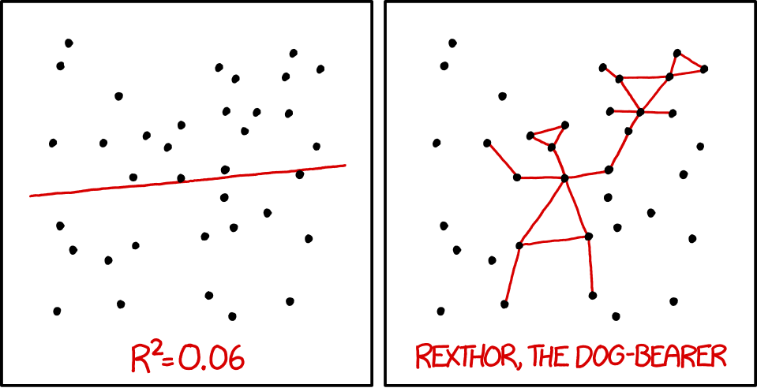

```{r setup, echo = FALSE}
knitr::opts_chunk$set(comment = NA, 
                      fig.width = 6, 
                      fig.height = 6,
                      fig.align = 'center',
                      echo = FALSE, 
                      eval = FALSE, 
                      warning = FALSE,
                      message = FALSE)

options(digits = 3)

set.seed(100)
```

```{r, message = FALSE, eval = TRUE, echo = FALSE}
# Load datasets locally
library(tidyverse)
graduation_train <- read_csv("1_Data/graduation_train.csv")
graduation_test <- read_csv("1_Data/graduation_test.csv")
house_train <- read_csv("1_Data/house_train.csv")
house_test <- read_csv("1_Data/house_test.csv")
baseball_train <- read_csv("1_Data/baseball_train.csv") 
baseball_test <- read_csv("1_Data/baseball_test.csv") 
```
<p align="center">
<br>
<font style="font-size:10px">from [xkcd.com](https://xkcd.com/1725/)</font>
</p>

# {.tabset}


## Überblick

In diesem Practical wirst du optimale Tuning Parameter identifizieren für eine bestmögliche Vorhersageperformanz. 

Am Ende des Practicals wirst du wissen wie man...

1. Cross-Validation zur Auswahl der Tuning Parameter verwendet. 
2. Wie sich eine simple Regression von Lasso und Ridge unterscheidet.

## Aufgaben

### A - Setup

1. Öffne dein `TheRBootcamp` R project. 

2. Öffne ein neues R Skript. Schreibe deinen Namen, das Datum und "Optimizing Practical" als Kommentare an den Anfang des Skripts.

```{r, eval = FALSE, echo = TRUE}
## NAME
## DATUM
## Optimizing Practical
```

3. Speichere das neue Skript unter dem Namen `optimizing_practical.R` im `2_Code` Ordner.

4. Lade die Pakete `tidyverse`, `caret`, `party`, `partykit`.

```{r}
library(tidyverse)
library(caret)
library(party)
library(partykit)
```


### B - Lade die `baseball` Datensätze

1. Verwende die `read_csv()` Funktion um die Datensätze `baseball_train.csv` und `baseball_test.csv` einzulesen.

```{r, echo = T, eval = T, message = F}
# Lese Daten ein
baseball_train <- read_csv(file = "1_Data/baseball_train.csv")
baseball_test <- read_csv(file = "1_Data/baseball_test.csv")
```

2. Printe die Datensätze. 

3. Verwende `names(XX)`, `summary(XX)`, und `View(XX)` um einen weiteren Überblick über die Daten zu bekommen.

4. Wiederum, führe den Code unten aus um sicherzustellen, dass alle `character` Features als Faktoren vorliegen. 

```{r, echo = TRUE}
# Konvertiere alle character zu factor
baseball_train <- baseball_train %>%
          mutate_if(is.character, factor)

baseball_test <- baseball_test %>%
          mutate_if(is.character, factor)
```

### C - Definiere `trainControl`

1. Definiere ein Objekt `ctrl_cv` das 10-fold Cross-Validation als Resampling Methode bestimmt. Im Detail,...

- setze das `method` Argument auf `"cv"` für Cross-Validation.
- setze das `number` Argument auf `10` für 10 folds.

```{r, eval = FALSE, echo = TRUE}
# Verwende 10-fold Cross-Validation
ctrl_cv <- trainControl(method = "XX", 
                        number = XX) 
```

```{r}
# Verwende 10-fold Cross-Validation
ctrl_cv <- trainControl(method = "cv", 
                        number = 10) 
```


### C - Regression

1. Fitte eine normale Regression auf bekanntem Wege (z.B. wie im Practical zu [Prediction](_sessions/Prediction/Prediction_practical.html)), die das `Gehalt` des Baseballspielers durch alle Features im Datensatz vorhersagt. Einziger Unterschied: Setze das `trControl` Argument auf das eben definierte `ctrl_cv` Objekt. 


```{r, echo = TRUE, eval = FALSE}
# Normal Regression
gehalt_glm <- train(form = XX ~ .,
                    data = XX,
                    method = "XX",
                    trControl = XX)
```

```{r}
# Normal Regression
gehalt_glm <- train(form = Gehalt ~ .,
                   data = baseball_train,
                   method = "glm",
                   trControl = ctrl_cv)
```

2. Exploriere `gehalt_glm` indem du `gehalt_glm$finalModel` printest und `summary()` auf das Fit-Objekt anwendest. Wie beurteilst du die Outputs?

```{r}
gehalt_glm
```


### D - Ridge Regression

1. Bevor du ein Regressionsmodel mit Ridge fitten kannst, benötigst du das Kandidatenset für die Tuning Parameter. Erstelle hierzu mit dem Code einen Vector von möglichen `lambda` Werten.  

```{r, echo = TRUE}
# Kandidaten für lambda
lambda_vec <- 10 ^ (seq(-4, 4, length = 100))
```

2. Fitte eine Ridge Regression, die das `Gehalt` des Baseballspielers durch alle Feature im Datensatz vorhersagt. Hierzu kannst du mit dem Code der normalen Regression beginnen und anschliessend zwei Änderungen vornehmen: 

- setze das `preProcess` Argument auf `c("center", "scale")` um möglichen Problemen mit unterschielichen Skalierungen aus dem Weg zu gehen, die bei Regularisierung auftreten können.
- setze das `tuneGrid` auf `expand.grid(alpha = 0, lambda = lambda_vec)` um Ridge auszuwählen und alle verschiedenen Kandidaten in `lambda_vec` durchlaufen zu lassen.

```{r, echo = TRUE, eval = FALSE}
# Ridge Regression
gehalt_ridge <- train(form = XX ~ .,
                      data = XX,
                      method = "XX",
                      trControl = XX,
                      preProcess = XX,  
                      tuneGrid = XX)
```

```{r}
# Ridge Regression
gehalt_ridge <- train(form = Gehalt ~ .,
                      data = baseball_train,
                      method = "glmnet",
                      trControl = ctrl_cv,
                      preProcess = c("center", "scale"), 
                      tuneGrid = expand.grid(alpha = 0, 
                                             lambda = lambda_vec))
```

3. Plotte das Objekt `gehalt_ridge` mit `plot()`. Was verrät dir der Plot? Welcher `lambda` Wert könnte optimal sein?

```{r}
plot(gehalt_ridge)
```

4. Printe mit dem Code unten den durch die Cross-Validation als bestes `lambda` identifizierten Wert. Passt er zum Plot in der letzten Aufgabe?

```{r, echo = TRUE}
# Printe besten lambda parameter
gehalt_ridge$bestTune$lambda
```

5. Lasse dir mit dem Code unten die Parameter des finale Modells anzeigen. Wie beurteilst du den Output? 

```{r, echo = TRUE}
# Erhalte die Modellparameter für das Modell unter dem optimalen lambda
coef(gehalt_ridge$finalModel, 
     gehalt_ridge$bestTune$lambda)
```


### E - Lasso Regression

1. Fitte eine Lasso Regression, die das `Gehalt` des Baseballspielers durch alle Features im Datensatz vorhersagt. Beginne mit dem Code für die Ridge Regression und definiere als einzige Änderung `alpha = 1`.

```{r}
# Fit a lasso regression
gehalt_lasso <- train(form = Gehalt ~ .,
                   data = baseball_train,
                   method = "glmnet",
                   trControl = ctrl_cv,
                   preProcess = c("center", "scale"),
                   tuneGrid = expand.grid(alpha = 1,  # Lasso penalty
                                          lambda = lambda_vec))
```

2. Plotte das Objekt `gehalt_lasso` mit `plot()`. Was verrät dir der Plot? Welcher `lambda` Wert könnte optimal sein?

```{r}
plot(gehalt_lasso)
```

3. Printe mit dem Code unten den durch die Cross-Validation als bestes `lambda` identifizierten Wert. Passt er zum Plot in der letzten Aufgabe?

```{r, echo = TRUE}
# Printe besten lambda Parameter
gehalt_lasso$bestTune$lambda
```

4. Lasse dir mit dem Code unten die Parameter des finalen Modells anzeigen. Wie beurteilst du den Output? Hat sich was im Vergleich zu Ridge verändert?

```{r, echo = TRUE}
# Erhalte die Modellparameter für das Modell unter dem optimalen lambda
coef(gehalt_lasso$finalModel, 
     gehalt_lasso$bestTune$lambda)
```

### F - Decision Tree

1. Bevor du einen Decision Tree per Cross-Validation fittest, benötigst du das Kandidatenset für die Tuning Parameter. Erstelle hierzu mit dem Code einen Vektor von möglichen `cp` Werten. 

```{r}
# Kandidaten für cp
cp_vec <- seq(from = 0, to = 1, length = 100)
```


2. Fitte einen Decision Tree, der das `Gehalt` des Baseballspielers durch alle Features im Datensatz vorhersagt. Beginne mit dem bekannten Code und zusätzlich...

- setze das `trControl` Argument auf das `ctrl_cv` Objekt. 
- setze das `tuneGrid` Argument auf `expand.grid(cp = cp_vec)`.

```{r, echo = TRUE, eval = FALSE}
# Decision Tree 
gehalt_rpart <- train(form = XX ~ .,
                  data = XX,
                  method = "XX",
                  trControl = XX,
                  tuneGrid = XX)
```

```{r}
# Decision Tree
gehalt_rpart <- train(form = Gehalt ~ .,
                  data = baseball_train,
                  method = "rpart",
                  trControl = ctrl_cv,
                  tuneGrid = expand.grid(cp = cp_vec))
```


3. Plotte das Objekt `gehalt_rpart` mit `plot()`. Was verrät dir der Plot? Welcher `cp` Wert könnte optimal sein?

```{r}
plot(gehalt_rpart)
```

4. Printe mit dem Code unten den durch die Cross-Validation als besten `cp` identifizierten Wert. Passt er zum Plot in der letzten Aufgabe?

```{r, echo = TRUE}
# Print besten cp Parameter
gehalt_rpart$bestTune$cp
```

5. Plotte das finale Modell mit dem folgenden Code.

```{r, echo = TRUE}
# Visualisiere den Decision Tree
plot(as.party(gehalt_rpart$finalModel)) 
```

### G - Random Forests

1. Bevor du einen Random Forest per Cross-Validation fittest, benötigst du das Kandidatenset für die Tuning Parameter. Erstelle hierzu mit dem Code einen Vektor von möglichen `mtry` Werten. 

```{r}
# Kandidaten für mtry
mtry_vec <- 1:10
```

2. Fitte einen Random Forest, der das `Gehalt` des Baseballspielers durch alle Features im Datensatz vorhersagt. Beginne mit dem bekannten Code und zusätzlich...

- setze das `trControl` Argument auf das `ctrl_cv` Objekt. 
- setze das `tuneGrid` Argument auf `expand.grid(mtry = mtry_vec)`.

```{r, echo = TRUE, eval = FALSE}
# Random Forest 
gehalt_rf <- train(form = XX ~ .,
                   data = XX,
                   method = "XX",
                   trControl = XX,
                   tuneGrid = XX)
```

```{r}
# Random Forest 
gehalt_rf <- train(form = Gehalt ~ .,
                   data = baseball_train,
                   method = "rf",
                   trControl = ctrl_cv,
                   tuneGrid = expand.grid(mtry = mtry_vec))
```


3. Plotte das Objekt `gehalt_rf` mit `plot()`. Was verrät dir der Plot? Welche `mtry` Werte könnten optimal sein?

```{r}
plot(gehalt_rf)
```

4. Printe mit dem Code unten den durch die Cross-Validation als bestes `mtry` identifizierten Wert. Passt er zum Plot in der letzten Aufgabe?

```{r, echo = TRUE}
# Printe besten mtry Parameter
gehalt_rf$bestTune$mtry
```


### H - Schätze die Vorhersageperformanz über Cross Validation

1. Verwende `resamples()` um die geschätzte Vorhersageleistung der einzelnen Modelle zu bestimmen. Übergebe hierzu die einzelnen gefitteten Modelle (z.b., `gehalt_glm`) an die Funktion. 
```{r, eval = FALSE, echo = TRUE}
# Geschätzte Vorhersageleistung
gehalt_resamples <- resamples(list(glm = XXX,
                                   ridge = XXX, 
                                   lasso = XXX, 
                                   rpart = XXX, 
                                   rf = XXX))
```

```{r}
# Geschätzte Vorhersageleistung
gehalt_resamples <- resamples(list(glm = gehalt_glm,
                                   ridge = gehalt_ridge, 
                                   lasso = gehalt_lasso, 
                                   dt = gehalt_rpart, 
                                   rf = gehalt_rf))
```

2. Erhalte einen Überblick über die Ergennisse mit `summary(gehalt_resamples)`. Wie interpretierst du den Ouput? Welches Modell hat die beste geschätzte Vorhersageleistung?

### I - Berechne tatsächliche Vorhersageleistung

1. Speichere das Kriterium (`Gehalt`) der Testdaten `baseball_test` in einem Objekt namens `criterion_test`.

```{r, eval = FALSE, echo = TRUE}
# Testkriterium
criterion_test <- XXX$XXX
```

```{r}
# Geschätzte Vorhersageleistung
criterion_test <- baseball_test$Gehalt
```

2. Verwende `predict()` um auf bekanntem Wege Vorhersagen für die Testdaten `baseball_test` auf Basis der Modelle zu bestimmen.

```{r, eval = FALSE, echo = TRUE}
# Vorhersagen der Modelle
ridge_pred <- predict(XXX, newdata = XXX)
lasso_pred <- predict(XXX, newdata = XXX)
rpart_pred <- predict(XXX, newdata = XXX)
rf_pred <- predict(XXX, newdata = XXX)
```

```{r}
# Vorhersagen der Modelle
ridge_pred <- predict(gehalt_ridge, newdata = baseball_test)
lasso_pred <- predict(gehalt_lasso, newdata = baseball_test)
rpart_pred <- predict(gehalt_rpart, newdata = baseball_test)
rf_pred <- predict(gehalt_rf, newdata = baseball_test)
```

4. Verwende `postResample()` um die Vorhersagen mit den tatsächlichen Kriteriumswerten zu vergleichen. Welches Modell hat in der Vorhersage der Testdaten die beste Performanz?

```{r}
postResample(ridge_pred, criterion_test)
postResample(lasso_pred, criterion_test)
postResample(rpart_pred, criterion_test)
postResample(rf_pred, criterion_test)
```


5. Vergleiche die geschätzten Vorhersageleistungen auf Basis von `resamples()` (aus der letzten Sektion) mit der Leistung für tatsächliche Vorhersage. Wie gross sind die Unterschiede?

### X - Challenges: Abschlussrate

Vergleiche auf Basis der Schritte in diesem Practical die Performanz von Regression, Lasso, Ridge, Decision Tree und Random Forest für die `graduation_train` und `graduation_test` Datensätze aus dem letzten Practical. Lass die Modelle das Kriterium `Privatuniversität` auf Basis aller anderen Features vorhersagen. Nicht vergessen für Klassifikation muss das Kriterium ein `factor` sein.

1. Welches Modell ist das beste? 
2. Wie viel besser werden die Modelle durch Model Tuning? Vergleiche mit den Ergebnissen des letzten Practicals. 
3. Setzt Lasso die Gewichte einzelner Features auf 0? Was könnte das für die Relevanz des Features bedeuten?

### Y - Challenges: Hauspreise

Vergleiche auf Basis der Schritte in diesem Practical die Performanz von Regression, Lasso, Ridge, Decision Tree und Random Forest für die `house_train` und `house_test` Datensätze aus dem letzten Practical. Lass die Modelle das Kriterium `Preis` auf Basis aller anderen Features vorhersagen.

1. Welches Modell ist das beste? 
2. Wie viel besser werden die Modelle durch Model Tuning? Vergleiche mit den Ergebnissen des letzten Practicals. 
3. Setzt Lasso die Gewichte einzelner Features auf 0? Was könnte das für die Relevanz des Features bedeuten?


## Beispiele

```{r, eval = FALSE, echo = TRUE}

# Schritt 0: Lade Pakete-----------
library(tidyverse)   
library(caret)      
library(partykit)  
library(party)  

# Step 1: Lade und bereite Daten ----------------------

# Training und Testdaten
data_train <- read_csv("1_Data/diamonds_train.csv")
data_test <- read_csv("1_Data/diamonds_test.csv")

# Konvertiere alle character zu factor
data_train <- data_train %>% mutate_if(is.character, factor)
data_test <- data_test %>% mutate_if(is.character, factor)

# Definiere Kriterien
criterion_train <- data_train$price
criterion_test <- data_test$price

# Schritt 2: Definiere die Training-Kontrollparameter -------------

# Verwende 10-fold Cross Validation
ctrl_cv <- trainControl(method = "cv", 
                        number = 10) 

# Scrhitt 3: Trainieree Modelle -----------------------------

# Simple Regression ----
price_glm <- train(form = price ~ carat + depth + table + x + y,
                   data = data_train,
                   method = "glm",
                   trControl = ctrl_cv)


# Zeige Outputs
price_glm
coef(price_glm$finalModel)

# Lasso ----

# Kandidatenset für lambda
lambda_vec <- 10 ^ seq(-3, 3, length = 100)

# Lasso Regression
price_lasso <- train(form = price ~ carat + depth + table + x + y,
                   data = data_train,
                   method = "glmnet",
                   trControl = ctrl_cv,
                   preProcess = c("center", "scale"), # Standardisiere 
                   tuneGrid = expand.grid(alpha = 1,  
                                          lambda = lambda_vec))

# Zeige Outputs
price_lasso 
plot(price_lasso)

# Zeige beste Regularisierungsparameter
price_lasso$bestTune$lambda

# Zeige finales Modell
coef(price_lasso$finalModel, 
     price_lasso$bestTune$lambda)


# Ridge ----

# Kandidatenset für lambda
lambda_vec <- 10 ^ seq(-3, 3, length = 100)

# Ridge Regression
price_ridge <- train(form = price ~ carat + depth + table + x + y,
                     data = data_train,
                     method = "glmnet",
                     trControl = ctrl_cv,
                     preProcess = c("center", "scale"), # Standardisiere
                     tuneGrid = expand.grid(alpha = 0,
                                            lambda = lambda_vec))

# Zeige Outputs
price_ridge
plot(price_ridge)

# Zeige beste Regularisierungsparameter
price_ridge$bestTune$lambda

# Zeige finales Modell
coef(price_ridge$finalModel, 
     price_ridge$bestTune$lambda)


# Decision Trees --------------------------

# Kandidatenset für cp
cp_vec <- seq(0, .1, length = 100)

price_rpart <- train(form = price ~ carat + depth + table + x + y,
                  data = data_train,
                  method = "rpart",
                  trControl = ctrl_cv,
                  tuneGrid = expand.grid(cp = cp_vec))

# Zeige Outputs
price_rpart

# Zeige beste Regularisierungsparameter
plot(price_rpart)
price_rpart$bestTune$cp


# Schritt 3: Vorhersageperformanz in folds ----

# Berechne Performanz
resamples_price <- resamples(list(ridge = price_ridge, 
                                  lasso = price_lasso, 
                                  glm = price_glm))

# Zusammenfassung
summary(resamples_price)


# Schritt 4: Vorhersageevaluation -------------------

# GLM
glm_pred <- predict(price_glm, newdata = data_test)
postResample(pred = glm_pred, obs = criterion_test)

# Ridge
ridge_pred <- predict(price_ridge, newdata = data_test)
postResample(pred = ridge_pred, obs = criterion_test)

# Lasso
lasso_pred <- predict(price_lasso, newdata = data_test)
postResample(pred = lasso_pred, obs = criterion_test)


```


## Datensätze

```{r, eval = TRUE, message = FALSE, echo = FALSE}
library(tidyverse)
library(ggthemes)
```

|Datei  |Zeilen | Spalten |
|:----|:-----|:------|
|[baseball_train.csv](https://raw.githubusercontent.com/therbootcamp/ML_2020Apr/master/1_Data/baseball_train.csv)| 213 | 20|
|[baseball_test.csv](https://raw.githubusercontent.com/therbootcamp/ML_2020Apr/master/1_Data/baseball_test.csv)| 50 | 20|
|[graduation_train.csv](https://raw.githubusercontent.com/therbootcamp/ML_2020Apr/master/1_Data/graduation_train.csv)| 500 | 18|
|[graduation_test.csv](https://raw.githubusercontent.com/therbootcamp/ML_2020Apr/master/1_Data/graduation_test.csv)| 277 | 18|
|[house_train.csv](https://raw.githubusercontent.com/therbootcamp/ML_2020Apr/master/1_Data/house_train.csv)| 5000 | 21|
|[house_test.csv](https://raw.githubusercontent.com/therbootcamp/ML_2020Apr/master/1_Data/house_test.csv)| 1000 | 21|


#### `baseball_train` and `baseball_test`

Die `baseball_train` und `baseball_test` Datensätze entstammen dem `Hitters` Datensatz des `ISLR` Pakets. Sie enthalten Daten über Major League Baseball Spieler aus den Saisons 1986 und 1987.

| Name | Beschreibung |
|Gehalt| Jahresgehalt zu Beginn des Jahres 1987 |
|Schlaeger86| Einsätze als Schläger im Jahr 1986 |
|Getroffen86| Treffer des Balls im Jahr 1986 |
|Home_runs86| Home runs im Jahr 1986 |
|Runs86| Runs im Jahr 1986 |
|Runs_andere86| Runs anderer ermöglicht im Jahr 1986 |
|Walks86| Walks durch Fehlwürfe des Werfers im Jahr 1986 |
|Putout86| Putouts eines Schlägers als Fänger im 1986  |
|Vorlage86| Vorlage zum Putout als Fänger im Jahr 1986 |
|Fehler86| Fehler der Fänger im Jahr 1986  |
|Erfahrung| Erfahrung in Jahren in Major Ligen zu Beginn des Jahres 1987 |
|Schlaeger| Einsätze als Schläger insgesamt |
|Getroffen| Treffer des Balls insgesamt |
|Home_runs| Home runs insgesamt |
|Runs| Runs insgesamt |
|Runs_andere| Runs anderer ermöglicht insgesamt |
|Walks| Walks durch Fehlwürfe des Werfers insgesamt |
|Liga| Ligakürzel: A = American, N = National |
|Division| Divisionskürzel: E = East, W = West |
|Liga87| Ligakürzel in 1987: A = American, N = National |

#### `graduation_train` und `graduation_test`

Die `graduation_train` und `graduation_test` Datensätze entstammen dem `College` Datensatz aus dem `ISLR` Paket. sie enthalten Statistiken für eine grosse Anzahl US Colleges auf Basis des *US News and World Reports* aus dem Jahr 1995.

| Name | Beschreibung |
|:-------------|:-------------------------------------|
|Privatuniversitaet| Ja oder Nein |
|Bewerbungen| Anzahl Bewerbungen |
|Angenommen| Anzahl angenommene Bewerbungen  |
|Eingeschrieben| Anzahl eingeschrieben  |
|Prozent_Top10| Prozent der Studierenden innerhalb Top 10% in High School |
|Prozent_Top25| Prozent der Studierenden innerhalb Top 25% in High School   |
|Vollzeit| Anzahl Studierende in Vollzeit  |
|Teilzeit| Anzahl Studierende in Teilzeit  |
|Kosten_ausserhalb| Kosten für Studierende aus einem anderen Staat |
|Kosten_Unterkunft| Kosten für Studierende für Unterkunft und Verpflegung  |
|Kosten_Buecher| Kosten für Studierende für Bücher  |
|Kosten_persoenlich| Kosten für Studierende für Persönliches  |
|Prozent_PhD| Anteil PhDs innerhalb der Dozentenschaft |
|Prozent_Degree| Anteil Abschlüsse innerhalb der Dozentenschaft |
|Verhaeltnis_Stud.Doz.| Verhältnis Studierene zu Dozenten  |
|Prozent_Spenden| Anteil Alumnis, die an das College spenden |
|Kosten_Student| Ausbildungskosten für das College pro Student |
|Abschlussrate| Abschlussrate |


#### `house_train` and `house_test`

Die `house_train` und `house_test` Datensätze enthalten Hauspreise und -Eigenschaften in der King County in den USA, welches die Stadt Seattle beinhaltet. Quelle der Daten ist [Kaggle](https://www.kaggle.com/harlfoxem/housesalesprediction).

| Name | Beschreibung |
|:-------------|:-------------------------------------|
|Preis| Preis des Hauses |
|Schlafzimmer| Anzahl Schlafzimmer  |
|Baeder| Anzahl Bäder |
|Gesamt_sqft| Gesamtfläche des Hauses in square foot |
|Grundstück_sqft| Fläche des Grundstücks in square foot |
|Stockwerke| Anzahl Stockwerke |
|Uferlage| 0 = Nein, 1 = Ja |
|Besichtigung| Wurde das Haus besichtigt  |
|Zustand| Wie gut ist der Zustand des Hauses |
|Einstufung| Einstufung gemäss King County Einstufungssystem |
|Wohnraum_sqft| Wohnraum des Hauses in square foot|
|Keller_sqft| Kellerraum des Hauses in square foot |
|Baujahr| Baujahr |
|Renovationsjahr| Renovationsjahr |
|Postleitzahl| Postleitzahl |
|Breitengrad| Breitengrad |
|Laengengrad| Längengrad |
|Gesamt_sqft_2015| Gesamtfläche des Hauses in square foot in 2015 |
|Grundstück_sqft_2015| Fläche des Grundstücks in square foot in 2015 |


## Funktionen

### Pakete

|Paket| Installation|
|:------|:------|
|`tidyverse`|`install.packages("tidyverse")`|
|`caret`|`install.packages("caret")`|
|`partykit`|`install.packages("partykit")`|
|`party`|`install.packages("party")`|

### Funktionen

| Funktion| Paket | Beschreibung |
|:---|:------|:---------------------------------------------|
| `trainControl()`|`caret`|   Definiere wie das Modell trainiert wird | 
| `train()`|`caret`|  Trainiere (fitte) ein Modell   |
| `predict(object, newdata)`|`stats`| Vorhersage des Kriteriumswerts in `newdata` |
| `postResample()`|`caret`| Evaluiere Performanz in Regressionsfällen   |
| `confusionMatrix()`|`caret`|   Evaluiere Performanz in Klassifikationsfällen |

## Materialien

<figure>
<center>
<a href="https://github.com/rstudio/cheatsheets/raw/master/caret.pdf">
  </a><br>
 <font style="font-size:10px"> from <a href= "https://github.com/rstudio/cheatsheets/raw/master/caret.pdf</figcaption">github.com/rstudio</a></font>
</figure>


