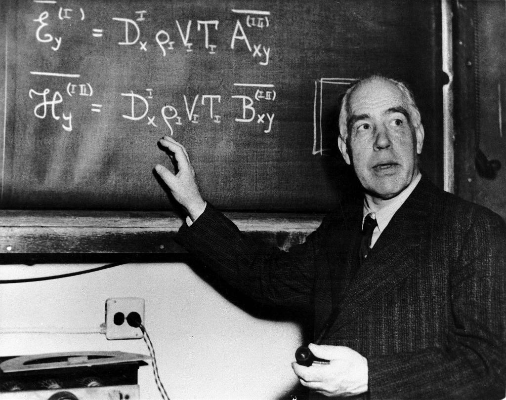
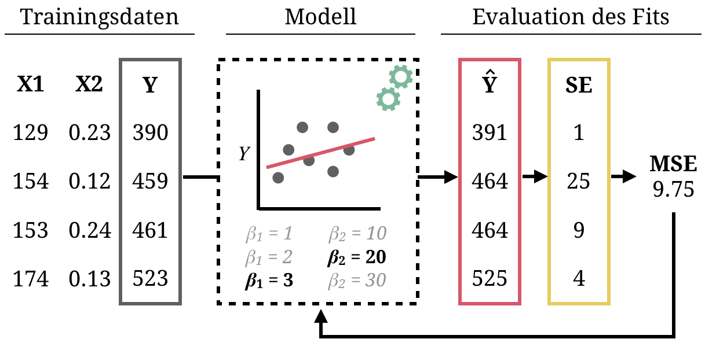
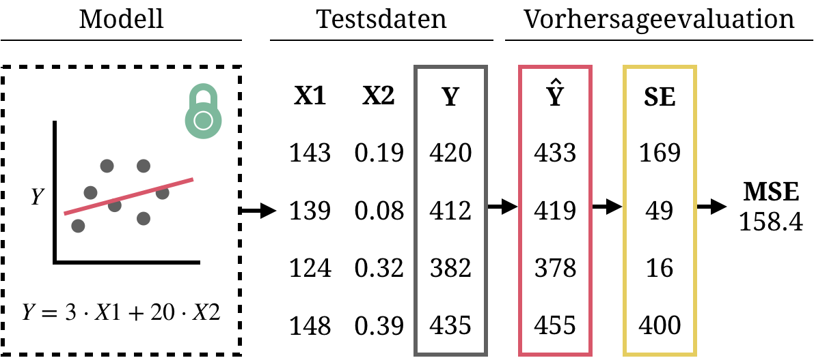
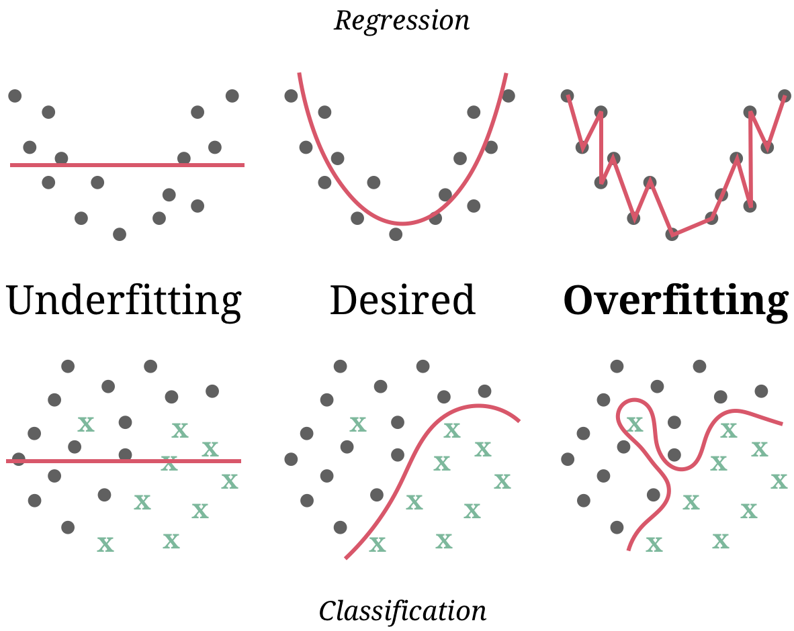
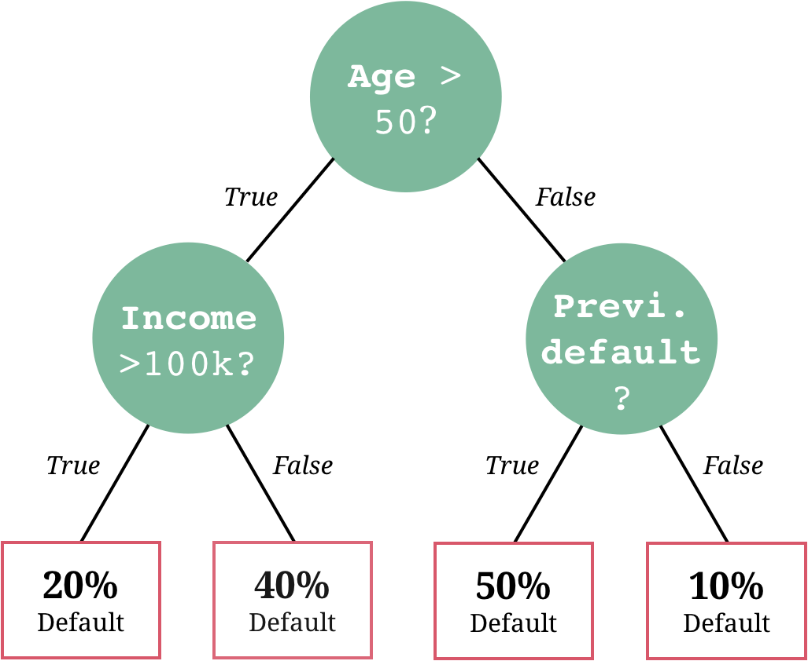
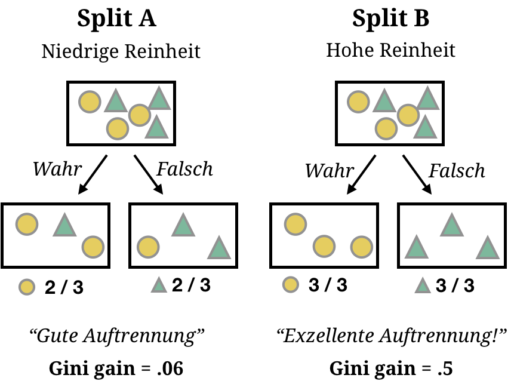
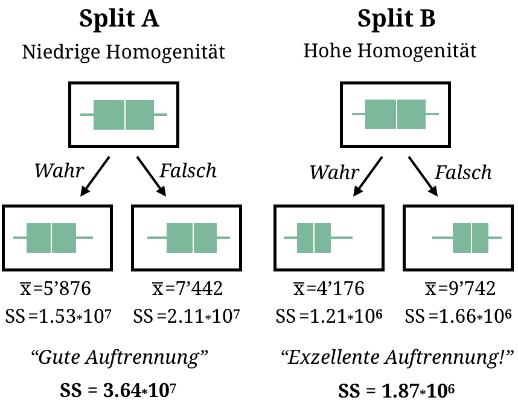
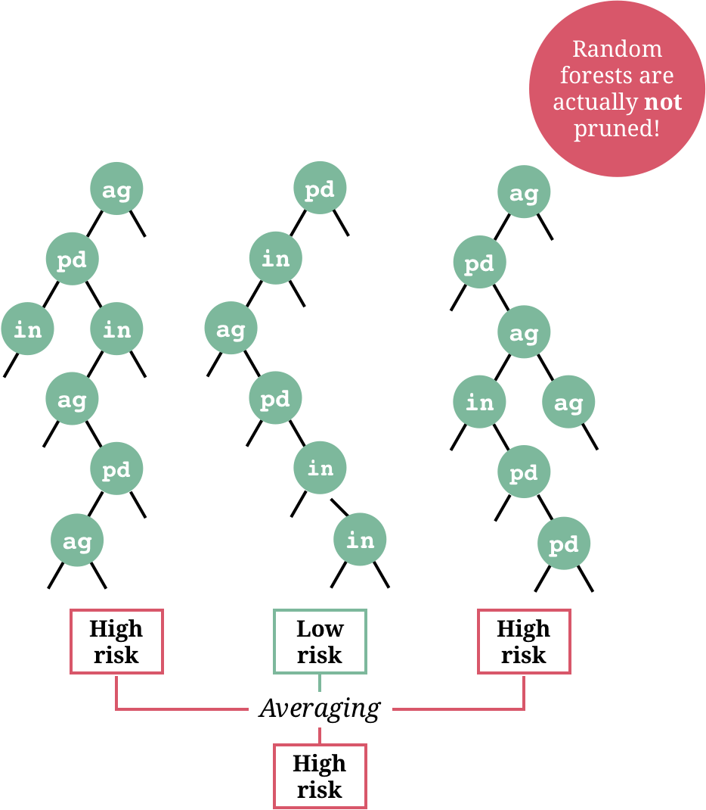
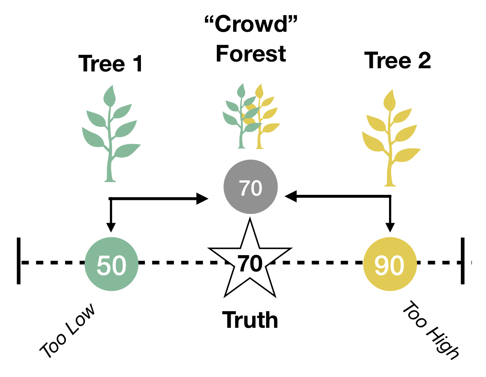

layout: true

<div class="my-footer">
  <span style="text-align:center">
    <span> 
      
    </span>
    <a href="https://therbootcamp.github.io/">
      <span style="padding-left:82px"> 
        <font color="#7E7E7E">
          www.therbootcamp.com
        </font>
      </span>
    </a>
    <a href="https://therbootcamp.github.io/">
      <font color="#7E7E7E">
      Maschinelles Lernen mit R | Oktober 2020
      </font>
    </a>
    </span>
  </div> 

---


```{r setup, include=FALSE}
library(tidyverse)
options(htmltools.dir.version = FALSE)
# see: https://github.com/yihui/xaringan
# install.packages("xaringan")
# see: 
# https://github.com/yihui/xaringan/wiki
# https://github.com/gnab/remark/wiki/Markdown
options(width=110)
options(digits = 4)

source("https://raw.githubusercontent.com/therbootcamp/ML_2019Oct/master/_materials/code/baselrbootcamp_palettes.R")


basel <- read_csv("1_Data/basel.csv")
```

```{r, echo = FALSE ,message = FALSE, warning = FALSE}
knitr::opts_chunk$set(comment=NA, fig.width=6, fig.height=6, echo = TRUE, eval = TRUE, 
                      message = FALSE, warning = FALSE, fig.align = 'center', dpi = 200)
library(tidyverse)
library(caret)
library(ggthemes)
library(knitr)

set.seed(100)

past <- tibble(id = 1:5,
               sex = sample(c("m", "f"), size  = 5, replace = TRUE),
               age = round(rnorm(5, mean = 45, sd = 5), 0),
               fam_history = sample(c("Yes", "No"), size = 5, replace = TRUE),
               smoking = sample(c(TRUE, FALSE), size = 5, replace = TRUE),
               criterion = sample(c(0, 1), size = 5, replace = TRUE))

present <- tibble(id = 91:95,
                  sex = sample(c("m", "f"), size  = 5, replace = TRUE),
               age = round(rnorm(5, mean = 45, sd = 5), 0),
               fam_history = sample(c("Yes", "No"), size = 5, replace = TRUE),
               smoking = sample(c(TRUE, FALSE), size = 5, replace = TRUE),
               criterion = rep("?", 5))
```


# Prediction...

.pull-left45[

<p>
<font style="font-size:32px"><i>Prediction is very difficult, especially if it's about the future.</i></font>
<br><br>
Nils Bohr, Nobelpreisträger in Physik
<br><br>
<font style="font-size:32px"><i>An economist is an expert who will know tomorrow why the things he predicted yesterday didn't happen today.</i></font>
<br><br>

Evan Esar, Satiriker

</p>

]

.pull-right45[

<p align = "center">
<br>
<font style="font-size:10px">from <a href="https://futurism.com/know-your-scientist-niels-bohr-the-father-of-the-atom">futurism.com</a></font>
</p>

]

---

# "Hold-out"-Daten

.pull-left45[

<ul>
  <li class="m1"><span>Die Performanz eines Models wird i.a.R. über die Vorhersage <high><i>ungesehener</i> Daten</high> evaluiert.</span></li><br>
  <li class="m2"><span>Die <i>ungesehenen</i> Daten können <high>natürlich vorkommen</high>.</span></li>
  <ul class="level">
    <li><span>zB. Aktiendaten aus 2019 für ein Modell auf Basis von Aktiendaten aus 2018</span></li>
  </ul><br>
  <li class="m3"><span>Meist werden die <i>ungesehenen</i> Daten manuell kreiert in dem die verfügbaren Daten in <high>Training und Test</high> aufgeteilt werden.</span></li>
</ul>

]


.pull-right45[

<p align = "center">

</p>

]

---

# Training <font style="font-size:20px">(= Fitting)</font>

<p align = "center" style="margin-top:40px">

</p>


---

# Test

<p align = "center" style="margin-top:40px">

</p>

<!---

# Warum wird Training und Test getrennt?

<br>
<p align = "center"><font size = 6><i>"Könnt ihr euch ein Modell vorstellen, das perfekten Fit im Training liefert und in der Vorhersage nutzlos ist?"</i></font><br><br>

.pull-left45[


<high>Trainingsdaten</high>
<br>

```{r, results = 'asis', echo = FALSE}
knitr::kable(past, format = "markdown")
```

]

.pull-right45[


<high> Testdaten</high>
<br>

```{r, echo = FALSE}
knitr::kable(present, format = "markdown")
```

]

--->


---

.pull-left4[

<br><br>
# Overfitting

<ul>
  <li class="m1"><span>Tritt ein, wenn ein Modell die <high>Daten zu genau fitted</high> und deswegen <high>keine guten Vorhersagen</high> liefert.</span></li><br>
  <li class="m2"><span>Ein zu genauer fit bedeutet, dass z.T. züfällige Tendenzen, sog. <high>Rauschen gefittet</high> wird.</span></li><br>
  <li class="m3"><span><high>"Komplexere" Modelle</high> neigen mehr zu overfitting.</span></li>
</ul>

]


.pull-right5[
<br><br><br>
<p align = "center" style="padding-top:0px">

</p>

]


---

# Overfitting

```{r, fig.width = 8, fig.height = 3.5, echo = FALSE, eval = TRUE, warning = FALSE, dpi = 200}
set.seed(5)

N <- 40

iv <- rnorm(N, mean = 10, sd = 2)
truth <- iv 
noise <- rnorm(N, mean = 0, sd = 2)
obs <- truth + noise

data <- data.frame(iv, obs)


poly_pred <- map_dfc(.x = c(1, 19), .f = function(degree) {
  
  output <- data.frame(lm(obs ~ poly(iv, degree), data = data)$fitted.values)
  
  names(output) <- paste0("d", degree)
  
  return(output)

}) %>% mutate(id = 1:N,
              x = iv,
              obs = obs) %>%
  gather(Degree, pred, -id, -x, -obs) %>%
  mutate(`Training` = abs(pred - obs))


poly_pred <- poly_pred %>%
  mutate(Model = case_when(Degree == "d1" ~ "Einfaches Modell",
                                     TRUE ~ "Komplexes Modell"))


overfit_gg <- ggplot(poly_pred, aes(x = x, y = pred, col = Model)) + 
  geom_line(size = 1.2) +
  geom_point(aes(x = x, y = obs), col = "black", pch = 21) +
  annotate("segment", x = 5, y = 5, xend = 15, yend = 15, col = "black", linetype = 4, size = 1) +
  xlim(5, 15) +
  ylim(5, 15) +
  labs(title = "Zwei Regressionsmodelle",
       subtitle = "Gestrichelte Linie entspricht wahrem Modell",
       x = "Feature",
       y = "Criterion") +
  theme_bw() +
    theme(legend.position="bottom") +
  scale_color_baselrbootcamp()
  
poly_pred <- poly_pred %>% mutate(

  obs_new = x + rnorm(1, mean = 0, sd = 2),
  `Testing` = abs(obs_new - pred)
  
)


poly_pred <- poly_pred %>%
  select(Model, `Training`, `Testing`) %>%
  gather(phase, Error, -Model)

agg <- poly_pred %>%
  group_by(Model, phase) %>%
  summarise(Error = mean(Error)) %>%
  ungroup() %>%
  mutate(phase = factor(phase, levels = c("Training", "Test"), ordered = TRUE))
 
fit_gg <- ggplot(agg, aes(x = phase, y = Error, fill = Model)) +
  geom_bar(position = "dodge", stat = "identity") +
  labs(title = "Error: Fitting versus Prediction",
       subtitle = "Kleinere Werte sind besser",
       x = "Evaluierungsphase") +  
  scale_y_continuous(limits=c(.75,1.25),oob = scales::rescale_none) +
  theme_bw() +
    theme(legend.position="bottom") +
  scale_fill_baselrbootcamp()

ggpubr::ggarrange(overfit_gg, fit_gg)
```


---
class: center, middle

<h1><a>Zwei neue Modelle</a></h1>

---
class: center, middle

<font color = "gray"><h1>Regression</h1></font>

<high><h1>Decision Trees</h1></high>

<font color = "gray"><h1>Random Forests</h1></font>

---

# CART

.pull-left45[

<ul>
  <li class="m1"><span>CART = Classification And Regression trees</span></li><br>
  <li class="m2"><span>Modelliert das Kriterium als <high>Sequenz logischer Entscheidungen</high>.</span></li>
</ul>

]

.pull-right45[

<p align = "center" style="padding-top:0px">

</p>
]

---

# Classificiation trees

.pull-left45[


<ul>
  <li class="m1"><span>Classification und regression trees werden mit dem folgengen <high>Algorithmus</high> gefitted:</span></li><br>
  <ul>
  <li><span>1 - <high>Trenne</high> Knoten so, dass <mono>purity gain</mono> (zB., Gini gain) maximiert wird.</span></li><br>
  <li><span>2 - <high>Wiederhole</high> bis zu einer vordefinierten Schwelle (zB. <mono>minsplit</mono>).</span></li><br>
  <li><span>3 - <high>Stutze</high> den Baum gemäss <mono>complexity parameter</mono></span></li>
  </ul>
</ul>

]

.pull-right45[

<p align = "center" style="padding-top:0px">

</p>
]

---

# Auftrennen der Knoten

.pull-left45[

<ul>
  <li class="m1"><span>Classification trees versuchen ingesammt <highm>impurity</highm> zu minimieren.</span></li>
</ul>


$$\large Gini(S) = 1 - \sum_j^kp_j^2$$

<ul>
  <li class="m2"><span>Durch das Auftrennen eines Knotens werden Cases so aufgeteilt, dass der resultierende <highm>purity gain</highm> maxmial ist.</span></li>
</ul>

$$Gini \; gain = Gini(S) - Gini(A,S)$$

mit

$$Gini(A, S) = \sum \frac{n_i}{n}Gini(S_i)$$

]


.pull-right45[


<p align = "center" style="padding-top:0px">

</p>

]

---

# Stutzen der Bäume

.pull-left45[

<ul>
  <li class="m1"><span>Classification trees werden schlussendlich <high>gestutzt (pruned)</high> sodass jedes Auftrennen eines Knotens einen gain von mindestens <highm>cp</highm>.</span></li>
</ul>

<br>

$$
\large
\begin{split}
Loss = & Impurity\,+\\
&cp*(n\:terminal\:nodes)\\
\end{split}
$$

]

.pull-right45[


<p align = "center" style="padding-top:0px">

</p>

]
---

# Regression trees

.pull-left45[

<ul>
  <li class="m1"><span>Regression trees <high>minimieren die Binnenvarianz der Knoten</high>, bzw. maximieren Homogenität innerhalb der Knoten.</span></li>
</ul>


$$\large SSE = \sum_{i \in S_1}(y_i - \bar{y}_1)^2+\sum_{i \in S_2}(y_i - \bar{y}_2)^2$$
<ul>
  <li class="m2"><span>Algorithmus:</span></li>
  <ul>
  <li><span>1 - <high>Trenne</high> Knoten, sodass der grösste <high>Zugewinn an Homogenität entsteht</high>.</li></span><br>
    <li><span>2 - <high>Wiederhole</high> bis zu einer vordefinierten Schwelle (zB. <mono>minsplit</mono>).</span></li><br>
  <li><span>3 - <high>Stutze</high> den Baum gemäss <mono>complexity parameter</mono></span></li>
  <ul>
</ul>

]


.pull-right45[

<p align = "center" style="padding-top:0px">

</p>


]


---

# CART in <mono>caret</mono>

.pull-left4[

<ul>
  <li class="m1"><span>Fitte einen decision tree in <mono>caret</mono> mit <highm>method = "rpart"</highm>.</span></li>
  <li class="m2"><span>Wenn das <high>Kriterium ein <mono>factor</mono></high> ist, verwendet <mono>caret</mono> einen Classificaton tree, anonsten einen Regression tree</highm>.</span></li>
</ul>

]

.pull-right45[

```{r, eval = FALSE}
# Fitte einen decision tree

train(form = verzug ~ ., # factor
      data = Darlehen,
      method = "rpart",
      trControl = ctrl)

# Fitte einen regression tree

train(form = einkommen ~ ., # kein factor
      data = basel,
      method = "rpart",
      trControl = ctrl)

```


]


---
class: center, middle

<font color = "gray"><h1>Regression</h1></font>

<font color = "gray"><h1>Decision Trees</h1></font>

<high><h1>Random Forests</h1></high>

---

.pull-left45[

# Random Forest

<ul>
  <li class="m1"><span>In Random Forests wird das Kriterium als <high>Aggregat vieler Entscheidungsbäume</high> modelliert.</span></li>
  <li class="m2"><span>Algorithmus:</span></li>
  <ul>
  <li><span>1 - <high>Wiederhole</high> <mono>n</mono> mal.</li></span><br>
  <ul>
  <li><span>1 - <high>Resample</high> die Daten.</span></li><br>
  <li><span>2 - <high>Fitte</high> nicht-gestutzte Entscheidungsbäume.<br><br>Berücksichtige bei jeder Auftrennung nur <high><mono>m</mono> Features</high>.</span></li><br>
  </ul>
  <li><span>2 - <high>Mittle</high> die gefitteten Werte.</li></span><br>  
  </ul>
</ul>


]

.pull-right45[
<br>

<p align = "center" style="padding-top:0px">

</p>


]

---

# Random Forest

.pull-left45[

<ul>
  <li class="m1"><span>Random Forests bedienen sich des <high>Baggings</high> (<high>Resampling</high> und <high>Averaging</high>) um höhere Vorhersageleistungen zu erzielen.</span></li>
</ul>

<br>

<table style="cellspacing:0; cellpadding:0; border:none;">
  <col width="30%">
  <col width="70%">
<tr>
  <td bgcolor="white">
    <b>Element</b>
  </td>
  <td bgcolor="white">
    <b>Beschreibung</b>
  </td>  
</tr>
<tr>
  <td bgcolor="white">
    <i>Resampling</i>
  </td>
  <td bgcolor="white">
    Kreiert neue Datensätze die in ihrer Komposition variieren. Dabei werden <high>Eigenheiten</high> der vorhandenen Daten <high>weniger Gewicht gegeben</high>. 
  </td>  
</tr>
<tr>
  <td bgcolor="white">
    <i>Averaging</i>
  </td>
  <td bgcolor="white">
    Das Kombinieren von Vorhersagen gleicht typischerweise <hoch>Eigenheiten</hoch> der aus einzelnen Datensätzen erstellten Modelle aus. 
  </td>  
</tr>
</table>
]


.pull-right45[

<p align = "center" style="padding-top:0px">

</p>


]


---


# Random forests in <mono>caret</mono>

.pull-left4[

<ul>
  <li class="m1"><span>Fitte einen Random Forest in <mono>caret</mono> mit <highm>method = "rf"</highm>.</span></li>
  <li class="m2"><span>Wenn das <high>Kriterium ein <mono>factor</mono></high> ist, verwendet <mono>caret</mono> Classificaton trees, anonsten Regression trees als Grundlage des Random Forests</highm>.</span></li>
</ul>

]

.pull-right45[

```{r, eval = FALSE}
# Fitte ein random forest

train(form = verzug ~ ., # factor
      data = Darlehen,
      method = "rf", 
      trControl = ctrl)

# Fitte ein random forest

train(form = einkommen ~ ., # kein factor
      data = basel, 
      method = "rf", 
      trControl = ctrl)

```


]


---
class: center,  middle

<br><br>

<h1><a>Vorhersageevaluation in <mono>caret</mono></h1>


```{r, echo = FALSE}
library(caret)
data(cars)
```


<!---

# <mono>createDataPartition()</mono>

.pull-left4[

<ul>
  <li class="m1"><span>Verwende <mono>createDataPartition()</mono> um den <high>Datensatz aufzuteilen</high> in Trainings- und Testdaten.</span></li>
</ul>

<br>

<table style="cellspacing:0; cellpadding:0; border:none;">
  <col width="30%">
  <col width="70%">
<tr>
  <td bgcolor="white">
    <b>Argument</b>
  </td>
  <td bgcolor="white">
    <b>Beschreibung</b>
  </td>  
</tr>
<tr>
  <td bgcolor="white">
    <mono>y</mono>
  </td>
  <td bgcolor="white">
    Das Kriterion. Wichtig für eine <high>ausgewogene Aufteilung</high> der Daten.  
  </td>  
</tr>
<tr>
  <td bgcolor="white">
    <mono>p</mono>
  </td>
  <td bgcolor="white">
    Der <high>Antei der Daten</high> der den Trainingsdaten zugewisen wird. Oft <mono>.8</mono> oder <mono>.5</mono>.    
  </td>  
</tr>
</table>


]

.pull-right5[

```{r, eval = FALSE, echo = TRUE}
# Wichtig für konstante Ergebnisse
set.seed(100)

# Indizes für Training
index <- 
  createDataPartition(y = basel$einkommen,
                             p = .8,
                             list = FALSE)

# Kreiere Trainingsdaten
basel_train <- basel %>% 
  slice(index)

# Kreiere Testdaten
basel_test <- basel %>% 
  slice(-index)
```


]

--->


---

# <mono>predict(, newdata)</mono>

.pull-left4[

<ul>
  <li class="m1"><span>Generiert auf Basis des Modells und des Testdatensatzes <high>neue Vorhersagen</high>.</span></li>
</ul>

<br>

<table style="cellspacing:0; cellpadding:0; border:none;">
  <col width="30%">
  <col width="70%">
<tr>
  <td bgcolor="white">
    <b>Argument</b>
  </td>
  <td bgcolor="white">
    <b>Beschreibung</b>
  </td>  
</tr>
<tr>
  <td bgcolor="white">
    <mono>object</mono>
  </td>
  <td bgcolor="white">
    <mono>caret</mono> Objekt nach dem Fitten.  
  </td>  
</tr>
<tr>
  <td bgcolor="white">
    <mono>newdata</mono>
  </td>
  <td bgcolor="white">
    Testdaten (Muss alle Features in <mono>object</mono> beinhalten).    
  </td>  
</tr>
</table>

]

.pull-right5[

```{r, eval = FALSE}
# Fitte das Modell zu dne Trainingsdaten
mod <- train(form = einkommen ~ .,
             method = "glm",
             data = basel_train)

# Extrahiere die gefitteten Werte
mod_fit <- predict(mod)

# Berechne echte Vorhersagen für Testdaten
mod_pred <- predict(mod, 
                    newdata = basel_test)

# Evaluiere das Ergebnis
postResample(pred = mod_pred, 
             obs = basel_test$einkommen)
```

]


---
class: middle, center

<h1><a href=https://therbootcamp.github.io/ML_2020Apr/_sessions/Prediction/Prediction_practical.html>Practical</a></h1>


