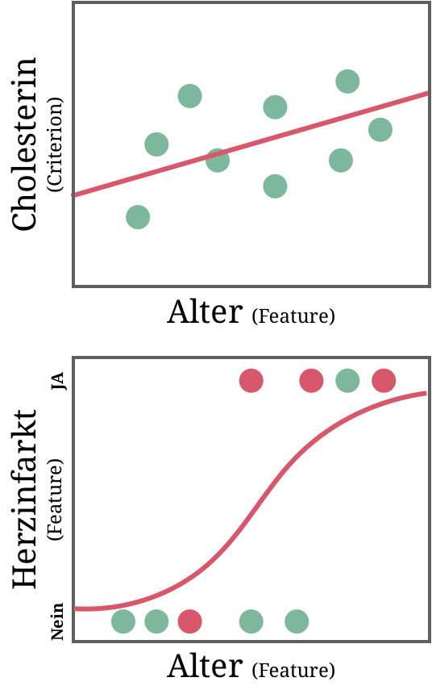
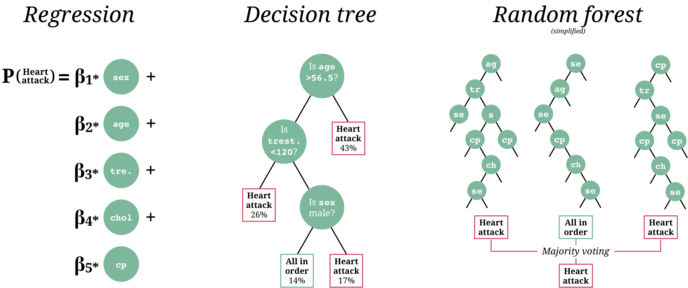

layout: true

<div class="my-footer">
  <span style="text-align:center">
    <span> 
      
    </span>
    <a href="https://therbootcamp.github.io/">
      <span style="padding-left:82px"> 
        <font color="#7E7E7E">
          www.therbootcamp.com
        </font>
      </span>
    </a>
    <a href="https://therbootcamp.github.io/">
      <font color="#7E7E7E">
       Maschinelles Lernen mit R | Oktober 2020
      </font>
    </a>
    </span>
  </div> 

---

```{r, eval = TRUE, echo = FALSE, warning=F,message=F}
# Code to knit slides
require(caret)
baselers <- readr::read_csv("data/baselers.csv")
source("https://raw.githubusercontent.com/therbootcamp/ML_2019Oct/master/_materials/code/baselrbootcamp_palettes.R")
```

```{r setup, include=FALSE}
options(htmltools.dir.version = FALSE)
# see: https://github.com/yihui/xaringan
# install.packages("xaringan")
# see: 
# https://github.com/yihui/xaringan/wiki
# https://github.com/gnab/remark/wiki/Markdown
options(width=110)
options(digits = 4)

require(tidyverse)

set.seed(102)
x <- rnorm(10)
y <- .7 * x + rnorm(10, sd = .3) + 2

data <- data.frame(x, y)

mod <- lm(y ~ x, data = data)

great_intercept <- mod$coefficients[1]
great_slope <- mod$coefficients[2]

bad_intercept <- 3.5
bad_slope <- -.5

x0 = x
x1 = x
y0 = y
y1 = great_intercept + great_slope * x

yhat_regression  = y1

dat_great <- data.frame(x0, x1, y0, y1)

x0 = x
x1 = x
y0 = y
y1 = bad_intercept + bad_slope * x

dat_bad <- data.frame(x0, x1, y0, y1)

library(tidyverse)

raw <- ggplot(dat_great, aes(x = x0, y = y0)) + geom_point(col = baselrbootcamp_cols("grey"), size = 2) +
  theme_minimal() +
  xlim(c(-2, 3)) +
  ylim(c(0, 5)) +
  labs(title = "Rohdaten",
       x = "Feature", y = "Kriterium")

great_raw <- ggplot(dat_great, aes(x = x0, y = y0)) + geom_point(col = baselrbootcamp_cols("grey"), size = 2) +
  geom_abline(slope = great_slope, intercept = great_intercept, size = .5, linetype = 3) +
  theme_minimal() +
  xlim(c(-2, 3)) +
  ylim(c(0, 5)) +
  labs(title = "Modell B",
              subtitle = paste0("B0 = ", round(great_intercept, 2), ", B1 = ", round(great_slope, 2)),

       x = "Feature", y = "Kriterium")

bad_raw <- ggplot(dat_bad, aes(x = x0, y = y0)) + geom_point(col = baselrbootcamp_cols("grey")) +
  geom_abline(slope = bad_slope, intercept = bad_intercept, size = .5, linetype = 3) +
  theme_minimal() +
  xlim(c(-2, 3)) +
  ylim(c(0, 5)) +
   labs(title = "Modell A",
        subtitle = paste0("B0 = ", round(bad_intercept, 2), ", B1 = ", round(bad_slope, 2)),
       x = "Feature", y = "Kriterium")

great_err <- great_raw +
  geom_linerange(data = dat_great, aes(x = x0, ymin = y0, ymax = y1), col = baselrbootcamp_cols("magenta")) +
  geom_point(data = dat_great, aes(x = x0, y = y1, size = 2), col = baselrbootcamp_cols("green"), pch = "X", size = 4) +
    labs(title = "Modell B",
       x = "Feature", y = "Kriterium")

bad_err <- bad_raw +
    geom_linerange(data = dat_bad, aes(x = x0, ymin = y0, ymax = y1), col = baselrbootcamp_cols("magenta")) +
    geom_point(data = dat_bad, aes(x = x0, y = y1, size = 2), col = baselrbootcamp_cols("green"), pch = "X", size = 4) +
   labs(title = "Modell A",
       x = "Feature", y = "Kriterium")


set.seed(103)
x <- rnorm(10)
y <- round(1 / (1 + exp(rnorm(10,0,1)+x-1)))

data <- data.frame(x, y)
mod <- glm(y ~ x, data = data, family='binomial')

great_intercept <- mod$coefficients[1]
great_slope <- mod$coefficients[2]

x0 = x
x1 = x
y0 = y
y1 = 1/(1+exp(-(great_intercept + great_slope * x)))

dat_great <- data.frame(x0, x1, y0, y1)


logreg1 = ggplot(dat_great, aes(x = x0, y = y0)) + geom_point(col = baselrbootcamp_cols("grey"), size = 2) +
  theme_minimal() +
  labs(x = "Feature", y = "Kriterium")

logreg2 = logreg1 +
  geom_line(aes(x0,y1), size = .5, linetype = 3) +
  geom_linerange(data = dat_great, aes(x = x0, ymin = y0, ymax = y1), col = baselrbootcamp_cols("magenta")) +
  geom_point(data = dat_great, aes(x = x0, y = y1, size = 2), col = baselrbootcamp_cols("green"), pch = "X", size = 4)


```


# Was ist maschinelles Lernen?

.pull-left45[

<ul>
  <li class="m1"><span><b>Maschinelles Lernen ist</b>...</span></li><br>
  <ul class="level">
    <li><span>...ein <high>Bereich der künstlichen Intelligenz</high>...</span></li><br>
    <li><span>...der mittels <high>statistischer Methoden</high>...</span></li><br>
    <li><span>...es Computern ermöglicht zu <high>lernen</high>...</span></li><br>
    <li><span>...d.h., fortwährend die eigene <high>Leistung</high> in (spezifischen) Aufgaben zu verbessert...</span></li><br>
    <li><span>...<high>ohne explizit programmiert</high> worden zu sein.</span></li>
  </ul>
</ul>

]


.pull-right45[

<p align = "center">
<br>
<font style="font-size:10px">from <a href="https://medium.com/@dkwok94/machine-learning-for-my-grandma-ca242e97ef62">medium.com</a></font>
</p>


]

---

.pull-left3[

# Bereiche des maschinellen Lernens

<ul>
  <li class="m1"><span>Es gibt verschiedene Bereiche des maschinellen Lernens mit jeweils eigenen Algorithmen.</span></li>
  <li class="m2"><span>Wir fokussieren auf den Bereich des <high>Supervised Learning</high> (Deutsch: überwachtes Lernen).</span></li>
</ul>

]

.pull-right65[

<br><br>

<p align = "center">
<br>
<font style="font-size:10px">from <a href="image/mltypes.png">amazonaws.com</a></font>
</p>
]

---

# Loss  Funktion

.pull-left45[

<ul>
<li class="m1"><span>Ein <high>zentrales Konzept</high> in der Statistik und im maschinellen Lernen.</span></li>
<li class="m2"><span>Die Loss Funktion fasst die <high>Fehler eines Modells zusammen</high>.</span></li>
</ul>
<p style="padding-top:7px">

$$\Large Loss = f(Fehler)$$

<p style="padding-top:7px">

<u>Zwei Zwecke</u>

<table style="cellspacing:0; cellpadding:0; border:none;">
<tr>
  <td>
    <b>Zweck</b>
  </td>
  <td>
    <b>Beschreibung</b>
  </td>
</tr>
<tr>
  <td bgcolor="white">
    Fitting
  </td>
  <td bgcolor="white">
    Finde Parameter, die die Verlustfunktion minimieren.
  </td>
</tr>
<tr>
  <td>
    Evaluation
  </td>
  <td>
    Berechne den Verlust für ein gefittetes Modell.
  </td>
</tr>
</table>

]


.pull-right45[

```{r, echo = FALSE, fig.width = 3, fig.height = 3, dpi = 200, out.width = "90%"}
bad_err + labs(title=element_blank(),subtitle = element_blank())
```


]

---

# Zwei Problemtypen

.pull-left5[

<ul>
  <li class="m1"><span><b>Regression</b></span></li>
  <br>
  <ul class="level">
    <li><span>Vorhersage eines <high>numerischen, kontinuierlichen Kriteriums</high>.</span></li><br>
    <li><span><i>Vorhersage des Cholesterinspiegels mit Alter</i></span></li>
  </ul><br>
  <li class="m2"><span><b>Klassifikation</b></span></li>
  <br>
  <ul class="level">
    <li><span>Vorhersage eines <high>kategorialen, diskreten Kriteriums</high>.</span></li><br>
    <li><span><i>Vorhersage, ob Herzinfarkt ja oder nein</i></span></li>
  </ul><br>
</ul>

]


.pull-right4[

<p align = "center">
<br>
</p>

]


---

# Drei Modelle des Supervised Learnings

<p align = "center" style="padding-top:20px">
<br>
</p>

---

# "Hold-out"-Daten

.pull-left45[

<ul>
  <li class="m1"><span>Die Performanz eines Modells wird i.a.R. über die Vorhersage <high><i>ungesehener</i> Daten</high> evaluiert.</span></li><br>
  <li class="m2"><span>Die <i>ungesehenen</i> Daten können <high>natürlich vorkommen</high>.</span></li>
  <ul class="level">
    <li><span>zB. Aktiendaten aus 2019 für ein Modell auf Basis von Aktiendaten aus 2018</span></li>
  </ul><br>
  <li class="m3"><span>Meist werden die <i>ungesehenen</i> Daten manuell kreiert in dem die verfügbaren Daten in <high>Training und Test</high> aufgeteilt werden.</span></li>
</ul>

]


.pull-right45[

<p align = "center">

</p>

]


---

.pull-left4[

<br><br>
# Overfitting

<ul>
  <li class="m1"><span>Tritt ein, wenn ein Modell die <high>Daten zu genau fitted</high> und deswegen <high>keine guten Vorhersagen</high> liefert.</span></li><br>
  <li class="m2"><span>Ein zu genauer fit bedeutet, dass z.T. züfällige Tendenzen, sog. <high>Rauschen gefittet</high> wird.</span></li><br>
  <li class="m3"><span><high>"Komplexere" Modelle</high> neigen mehr zu overfitting.</span></li>
</ul>

]


.pull-right5[
<br><br><br>
<p align = "center" style="padding-top:0px">

</p>

]


---

# 6 Schritte mit <mono>caret</mono>

.pull-left5[

Schritt 0: Lade daten

```{r, eval = FALSE}
data_train <- read_csv("1_Data/data.csv")
data_test <- read_csv("1_Data/data.csv")
```

Schritt 1: Definiere Kontrollparameter

```{r, eval = FALSE}
# Verwende Cross-Validation
ctrl <- trainControl(method = "cv")
```

Schritt 3: Trainiere Modell

```{r, eval = FALSE}
mod <- train(form = Y ~ .,  
             data = data_train,
             method = "My Favorite Model",
             trControl = ctrl)
```


]

.pull-right45[

Schritt 4: Inspiziere Modell

```{r, eval = FALSE}
mod            # Printe Objekt
mod$finalModel # Finales Modell
```

Schritt 5: Generiere Vorhersagen 

```{r, eval = FALSE}
# Generiere Vorhersagen
mod_pred <- predict(object = mod, 
                    newdata = data_test)
```

Schritt 6: Evaluiere Vorhersagen

```{r, eval = FALSE}
# Evaluiere Vorhersagen
postResample(pred = mod_pred, 
             obs = data_test$Y)
```

]

---

class: middle, center

<h1><a href=https://therbootcamp.github.io/ML_2020Apr/index.html>Schedule</a></h1>

