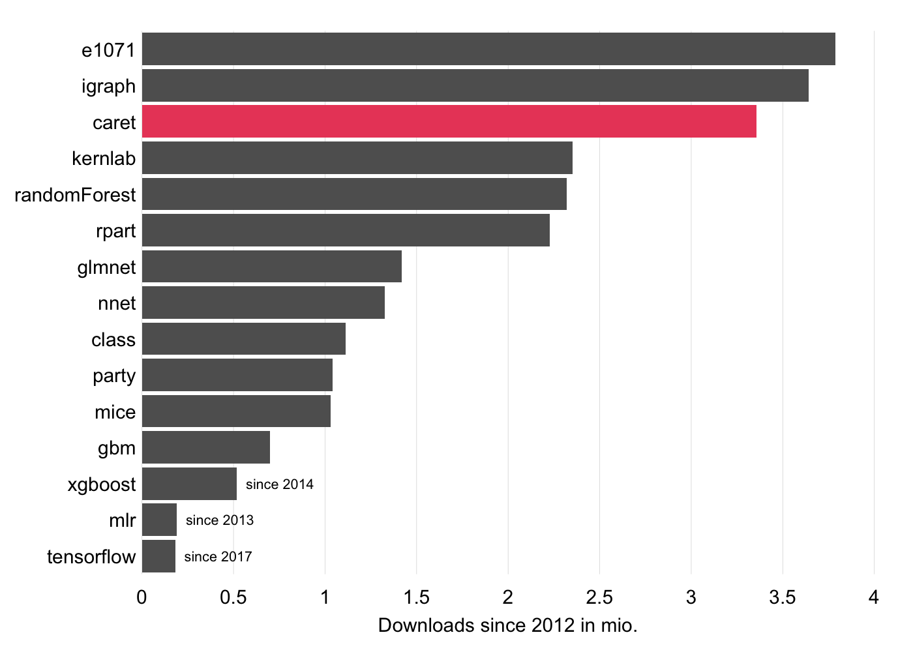
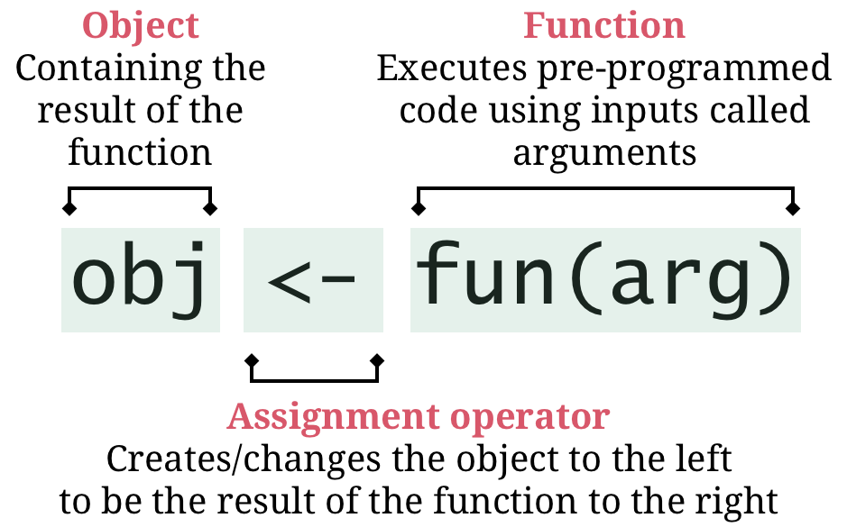
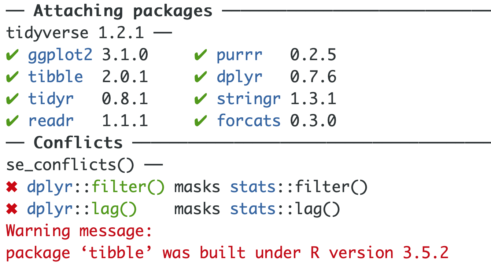

layout: true

<div class="my-footer">
  <span style="text-align:center">
    <span> 
      
    </span>
    <a href="https://therbootcamp.github.io/">
      <span style="padding-left:82px"> 
        <font color="#7E7E7E">
          www.therbootcamp.com
        </font>
      </span>
    </a>
    <a href="https://therbootcamp.github.io/">
      <font color="#7E7E7E">
       Machine Learning with R | October 2019
      </font>
    </a>
    </span>
  </div> 

---

```{r, eval = TRUE, echo = FALSE, warning=F,message=F}
# Code to knit slides
baselers <- readr::read_csv("data/baselers.csv")
```

```{r setup, include=FALSE}
options(htmltools.dir.version = FALSE)
# see: https://github.com/yihui/xaringan
# install.packages("xaringan")
# see: 
# https://github.com/yihui/xaringan/wiki
# https://github.com/gnab/remark/wiki/Markdown
options(width=110)
options(digits = 4)

require(tidyverse)
```

# R is a programming language

From [Wikipedia](https://en.wikipedia.org/wiki/Statistical_model) (emphasis added):

> A programming language is a **formal language** that specifies a set of instructions that can be used to produce various kinds of output. Programming languages generally consist of **instructions for a computer**. Programming languages can be used to create programs that **implement specific algorithms**.

.pull-left4[
### Algorithm
1. Load data
2. Extract variables
3. Run analysis
4. Print result
]

.pull-right6[
### Implementation in R
```{r,echo=F}
#link = 'https://raw.githubusercontent.com/therbootcamp/therbootcamp.github.io/master/_session#s/_data/my_data.txt'
```

```{r, results='hide'}
#data <- read.table(link)
#variables <- data[,c('group','variable')]
#analysis <- lm(variable ~ group, data = variables)
#summary(analysis)
```
]

---

# Why R?

.pull-left3[
R steadily **grows in popularity**. 

Today, R is one of the **most popular languages for data science** and overall. 

In terms of the number of data science jobs, **R beats SAS and Matlab**, and is on par with Python.

<p style="font-size:10px;float:bottom">
  Image source: https://i0.wp.com/r4stats.com/
<p>


]

.pull-right6[
<p align="center">
  
</p>
]

---

# R is so popular because

There are many good reasons to prefer R over superficially more user friendly software such as **Excel** or **SPSS** or more complex programming languages like **C++** or **Python**. 

.pull-left45[
### Pro
1. **It's free**
2. Relatively **easy**
3. **Extensibility** ([CRAN](https://cran.r-project.org/), packages)
4. **User base** (e.g., [stackoverflow](https://stackoverflow.com/))
5. [**Tidyverse**](https://www.tidyverse.org/) (`dplyr`, `ggplot`, etc.)
6. [**RStudio**](https://www.rstudio.com/)
7. **Productivity** options: [Latex](https://www.latex-project.org/), [Markdown](https://daringfireball.net/projects/markdown/), [GitHub](https://github.com/)
]

.pull-right45[
### Con (?)
It's slow, but... 

[Tidyverse](https://www.tidyverse.org/)
[Rcpp](http://www.rcpp.org/), [BH](https://cran.r-project.org/web/packages/BH/index.html): Links R to C++ and high-performance C++ libraries<br>
[rPython](http://rpython.r-forge.r-project.org/): Links R to Python<br>
[RHadoop](https://github.com/RevolutionAnalytics/RHadoop/wiki): Links R to Hadoop for big data applications.<br>
]


---

# R is great for ML

...because of high-performance R packages (extensions) downloaded and used millions of times.

<p align="center"></p>

---

# `caret`

.pull-left55[

The <high>C</high>lassification <high>A</high>nd <high>RE</high>gression <high>T</high>raining package is a meta-package to streamline the application of R's best machine learning tools.  

`caret` facilitates...<br><br>
&nbsp;&nbsp;&nbsp;&nbsp;1) <high>data pre-processing</high><br><br>
&nbsp;&nbsp;&nbsp;&nbsp;2) <high>feature selection</high><br><br>
&nbsp;&nbsp;&nbsp;&nbsp;3) <high>fitting, tuning, & model prediction</high><br><br>

Includes dozens of algorithms/models including...

<high>regression</high>, <high>decision trees</high>, <high>random forests</high>, neural nets, AdaBoost, elastic nets, <high>lasso & ridge regression</high>, support vector machines, etc.

]

.pull-right4[
<p align="center"></p>
<p align="center"></p>
<p align="center"></p>
]
---

<div class="center_text">
  <span>
  6+3+2 basic R lessons
  </span>
</div> 

---

# 6+3+2 basic R lessons 

.pull-left4[
<i>R essentials</i>
1. <high>Everything is an object</high>
2. <high><mono><-</mono> creates/changes objects</high>
3. Everything happens through functions
4. Functions have (default) arguments
5. Functions live in packages
6. Find help with <mono>?</mono>

<i>Analytic essentials</i>
7. Data lives in data frames
8. 3 data types + factors
9. `formula` and `data` specify a model 

<i>Productivity essentials</i>
10. Use RStudio and projects
11. Use editor, shortcuts, auto-complete
]

.pull-right5[

<p align="center">
  
</p>

]

---

# 6+3+2 basic R lessons 

.pull-left4[
<i>R essentials</i>
1. <high>Everything is an object</high>
2. <high><mono><-</mono> creates/changes objects</high>
3. Everything happens through functions
4. Functions have (default) arguments
5. Functions live in packages
6. Find help with <mono>?</mono>

<i>Analytic essentials</i>
7. Data lives in data frames
8. 3 data types + factors
9. `formula` and `data` specify a model 

<i>Productivity essentials</i>
10. Use RStudio and projects
11. Use editor, shortcuts, auto-complete
]

.pull-right5[
```{r}
# an object called one_two_three
one_two_three <- c(1, 2, 3)

# print object
one_two_three

# add 100 to the object's numbers (without <- )
one_two_three + 100

# print object (no <-, no change!)
one_two_three
```
]


---

# 6+3+2 basic R lessons 

.pull-left4[
<i>R essentials</i>
1. <high>Everything is an object</high>
2. <high><mono><-</mono> creates/changes objects</high>
3. Everything happens through functions
4. Functions have (default) arguments
5. Functions live in packages
6. Find help with <mono>?</mono>

<i>Analytic essentials</i>
7. Data lives in data frames
8. 3 data types + factors
9. `formula` and `data` specify a model

<i>Productivity essentials</i>
10. Use RStudio and projects
11. Use editor, shortcuts, auto-complete
]

.pull-right5[
```{r}
# print object
one_two_three

# make change permanent (with <- )
one_two_three <- one_two_three + 100

# print object (it has changed!)
one_two_three
```
]


---

# 6+3+2 basic R lessons 

.pull-left4[
<i>R essentials</i>
1. Everything is an object
2. <mono><-</mono> creates/changes objects
3. <high>Everything happens through functions</high>
4. Functions have (default) arguments
5. Functions live in packages
6. Find help with <mono>?</mono>

<i>Analytic essentials</i>
7. Data lives in data frames
8. 3 data types + factors
9. `formula` and `data` specify a model

<i>Productivity essentials</i>
10. Use RStudio and projects
11. Use editor, shortcuts, auto-complete
]

.pull-right5[
```{r}
# function c()
one_two_three <- c(1, 2, 3)

# function `+`()
one_two_three + 100

# function print()
one_two_three

# function mean()
mean(x = one_two_three)

```
]

---

# 6+3+2 basic R lessons 

.pull-left4[
<i>R essentials</i>
1. Everything is an object
2. <mono><-</mono> creates/changes objects
3. Everything happens through functions
4. <high>Functions have (default) arguments</high>
5. Functions live in packages
6. Find help with <mono>?</mono>

<i>Analytic essentials</i>
7. Data lives in data frames
8. 3 data types + factors
9. `formula` and `data` specify a model

<i>Productivity essentials</i>
10. Use RStudio and projects
11. Use editor, shortcuts, auto-complete
]

.pull-right5[
```{r, error=TRUE,tidy=T}
# no argument
mean()

# one (required) argument
mean(c(1, 2, 3))

# assume a missing value (NA)
mean(c(1, 2, 3, NA))

# changing default to handle NA
mean(c(1, 2, 3, NA), na.rm = TRUE)

```
]

---

# 6+3+2 basic R lessons  

.pull-left4[
<i>R essentials</i>
1. Everything is an object
2. <mono><-</mono> creates/changes objects
3. Everything happens through functions
4. <high>Functions have (default) arguments</high>
5. Functions live in packages
6. Find help with <mono>?</mono>

<i>Analytic essentials</i>
7. Data lives in data frames
8. 3 data types + factors
9. `formula` and `data` specify a model

<i>Productivity essentials</i>
10. Use RStudio and projects
11. Use editor, shortcuts, auto-complete
]

.pull-right5[
```{r}
# mean with pipe %>%
c(1, 2, 3) %>% mean()

# mean with pipe %>% and NA
c(1, 2, 3, NA) %>% mean()

# changing default to handle NA
c(1, 2, 3, NA) %>% mean(na.rm = TRUE)

```
]

---

# 6+3+2 basic R lessons 

.pull-left4[
<i>R essentials</i>
1. Everything is an object
2. <mono><-</mono> creates/changes objects
3. Everything happens through functions
4. Functions have (default) arguments
5. <high>Functions live in packages</high>
6. Find help with <mono>?</mono>

<i>Analytic essentials</i>
7. Data lives in data frames
8. 3 data types + factors
9. `formula` and `data` specify a model

<i>Productivity essentials</i>
10. Use RStudio and projects
11. Use editor, shortcuts, auto-complete
]

.pull-right5[

<p align="center"></p>

]

---

# 6+3+2 basic R lessons 

.pull-left4[
<i>R essentials</i>
1. Everything is an object
2. <mono><-</mono> creates/changes objects
3. Everything happens through functions
4. Functions have (default) arguments
5. <high>Functions live in packages</high>
6. Find help with <mono>?</mono>

<i>Analytic essentials</i>
7. Data lives in data frames
8. 3 data types + factors
9. `formula` and `data` specify a model

<i>Productivity essentials</i>
10. Use RStudio and projects
11. Use editor, shortcuts, auto-complete
]

.pull-right5[

<high>Install new packages</high> with `install.packages()`

```{r, eval = FALSE}
# install package: Only do this once!
install.packages("tidyverse")
```

<high>Load existing packages</high> with `library()`

```{r, eval = FALSE}
# load package: EVERY TIME you write code
library(tidyverse)
```

<p align="center"></p>

]

---

# 6+3+2 basic R lessons 

.pull-left4[
<i>R essentials</i>
1. Everything is an object
2. <mono><-</mono> creates/changes objects
3. Everything happens through functions
4. Functions have (default) arguments
5. Functions live in packages
6. <high>Find help with <mono>?</mono></high>

<i>Analytic essentials</i>
7. Data lives in data frames
8. 3 data types + factors
9. `formula` and `data` specify a model

<i>Productivity essentials</i>
10. Use RStudio and projects
11. Use editor, shortcuts, auto-complete
]

.pull-right5[
```{r}
?mean
```
<p align="center"></p>
]

---

# 6+3+2 basic R lessons 

.pull-left4[
<i>R essentials</i>
1. Everything is an object
2. <mono><-</mono> creates/changes objects
3. Everything happens through functions
4. Functions have (default) arguments
5. Functions live in packages
6. <high>Find help with <mono>?</mono></high>

<i>Analytic essentials</i>
7. Data lives in data frames
8. 3 data types + factors
9. `formula` and `data` specify a model

<i>Productivity essentials</i>
10. Use RStudio and projects
11. Use editor, shortcuts, auto-complete
]

.pull-right5[
```{r}
?cor
```
<p align="center"></p>
]

---

class: middle, center

<h1><a>Interactive</a></h1>

---

# 6+3+2 basic R lessons 

.pull-left4[
<i>R essentials</i>
1. Everything is an object
2. <mono><-</mono> creates/changes objects
3. Everything happens through functions
4. Functions have (default) arguments
5. Functions live in packages
6. Find help with <mono>?</mono>

<i>Analytic essentials</i>
7. <high>Data lives in data frames</high>
8. 3 data types + factors
9. `formula` and `data` specify a model

<i>Productivity essentials</i>
10. Use RStudio and projects
11. Use editor, shortcuts, auto-complete
]

.pull-right55[
</img>
]

---

# 6+3+2 basic R lessons 

.pull-left4[
<i>R essentials</i>
1. Everything is an object
2. <mono><-</mono> creates/changes objects
3. Everything happens through functions
4. Functions have (default) arguments
5. Functions live in packages
6. Find help with <mono>?</mono>

<i>Analytic essentials</i>
7. Data lives in data frames
8. <high>3 data types + factors</high>
9. `formula` and `data` specify a model 

<i>Productivity essentials</i>
10. Use RStudio and projects
11. Use editor, shortcuts, auto-complete
]


.pull-right5[
</img>
]


---

# 6+3+2 basic R lessons 

.pull-left4[
<i>R essentials</i>
1. Everything is an object
2. <mono><-</mono> creates/changes objects
3. Everything happens through functions
4. Functions have (default) arguments
5. Functions live in packages
6. Find help with <mono>?</mono>

<i>Analytic essentials</i>
7. Data lives in data frames
8. <high>3 data types + factors</high>
9. `formula` and `data` specify a model

<i>Productivity essentials</i>
10. Use RStudio and projects
11. Use editor, shortcuts, auto-complete
]


.pull-right5[
```{r, echo=FALSE,eval=T,warning=F,message=F,error=T}
require(tibble)
options(tibble.width = 48, tibble.max_extra_cols = 0)
```

```{r, error=T}
print(baselers)
```
]

---

# 6+3+2 basic R lessons 

.pull-left4[
<i>R essentials</i>
1. Everything is an object
2. <mono><-</mono> creates/changes objects
3. Everything happens through functions
4. Functions have (default) arguments
5. Functions live in packages
6. Find help with <mono>?</mono>

<i>Analytic essentials</i>
7. Data lives in data frames
8. <high>3 data types + factors</high>
9. `formula` and `data` specify a model


<i>Productivity essentials</i>
10. Use RStudio and projects
11. Use editor, shortcuts, auto-complete
]

.pull-right5[
```{r, echo=FALSE,eval=T,warning=F,message=F}
options(max.print=8,width=44)
```

```{r}
# select sex veriable using $
baselers$sex

# select sex veriable using %>% select
baselers %>% select(sex) %>% pull()
```

```{r, eval = F}
# Possible, but less pretty...
baselers[['sex']]
baselers[[2]]
```

```{r, echo=FALSE,eval=T,warning=F,message=F}
options(max.print=100,width=110)
```
]

---

# 6+3+2 basic R lessons 

.pull-left4[
<i>R essentials</i>
1. Everything is an object
2. <mono><-</mono> creates/changes objects
3. Everything happens through functions
4. Functions have (default) arguments
5. Functions live in packages
6. Find help with <mono>?</mono>

<i>Analytic essentials</i>
7. Data lives in data frames
8. <high>3 data types + factors</high>
9. `formula` and `data` specify a model

<i>Productivity essentials</i>
10. Use RStudio and projects
11. Use editor, shortcuts, auto-complete
]


.pull-right5[
```{r, echo=FALSE,eval=T,warning=F,message=F}
options(max.print=5,width=48)
```

```{r}
# original sex vector
baselers$sex

as.factor(baselers$sex)

as.factor(baselers$weight)
```

```{r, echo=FALSE,eval=T,warning=F,message=F}
options(max.print=100,width=110)
```
]

---

# 6+3+2 basic R lessons 

.pull-left4[
<i>R essentials</i>
1. Everything is an object
2. <mono><-</mono> creates/changes objects
3. Everything happens through functions
4. Functions have (default) arguments
5. Functions live in packages
6. Find help with <mono>?</mono>

<i>Analytic essentials</i>
7. Data lives in data frames
8. 3 data types + factors</high>
9. <high><mono>formula</mono> and <mono>data</mono> specify a model</high>

<i>Productivity essentials</i>
10. Use RStudio and projects
11. Use editor, shortcuts, auto-complete
]


.pull-right5[

```{r}
# Run a regression and store result in my_lm
my_lm <- lm(formula = income ~ age + height,
            data = baselers)
```
<br>
</img>
]


---

# 6+3+2 basic R lessons 

.pull-left4[
<i>R essentials</i>
1. Everything is an object
2. <mono><-</mono> creates/changes objects
3. Everything happens through functions
4. Functions have (default) arguments
5. Functions live in packages
6. Find help with <mono>?</mono>

<i>Analytic essentials</i>
7. Data lives in data frames
8. 3 data types + factors</high>
9. <high><mono>formula</mono> and <mono>data</mono> specify a model</high>

<i>Productivity essentials</i>
10. Use RStudio and projects
11. Use editor, shortcuts, auto-complete
]


.pull-right5[
<high>Add variables</high> using `+` 

```{r}
# Include multiple terms with +
my_lm <- lm(formula = income ~ age + height,
            data = baselers)
```

<high>Include all variables</high> using `formula = y ~ .`

```{r}
# Use  y ~ . to include ALL variables
my_lm <- lm(formula = income ~ .,
            data = baselers)
```

<high>Subtract variables</high> using `-`

```{r}
# Remove variables with -
my_lm <- lm(formula = income ~ . - id,
            data = baselers)
```

]


---

# 6+3+2 basic R lessons 

.pull-left4[
<i>R essentials</i>
1. Everything is an object
2. <mono><-</mono> creates/changes objects
3. Everything happens through functions
4. Functions have (default) arguments
5. Functions live in packages
6. Find help with <mono>?</mono>

<i>Analytic essentials</i>
7. Data lives in data frames
8. 3 data types + factors</high>
9. <mono>formula</mono> and <mono>data</mono> specify a model

<i>Productivity essentials</i>
10. <high>Use RStudio and projects</high>
11. Use editor, shortcuts, auto-complete
]

.pull-right5[
### Projects help...
save workspace and history &#9679; set project specific options &#9679; access files &#9679; version control &#9679; etc.
<p align="left"></p>
]

---

# 6+3+2 basic R lessons 

.pull-left4[
<i>R essentials</i>
1. Everything is an object
2. <mono><-</mono> creates/changes objects
3. Everything happens through functions
4. Functions have (default) arguments
5. Functions live in packages
6. Find help with <mono>?</mono>

<i>Analytic essentials</i>
7. Data lives in data frames
8. 3 data types + factors</high>
9. <mono>formula</mono> and <mono>data</mono> specify a model

<i>Productivity essentials</i>
10. <high>Use RStudio and projects</high>
11. Use editor, shortcuts, auto-complete
]

.pull-right5[
### Folder structure
Complement projects by a <high>folder structure</high> appropriate for your project.
<br><br>
<p align="left">
  
</p>

]

---

# 6+3+2 basic R lessons 

.pull-left4[
<i>R essentials</i>
1. Everything is an object
2. <mono><-</mono> creates/changes objects
3. Everything happens through functions
4. Functions have (default) arguments
5. Functions live in packages
6. Find help with <mono>?</mono>

<i>Analytic essentials</i>
7. Data lives in data frames
8. 3 data types + factors</high>
9. <mono>formula</mono> and <mono>data</mono> specify a model

<i>Productivity essentials</i>
10. Use RStudio and projects
11. <high>Use editor, shortcuts, auto-complete</high>
]


.pull-right5[

</img>
<br><br><br>
Shortcut to <high>send to console</high>:<br><br2><font size = 6>&#8984;/ctrl + &#9166;</font><br><br2><br2>
Shortcut to <high>rerun chunk</high>:<br><br2><font size = 6>  &#8984;/ctrl + &#8679; + p</font>
]


---

# 6+3+2 basic R lessons 

.pull-left4[
<i>R essentials</i>
1. Everything is an object
2. <mono><-</mono> creates/changes objects
3. Everything happens through functions
4. Functions have (default) arguments
5. Functions live in packages
6. Find help with <mono>?</mono>

<i>Analytic essentials</i>
7. Data lives in data frames
8. 3 data types + factors</high>
9. <mono>formula</mono> and <mono>data</mono> specify a model

<i>Productivity essentials</i>
10. Use RStudio and projects
11. <high>Use editor, shortcuts, auto-complete</high>
]


.pull-right5[

```{r, eval = FALSE}
# Load packages with library()
library(tidyverse)
library(yarrr)
library(lme4)

# import data with 
baselers <- read_delim(file = "baselers.txt",
                       delim = '\t')
```
]

---

# 6+3+2 basic R lessons 

.pull-left4[
<i>R essentials</i>
1. Everything is an object
2. <mono><-</mono> creates/changes objects
3. Everything happens through functions
4. Functions have (default) arguments
5. Functions live in packages
6. Find help with <mono>?</mono>

<i>Analytic essentials</i>
7. Data lives in data frames
8. 3 data types + factors</high>
9. <mono>formula</mono> and <mono>data</mono> specify a model

<i>Productivity essentials</i>
10. Use RStudio and projects
11. <high>Use editor, shortcuts, auto-complete</high>
]

.pull-right55[

</img>

]

---

# 6+3+2 basic R lessons 

.pull-left4[
<i>R essentials</i>
1. Everything is an object
2. <mono><-</mono> creates/changes objects
3. Everything happens through functions
4. Functions have (default) arguments
5. Functions live in packages
6. Find help with <mono>?</mono>

<i>Analytic essentials</i>
7. Data lives in data frames
8. 3 data types + factors</high>
9. <mono>formula</mono> and <mono>data</mono> specify a model

<i>Productivity essentials</i>
10. Use RStudio and projects
11. <high>Use editor, shortcuts, auto-complete</high>
]

.pull-right55[

</img>

]

---

# 6+3+2 basic R lessons 

.pull-left4[
<i>R essentials</i>
1. Everything is an object
2. <mono><-</mono> creates/changes objects
3. Everything happens through functions
4. Functions have (default) arguments
5. Functions live in packages
6. Find help with <mono>?</mono>

<i>Analytic essentials</i>
7. Data lives in data frames
8. 3 data types + factors</high>
9. <mono>formula</mono> and <mono>data</mono> specify a model

<i>Productivity essentials</i>
10. Use RStudio and projects
11. <high>Use editor, shortcuts, auto-complete</high>
]

.pull-right55[

</img>

]


---

class: middle, center
<h1><a href="https://therbootcamp.github.io/ML_2019Oct/1_Data/baselrbootcamp_MLdata.zip">Download</a></h1>

---

class: middle, center

<h1><a>Interactive</a></h1>

