layout: true

<div class="my-footer">
  <span style="text-align:center">
    <span> 
      
    </span>
    <a href="https://therbootcamp.github.io/">
      <span style="padding-left:82px"> 
        <font color="#7E7E7E">
          www.therbootcamp.com
        </font>
      </span>
    </a>
    <a href="https://therbootcamp.github.io/">
      <font color="#7E7E7E">
      Maschinelles Lernen mit R | Oktober 2020
      </font>
    </a>
    </span>
  </div> 

---

```{r, eval = TRUE, echo = FALSE, warning=F,message=F}
library(tidyverse)
# Code to knit slides
#baselers <- readr::read_csv("/1_Data/basel.csv")


source("https://raw.githubusercontent.com/therbootcamp/ML_2019Oct/master/_materials/code/baselrbootcamp_palettes.R")
```


```{r setup, include=FALSE}
options(htmltools.dir.version = FALSE)
# see: https://github.com/yihui/xaringan
# install.packages("xaringan")
# see:
# https://github.com/yihui/xaringan/wiki
# https://github.com/gnab/remark/wiki/Markdown
options(width=110)
options(digits = 4)

require(tidyverse)
gap1952 = gapminder::gapminder %>% filter(country != 'Kuwait') %>%
  rename('BIP pro Kopf' = gdpPercap, Lebenserwartung = lifeExp) %>% 
  filter(year == 1952) %>% select('BIP pro Kopf', Lebenserwartung)

```

<br><br>

# Unsupervised learning

.pull-left45[

<ul>
  <li class="m1"><span>Ziel des Unsupervised learning ist die Identifikation <high>versteckter Muster</high> in den <high>Ähnlichkeiten</high> zwischen Cases oder Features.</span></li><br>
  <li class="m2"><span>Man unterscheidet zwei Unterbereiche: <high>Clusteranalyse</high> und <high>Dimensionsreduktion</high>.</span></li><br>
</ul>

]


.pull-right45[

<p align = "center">
<br>
<font style="font-size:10px">from <a href="https://www.c-span.org/organization/?9764/Copley-News-Service">c-span.org</a></font>
</p>

]

---

.pull-left35[

# Zwei Kernbereiche des UL

<ul>
  <li class="m1"><span><b>Dimensionsreduktion</b></span></li>
  <ul>
    <li><span>Basiert auf den Ähnlichkeiten der <high>Features</high>.</span></li>
    <li><span>Dient der <high>Identifikation der relevanten Dimensionen</high> in den Daten und ist ein Kernbestandteil des Deep Learnings.</span></li>
  </ul><br>
  <li class="m2"><span><b>Clusteranalyse</b></span></li>
  <ul>
    <li><span>Basiert auf den Ähnlichkeiten der <high>Cases</high>.</span></li>
    <li><span>Dient der <high>Identifikation von Gruppen und Ausreissern</high> in den Daten.</span></li>
  </ul>  
</ul>

]


.pull-right55[

<br>

<p align = "center">
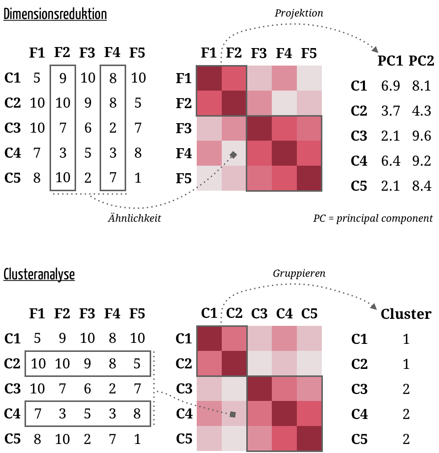<br>
</p>

]


---

.pull-left4[

# Gapminder

<ul>
  <li class="m1"><span>Hans Rosling's Gapminder Projekt kartographiert die <high>gesundheitliche und ökonomische Entwicklung in den Ländern</high> der Welt.</span></li>
  <li class="m2"><span>Gibt es klar abgrenzbare Klassen von Ländern</high>: z.B. <high>Entwickelte versus Entwicklungsländer</high>.</span></li>
</ul>

<p align = "center" style="margin-top:55px">
<br>
<font style="font-size:10px">Hans Rosling, 1948-2017, adapted from <a href="https://www.volkskrant.nl/cultuur-media/hans-rosling-68-volksverheffer-met-rocksterstatus~b3746a58/?referer=https%3A%2F%2Fwww.google.com%2F">volkskrant.nl</a></font>
</p>

]


.pull-right5[
<br>
<p align = "center">
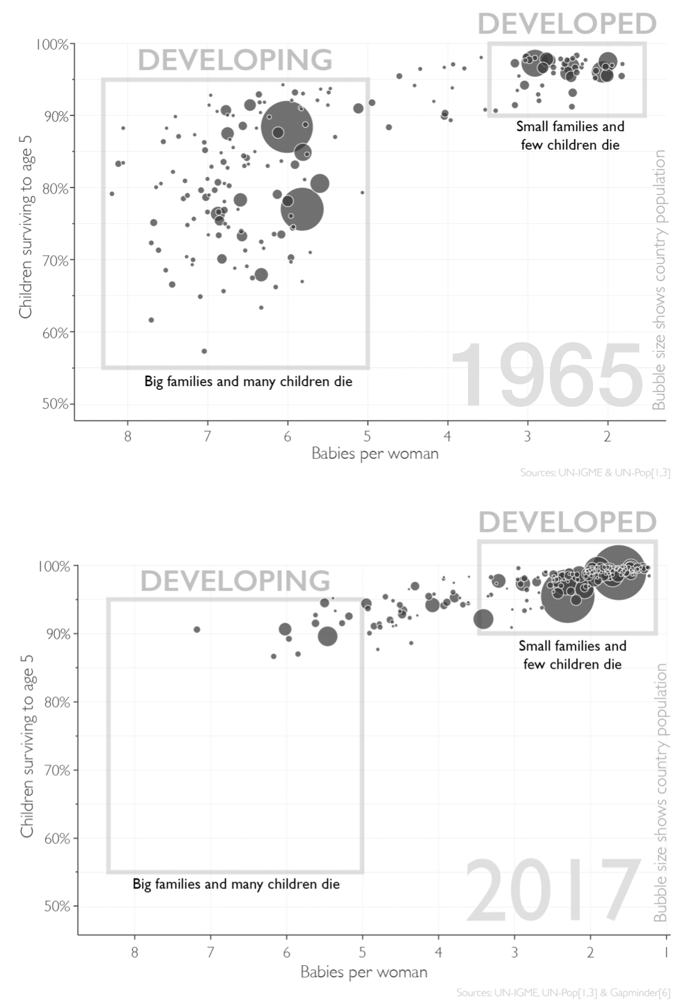<br>
<font style="font-size:10px">adapted from <a href="https://www.ullstein-buchverlage.de/nc/buch/details/factfulness-9783548060415.html">Factfulness, Hans Rosling, Ullstein</a></font>
</p>

]

---

.pull-left4[

# Gapminder

<ul>
  <li class="m1"><span>Hans Rosling's Gapminder Projekt kartographiert die <high>gesundheitlichz und ökonomische Entwicklung in den Ländern</high> der Welt.</span></li>
  <li class="m2"><span>Gibt es klar abgrenzbare Klassen von Ländern</high>: z.B. <high>Entwickelte versus Entwicklungsländer</high>.</span></li>
</ul>

<p align = "center" style="margin-top:55px">
<br>
<font style="font-size:10px">Hans Rosling, 1948-2017, adapted from <a href="https://www.volkskrant.nl/cultuur-media/hans-rosling-68-volksverheffer-met-rocksterstatus~b3746a58/?referer=https%3A%2F%2Fwww.google.com%2F">volkskrant.nl</a></font>
</p>

]


.pull-right5[
<br>
<p align = "center">
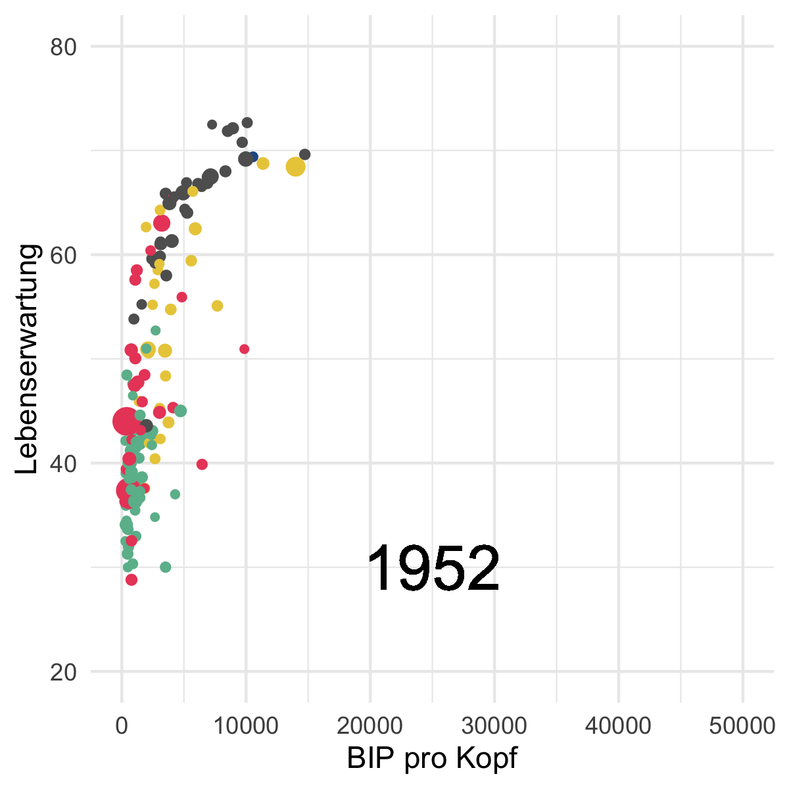<br>
<font style="font-size:10px">data from <a href="https://cran.r-project.org/web/packages/gapminder/README.html">gapminder</a></font>
</p>

]

---

.pull-left4[

# Gap in 1952

<ul>
  <li class="m1"><span>Gibt es <high>in 1952 Klassen von Ländern</high> gemäss Lebenserwartung und BIP pro Kopf in 1952?</span></li><br>
  <li class="m2"><span>Verfahren:</span></li><br>
  <ul>
    <li><span><high><i>k</i>-means</high></span></li><br>
    <li><span><high>DBSCAN</high></span></li><br>
    <li><span><high>Gaussian mixtures</high></span></li>
  </ul>
</ul>

]


.pull-right5[
<br>
<p align = "center">
<br>
</p>

]


---

.pull-left4[

# <i>k</i>-means

<ul>
  <li class="m1"><span>Das Standardverfahren für Clusteranalyse.</span></li><br>
  <li class="m2"><span><b>Algorithmus</b></span></li><br>
  <ol class="">
    <li><span>Zufällige <high>Startpunkte</high> für die Clusterzentroide wählen.</span></li><br>
    <li><span>Cases dem nächstgelegenen <high>Klassenzentroid zuweisen</high>.</span></li><br>
    <li><span><high>Neue Clusterzentroide</high> als Mittel aller Cases eines Clusters berechnen.</span></li>
  </ol>
</ul>

]

.pull-right5[

<br>
<p align = "center">
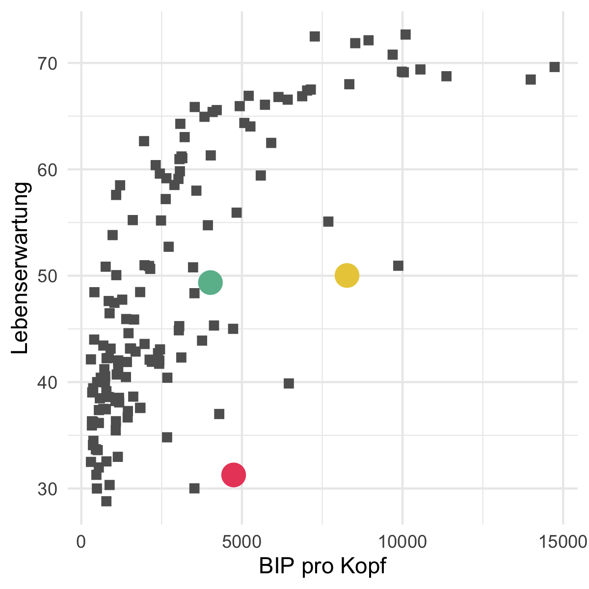<br>
</p>

]

---

.pull-left4[

# <i>k</i>-means

<ul>
  <li class="m1"><span>Das Standardverfahren für Clusteranalyse.</span></li><br>
  <li class="m2"><span><b>Algorithmus</b></span></li><br>
  <ol class="">
    <li><span>Zufällige <high>Startpunkte</high> für die Clusterzentroide wählen.</span></li><br>
    <li><span>Cases dem nächstgelegenen <high>Klassenzentroid zuweisen</high>.</span></li><br>
    <li><span><high>Neue Clusterzentroide</high> als Mittel aller Cases eines Clusters berechnen.</span></li>
  </ol>
</ul>

]

.pull-right5[

<br>

```{r, echo = F}
options(width=50)
```

```{r}

# berechne k-means
gap_kmeans <- kmeans(gap1952, 
                     centers = 3)

# zeige Inhalte
names(gap_kmeans)

# zeige Cluster
gap_kmeans$cluster

```


]


---

.pull-left4[

# <i>k</i>-selection

<ul>
  <li class="m1"><span>Es gibt <high>kein richtiges <i>k</i></high>!.</span></li><br>
  <li class="m2"><span>Durch Abwägung folgender zwei Aspekte können <high>angemessene <i>k</i></high> identifziert werden:</span></li>
  <ul>
    <li><span><i>k</i> sollte <high>möglichst klein</high> sein.</span></li>
    <li><span>Mit <i>k</i> sollte das Modell die <high>Daten möglichst gut beschreiben</high>.</span></li>
  </ul><br>
  <li class="m3"><span><b>Ansätze</b></span></li>
  <ul>
    <li><span>Ellbogen der <high>Binnenvarianz</high>.</span></li>
    <li><span>Gap-Statistik.</span></li>
    <li><span>Slope-Statistik.</span></li>
    <li><span>Cluster-Instabilität.</span></li>
    <li><span>etc.</span></li>
  </ul>
  </ul>
</ul>

]

.pull-right5[

<br>

<p align = "center">
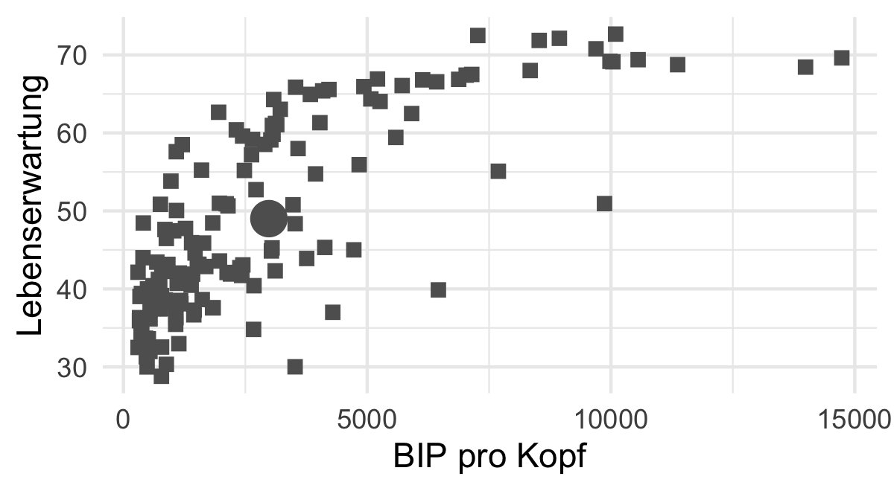<br>
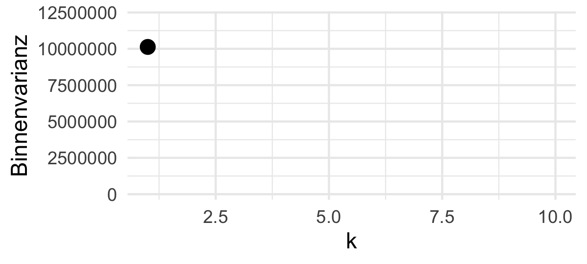<br>
</p>

]

---

.pull-left4[

# <i>k</i>-selection

<ul>
  <li class="m1"><span>Es gibt <high>kein richtiges <i>k</i></high>!.</span></li><br>
  <li class="m2"><span>Durch Abwägung folgender zwei Aspekte können <high>angemessene <i>k</i></high> identifziert werden:</span></li>
  <ul>
    <li><span><i>k</i> sollte <high>möglichst klein</high> sein.</span></li>
    <li><span>Mit <i>k</i> sollte das Modell die <high>Daten möglichst gut beschreiben</high>.</span></li>
  </ul><br>
  <li class="m3"><span><b>Ansätze</b></span></li>
  <ul>
    <li><span>Ellbogen der <high>Binnenvarianz</high>.</span></li>
    <li><span>Gap-Statistik.</span></li>
    <li><span>Slope-Statistik.</span></li>
    <li><span>Cluster-Instabilität.</span></li>
    <li><span>etc.</span></li>
  </ul>
  </ul>
</ul>

]

.pull-right5[

<br><br><br><br>

```{r, echo = F}
options(width=50)
```

```{r, message = F}

# lade cstab
library(cstab)

# berechne k-sel
gap_ksel <- cDistance(as.matrix(gap1952), 
                      kseq = 2:10,
                      method = "kmeans")

# zeige geschätze Clusteranzahl
gap_ksel$k_Gap
gap_ksel$k_Slope

```
]

---

.pull-left4[

# <i>k</i>-selection

<ul>
  <li class="m1"><span>Es gibt <high>kein richtiges <i>k</i></high>!.</span></li><br>
  <li class="m2"><span>Durch Abwägung folgender zwei Aspekte können <high>angemessene <i>k</i></high> identifziert werden:</span></li>
  <ul>
    <li><span><i>k</i> sollte <high>möglichst klein</high> sein.</span></li>
    <li><span>Mit <i>k</i> sollte das Modell die <high>Daten möglichst gut beschreiben</high>.</span></li>
  </ul><br>
  <li class="m3"><span><b>Ansätze</b></span></li>
  <ul>
    <li><span>Ellbogen der <high>Binnenvarianz</high>.</span></li>
    <li><span>Gap-Statistik.</span></li>
    <li><span>Slope-Statistik.</span></li>
    <li><span>Cluster-Instabilität.</span></li>
    <li><span>etc.</span></li>
  </ul>
  </ul>
</ul>

]

.pull-right5[

<br><br><br><br>

```{r, echo = F, message=F}
options(width=50)
library(cstab)
gap_ksel <- cStability(as.matrix(gap1952), 
                      kseq = 2:10, nB=20,
                      method = "kmeans",
                      pbar = F)
```

```{r, eval = F, message = F}

# lade cstab
library(cstab)

# berechne k-sel
gap_ksel <- cStability(as.matrix(gap1952), 
                      kseq = 2:10,
                      method = "kmeans")
```

```{r, message = F}
# zeige geschätze Clusteranzahl
gap_ksel$k_instab

```


]


---

.pull-left4[

# DBSCAN

<ul>
  <li class="m1"><span>DBSCAN = Density-Based Spatial Clustering of Applications with Noise.</span></li><br>
  <li class="m2"><span><b>Algorithmus</b></span></li><br>
  <ol>
    <li><span>Für jeden Punkt Anzahl anderer <high>Punkte im Abstand von <b>&epsilon;</b></high> überprüfen:<br>a. N = 0 <b>&rarr;</b> <high>Ausreisser</high><br>b. N &ge; <i>minPts</i> <b>&rarr;</b> <high>Kernpunkt</high><br>c. <i>minPts</i> &gt; N &gt; 0 <b>&rarr;</b> <high>unbestimmt</high></span></li><br>
    <li><span><high>Kernpunkte</high> mit Abstand &lt <b>&epsilon;</b>; zueinander zu Clustern verbinden.</span></li><br>
    <li><span><high>Unbestimmte Punkte</high> mit Abstand &lt <b>&epsilon;</b>; zu Kernpunkten dem Cluster hinzufügen, sonst Ausreisser.</span></li>
  </ol>
</ul>

]

.pull-right5[

<br>
<p align = "center">
<font style="font-size:20px;font-weight:900">&epsilon; = .2</font>
<br>
</p>

]

---

.pull-left4[

# DBSCAN

<ul>
  <li class="m1"><span>DBSCAN = Density-Based Spatial Clustering of Applications with Noise.</span></li><br>
  <li class="m2"><span><b>Algorithmus</b></span></li><br>
  <ol>
    <li><span>Für jeden Punkt Anzahl anderer <high>Punkte im Abstand von <b>&epsilon;</b></high> überprüfen:<br>a. N = 0 <b>&rarr;</b> <high>Ausreisser</high><br>b. N &ge; <i>minPts</i> <b>&rarr;</b> <high>Kernpunkt</high><br>c. <i>minPts</i> &gt; N &gt; 0 <b>&rarr;</b> <high>unbestimmt</high></span></li><br>
    <li><span><high>Kernpunkte</high> mit Abstand &lt <b>&epsilon;</b>; zueinander zu Clustern verbinden.</span></li><br>
    <li><span><high>Unbestimmte Punkte</high> mit Abstand &lt <b>&epsilon;</b>; zu Kernpunkten dem Cluster hinzufügen, sonst Ausreisser.</span></li>
  </ol>
</ul>

]

.pull-right5[

<br>
<p align = "center">
<font style="font-size:20px;font-weight:900">&epsilon; = .3</font>
<br>
</p>

]

---

.pull-left4[

# DBSCAN

<ul>
  <li class="m1"><span>DBSCAN = Density-Based Spatial Clustering of Applications with Noise.</span></li><br>
  <li class="m2"><span><b>Algorithmus</b></span></li><br>
  <ol>
    <li><span>Für jeden Punkt Anzahl anderer <high>Punkte im Abstand von <b>&epsilon;</b></high> überprüfen:<br>a. N = 0 <b>&rarr;</b> <high>Ausreisser</high><br>b. N &ge; <i>minPts</i> <b>&rarr;</b> <high>Kernpunkt</high><br>c. <i>minPts</i> &gt; N &gt; 0 <b>&rarr;</b> <high>unbestimmt</high></span></li><br>
    <li><span><high>Kernpunkte</high> mit Abstand &lt <b>&epsilon;</b>; zueinander zu Clustern verbinden.</span></li><br>
    <li><span><high>Unbestimmte Punkte</high> mit Abstand &lt <b>&epsilon;</b>; zu Kernpunkten dem Cluster hinzufügen, sonst Ausreisser.</span></li>
  </ol>
</ul>

]

.pull-right5[

<br><br><br><br>

```{r, echo = F, message=F}
options(width=50)
```

```{r, eval = T, message = F}

# lade dbscan
library(dbscan)

# berechne dbscan
gap_dbscan <- dbscan(scale(gap1952), 
                     eps = .2)

# zeige Ergebnis
gap_dbscan

```

]

---

.pull-left4[

# Eigenschaften von DBSCAN

<ul>
  <li class="m1"><span><b>Vorteile</b></span></li>
  <ul>
    <li><span><high>Identifiziert <i>k</i></high> eigenständig.</span></li>
    <li><span>Kann <high>"komplexe" Cluster</high> identifizieren.</span></li>
    <li><span>Eignet sich für die Erkennung von <high>Anomalien</high>.</span></li>
  </ul>
<li class="m2"><span><b>Nachteile</b>.</span></li>
  <ul>
    <li><span>Reagiert <high>sehr sensibel</high> auf Änderungen der Parameter.</span></li>
    <li><span>Schwierigkeiten mit <high>Clustern ungleicher Dichte</high>.</span></li>
  </ul>
</ul>

]

.pull-right5[

<p align = "center">
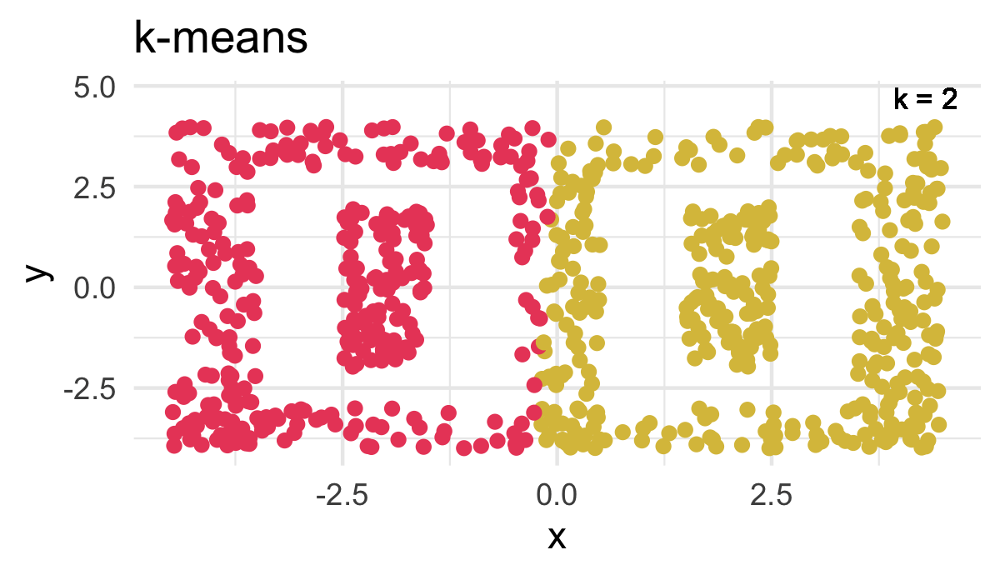<br>
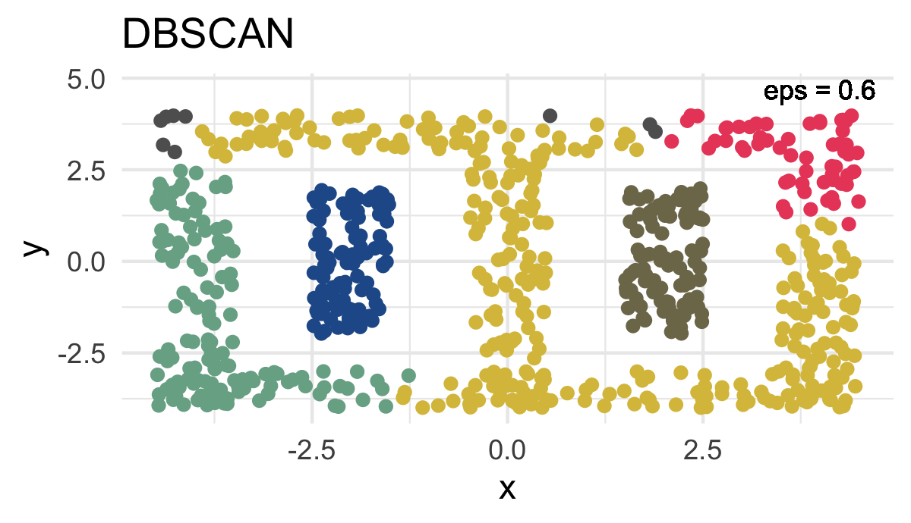<br>
</p>

]

---

.pull-left4[

# Eigenschaften von DBSCAN

<ul>
  <li class="m1"><span><b>Vorteile</b></span></li>
  <ul>
    <li><span><high>Identifiziert <i>k</i></high> eigenständig.</span></li>
    <li><span>Kann <high>"komplexe" Cluster</high> identifizieren.</span></li>
    <li><span>Eignet sich für die Erkennung von <high>Anomalien</high>.</span></li>
  </ul><br>
<li class="m2"><span><b>Nachteile</b>.</span></li>
  <ul>
    <li><span>Reagiert <high>sehr sensibel</high> auf Änderungen der Parameter.</span></li>
    <li><span>Schwierigkeiten mit <high>Clustern ungleicher Dichte</high>.</span></li>
  </ul>
</ul>

]

.pull-right5[

<p align = "center">
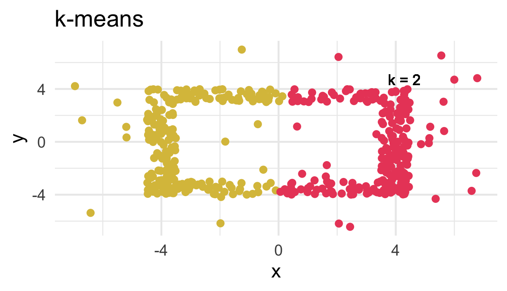<br>
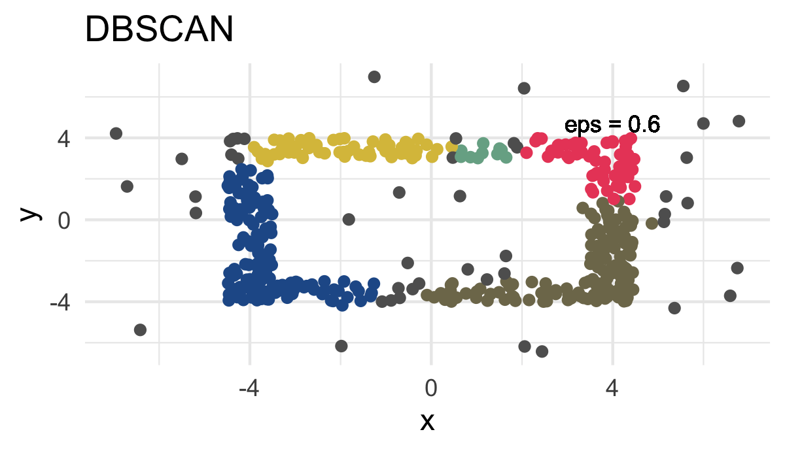<br>
</p>

]


---

.pull-left4[

# Eigenschaften von DBSCAN

<ul>
  <li class="m1"><span><b>Vorteile</b></span></li>
  <ul>
    <li><span><high>Identifiziert <i>k</i></high> eigenständig.</span></li>
    <li><span>Kann <high>"komplexe" Cluster</high> identifizieren.</span></li>
    <li><span>Eignet sich für die Erkennung von <high>Anomalien</high>.</span></li>
  </ul><br>
<li class="m2"><span><b>Nachteile</b>.</span></li>
  <ul>
    <li><span>Reagiert <high>sehr sensibel</high> auf Änderungen der Parameter.</span></li>
    <li><span>Schwierigkeiten mit <high>Clustern ungleicher Dichte</high>.</span></li>
  </ul>
</ul>

]

.pull-right5[

<p align = "center">
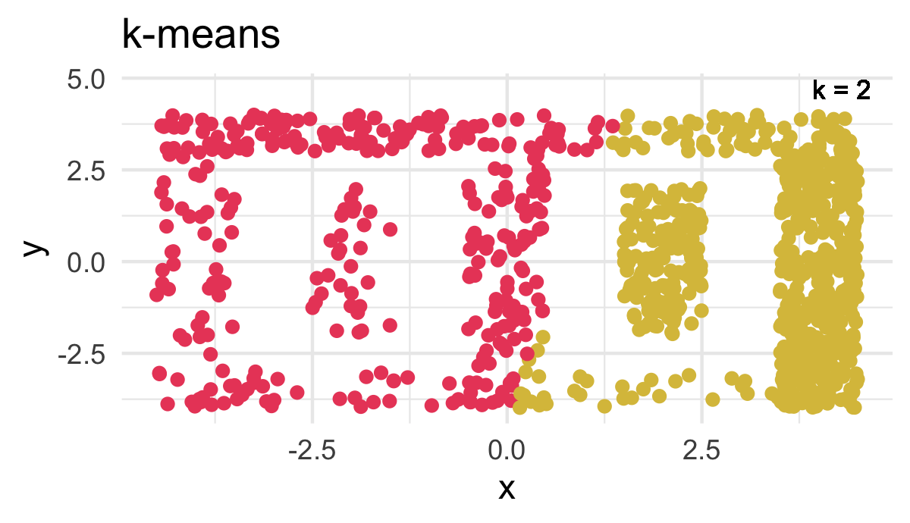<br>
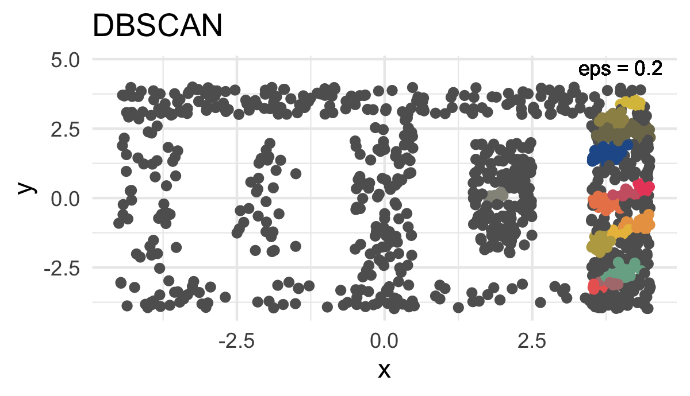<br>
</p>

]

---

.pull-left4[

# Gaussian mixtures

<ul>
  <li class="m1"><span>Eine probabilistische <high>Erweiterung des <i>k</i>-means Algorithmus</high> auf Basis multivariater Normalverteilungen</span></li>
  <li class="m2"><span>Guter Umgang mit Clustern verschiedener <high>Orientierungen und Dichten</high></span></li>
    <li class="m3"><span>Einfache Schätzung <i>k</i> über <high>Modellvergleiche</high></span></li>
    <li class="m4"><span><high>Komplexe Topologien</high> bereiten Gaussian mixtures jedoch Schwierigkeiten</span></li>
</ul>

]

.pull-right5[

<br>

<p align = "center">
<br>
</p>

]

---

.pull-left4[

# Gaussian mixtures

<ul>
  <li class="m1"><span>Eine probabilistische <high>Erweiterung des <i>k</i>-means Algorithmus</high> auf Basis multivariater Normalverteilungen</span></li>
  <li class="m2"><span>Guter Umgang mit Clustern verschiedener <high>Orientierungen und Dichten</high></span></li>
    <li class="m3"><span>Einfache Schätzung <i>k</i> über <high>Modellvergleiche</high></span></li>
    <li class="m4"><span><high>Komplexe Topologien</high> bereiten Gaussian mixtures jedoch Schwierigkeiten</span></li>
</ul>

]

.pull-right5[

<br>

<p align = "center">
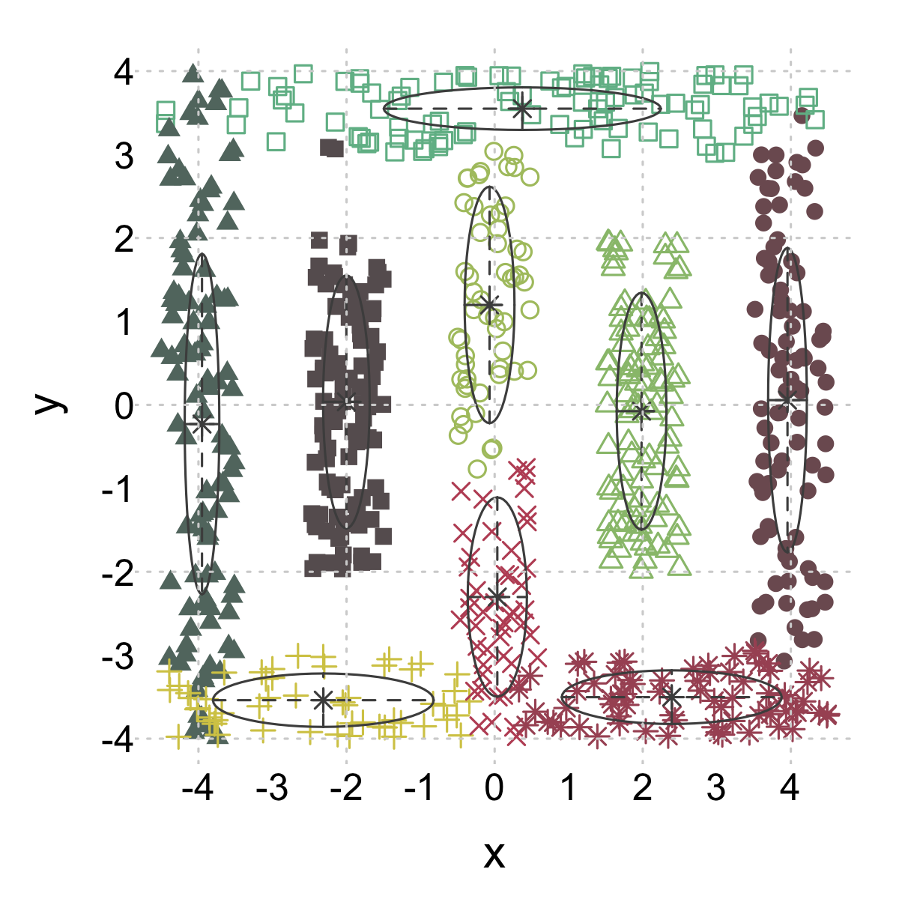<br>
</p>

]

---

.pull-left4[

# Gaussian mixtures

<ul>
  <li class="m1"><span>Eine probabilistische <high>Erweiterung des <i>k</i>-means Algorithmus</high> auf Basis multivariater Normalverteilungen</span></li>
  <li class="m2"><span>Guter Umgang mit Clustern verschiedener <high>Orientierungen und Dichten</high></span></li>
    <li class="m3"><span>Einfache Schätzung <i>k</i> über <high>Modellvergleiche</high></span></li>
    <li class="m4"><span><high>Komplexe Topologien</high> bereiten Gaussian mixtures jedoch Schwierigkeiten</span></li>
</ul>

]

.pull-right5[

<br><br><br><br>

```{r, echo = F, message=F}
options(width=50)
```

```{r, eval = T, message = F}

# lade gaussian mixture
library(mclust)

# berechne gaussian mixture
gap_mclust <- Mclust(gap1952)

# zeige Ergebnis
gap_mclust

```

]

---

.pull-left4[

# Gaussian mixtures

<ul>
  <li class="m1"><span>Eine probabilistische <high>Erweiterung des <i>k</i>-means Algorithmus</high> auf Basis multivariater Normalverteilungen</span></li>
  <li class="m2"><span>Guter Umgang mit Clustern verschiedener <high>Orientierungen und Dichten</high></span></li>
    <li class="m3"><span>Einfache Schätzung <i>k</i> über <high>Modellvergleiche</high></span></li>
    <li class="m4"><span><high>Komplexe Topologien</high> bereiten Gaussian mixtures jedoch Schwierigkeiten</span></li>
</ul>

]

.pull-right5[

<br><br><br><br>

```{r, echo = F, message=F}
options(width=50)
```

```{r, eval = T, message = F}

# lade gaussian mixture
library(mclust)

# berechne gaussian mixture
gap_mclust <- Mclust(gap1952)

# zeige Ergebnis
gap_mclust$classification

```

]


---
class: middle, center

<h1><a href=https://therbootcamp.github.io/ML_2020Oct/_sessions/Unsupervised/Unsupervised_practical.html>Practical</a></h1>
