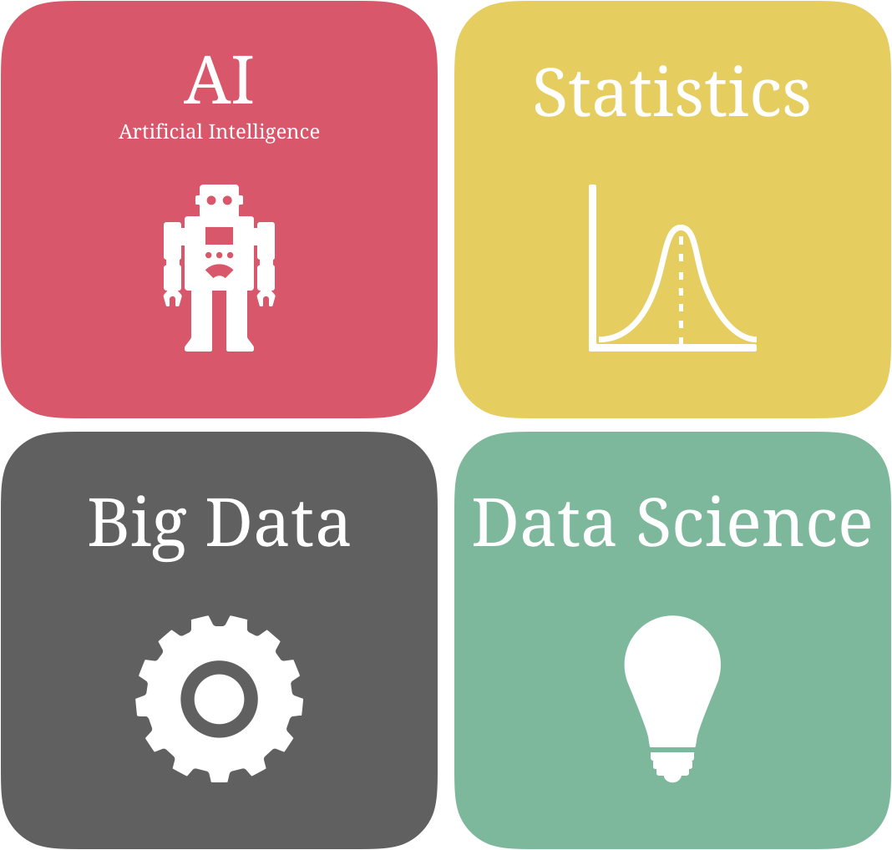
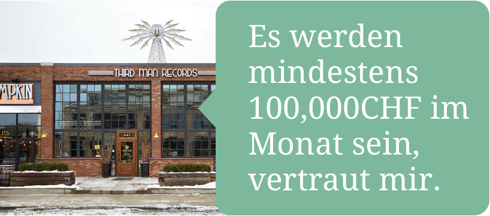
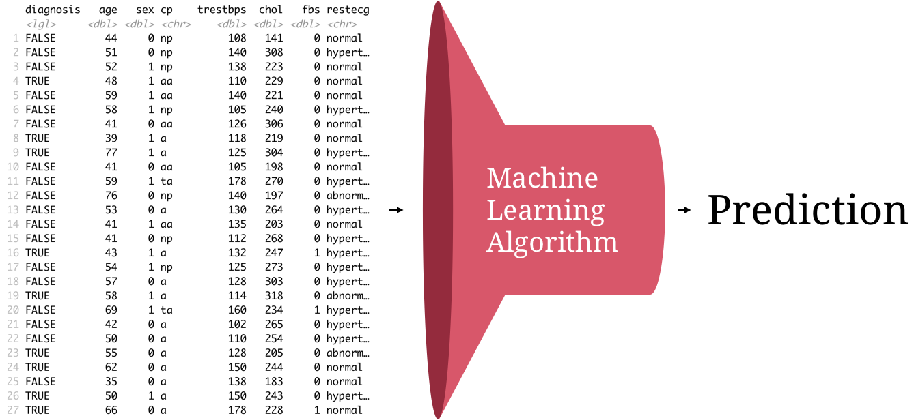
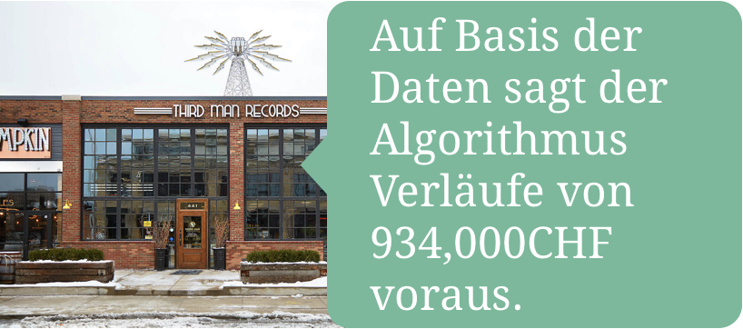
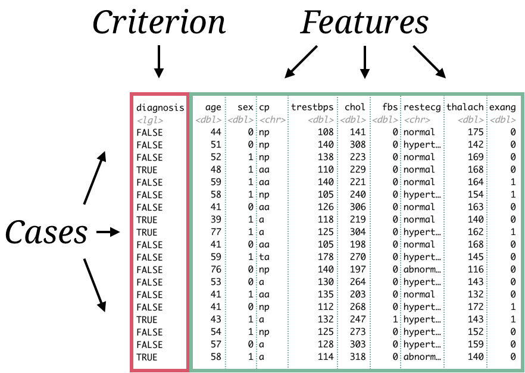
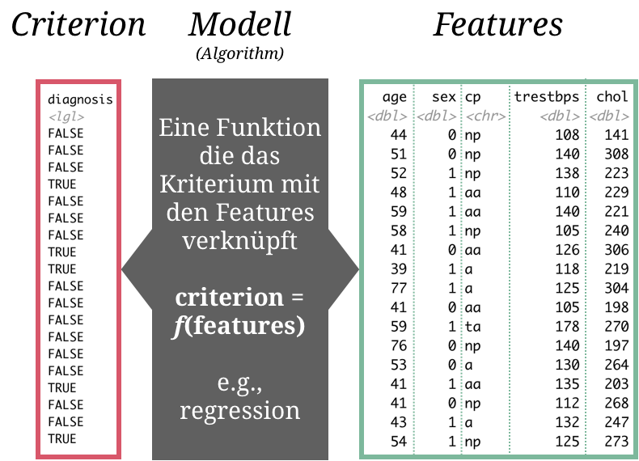
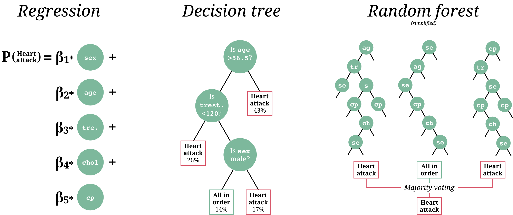
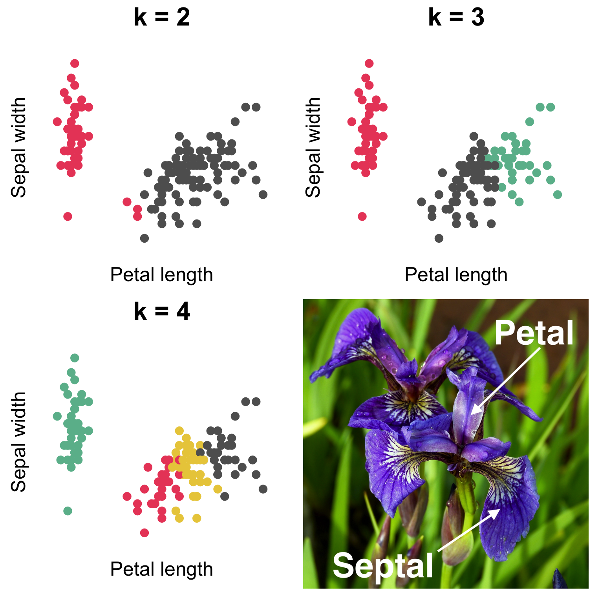
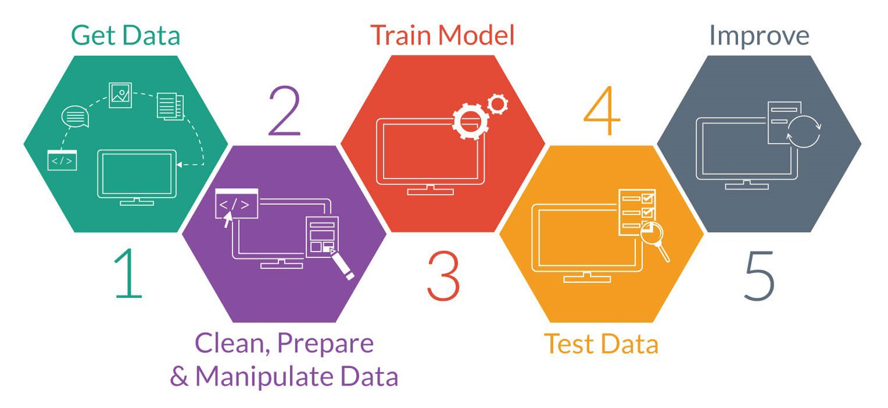

layout: true

<div class="my-footer">
  <span style="text-align:center">
    <span> 
      
    </span>
    <a href="https://therbootcamp.github.io/">
      <span style="padding-left:82px"> 
        <font color="#7E7E7E">
          www.therbootcamp.com
        </font>
      </span>
    </a>
    <a href="https://therbootcamp.github.io/">
      <font color="#7E7E7E">
      Maschinelles Lernen mit R | Oktober 2020
      </font>
    </a>
    </span>
  </div> 

---

```{r, eval = FALSE, echo = FALSE}
# Code to knit slides
xaringan::inf_mr('_sessions/D1S2_Wrangling/Wrangling.Rmd')
baselers <- read_csv("https://raw.githubusercontent.com/therbootcamp/baselers/master/inst/extdata/baselers.txt")
```

```{r setup, include=FALSE}
options(htmltools.dir.version = FALSE)
options(width=110)
options(digits = 4)
library(tidyverse)
baselers <- read_csv("1_Data/basel.csv")
```


class: middle, center

<h1><a>Was denkt Du?</a></h1>

Nicht Googlen :)

---

# Was ist maschinelles Lernen?

.pull-left45[

<ul>
  <li class="m1"><span><b>Maschinelles Lernen ist</b>...</span></li><br>
  <ul class="level">
    <li><span>...ein <high>Bereich der künstlichen Intelligenz</high>...</span></li><br>
    <li><span>...der mittels <high>statistischer Methoden</high>...</span></li><br>
    <li><span>...es Computern ermöglicht zu <high>lernen</high>...</span></li><br>
    <li><span>...d.h., fortwährend die eigene <high>Leistung</high> in (spezifischen) Aufgaben verbessert...</span></li><br>
    <li><span>...<high>ohne explizit programmiert</high> worden zu sein.</span></li>
  </ul>
</ul>

]


.pull-right45[

<p align = "center">
<br>
<font style="font-size:10px">from <a href="https://medium.com/@dkwok94/machine-learning-for-my-grandma-ca242e97ef62">medium.com</a></font>
</p>


]

---

# Herkunft von ML 

<div align="center">
<iframe width="800" height="450" src="https://www.youtube.com/embed/cNxadbrN_aI" frameborder="0" allow="accelerometer; autoplay; encrypted-media; gyroscope; picture-in-picture" allowfullscreen></iframe>
</div>

---

# Leicht zu verwechseln

.pull-left5[

<ul>
  <li class="m1"><span><b>AI</b></span></li>
  <ul class="level">
    <li><span><high>Intelligenz realisiert durch Maschinen</high> im Vergleich zu Intelligenz realisiert durch Menschen oder Tiere.</span></li>
  </ul>
  <li class="m2"><span><b>Statistik</b></span></li>
  <ul class="level">
    <li><span><high>Feld der Mathematik</high>, das sich mit der Erhebung, Verarbeitung, Analyse, und Interpretation von Daten beschäftigt.</span></li>
  </ul>
  <li class="m3"><span><b>Big Data</b></span></li>
  <ul class="level">
    <li><span>Beschäftigt sich mit Daten, die <high> zu gross und/oder zu komplex</high> für traditionelle Tools der Datenverarbeitung sind.</span></li>
  </ul>
  <li class="m4"><span><b>Data Science</b></span></li>
  <ul class="level">
    <li><span>Multi-disziplinares Feld, das sich mit Methoden und Systemen zur Extraktion von <high>Erkenntnissen aus Daten</high> beschäftigt</span></li>
  </ul>
</ul>

]

.pull-right4[

<p align = "center">
<br>
</p>

]

---

class: middle, center

<h1><a href="">Warum ML?</a></h1>

---

# Zwei Szenarien

.pull-left5[

<ul>
  <li class="m1"><span><b>Herzinfarkt vorhersagen</b></span></li>
  <ul class="level">
    <li><span>Ein Patient kommt in die Notaufnahme mit Schmerzen in der Brust und befürchtet einen Herzinfarkt.</span></li><br>
    <li><span><i>Wie entscheidet ihr, ob der Patient einen Herzinfarkt hat oder nicht?</i></span></li>
  </ul>
  <br><br>
  <li class="m2"><span><b>Verkaufszahlen vorhersagen</b></span></li>
  <ul class="level">
    <li><span>Die Unternehmensführung überlegt eine neue Filiale in Basel zu eröffnen.</span></li><br>
    <li><span>Wie entscheidet ihr, ob prospektive Verkaufszahlen eine neue Filiale rechtfertigen?</span></li>
  </ul>
</ul>

]

.pull-right4[


<p align = "center">
<br>
<font style="font-size:10px">from <a href="https://medium.com/@dkwok94/machine-learning-for-my-grandma-ca242e97ef62">medium.com</a></font>
</p>

<p align = "center">
<br>
<font style="font-size:10px">from <a href="https://thirdmanrecords.com/locations/detroit-storefront">thirdmanrecords.com</a></font>
</p>

]

---

<p align = "center">
<br>
<font style="font-size:10px">from <a href="cnn.com">cnn.com</a></font>
</p>


---

# Können wir unser Intuition trauen?

.pull-left45[

<ul>
  <li class="m1"><span><b>Intuition...</b></span></li>
  <br>
  <ul class="level">
    <li><span></span></li><br>
    <li><span></span></li><br>
    <li><span></span></li><br>
    <li><span></span></li><br>
    <li><span></span></li>
  </ul>
</ul>

]

.pull-right45[


<p align = "center">
<br>
<font style="font-size:10px">adapted from <a href="https://medium.com/@dkwok94/machine-learning-for-my-grandma-ca242e97ef62">medium.com</a></font>
</p>

<p align = "center">
<br>
<font style="font-size:10px">adapted from <a href="https://thirdmanrecords.com/locations/detroit-storefront">thirdmanrecords.com</a></font>
</p>

]

---

# Können wir unser Intuition trauen?

.pull-left45[

<ul>
  <li class="m1"><span><b>Intuition...</b></span></li>
  <br>
  <ul class="level">
    <li><span>...verrät wenig darüber <high>wie die Vorhersage zustande gekommen ist</high>.</span></li><br>
    <li><span>...kann leicht durch <high>andere Beweggründe als Akkuratheit</high> beeinflusst worden sein.</span></li><br>
    <li><span>...es kann nicht festgestellt werden, ob <high>alle relevanten Informationen</high> berücksichtigt wurde.</span></li><br>
    <li><span>...ist schwierig (exakt) zu <high>reproduzieren</high>.</span></li><br>
    <li><span>...ist im Nachhinein <high>leicht zu verteidigen</high>.</span></li>
  </ul>
</ul>

]

.pull-right45[


<p align = "center">
<br>
<font style="font-size:10px">adapted from <a href="https://medium.com/@dkwok94/machine-learning-for-my-grandma-ca242e97ef62">medium.com</a></font>
</p>

<p align = "center">
<br>
<font style="font-size:10px">adapted from <a href="https://thirdmanrecords.com/locations/detroit-storefront">thirdmanrecords.com</a></font>
</p>

]

---

<br>

<p align = "center">
<br>
</p>


---

# Vorteile des maschinellen Lernens

.pull-left45[

<ul>
  <li class="m1"><span><b>ML...</b></span></li>
  <br>
  <ul class="level">
    <li><span></span></li><br>
    <li><span></span></li><br>
    <li><span></span></li><br>
    <li><span></span></li><br>
    <li><span></span></li><br>
    <li><span></span></li>
  </ul>
</ul>

]

.pull-right45[

<p align = "center">
<br>
<font style="font-size:10px">from <a href="https://medium.com/@dkwok94/machine-learning-for-my-grandma-ca242e97ef62">medium.com</a></font>
</p>

<p align = "center">
<br>
<font style="font-size:10px">from <a href="https://thirdmanrecords.com/locations/detroit-storefront">thirdmanrecords.com</a></font>
</p>

] 

---

# Vorteile des maschinellen Lernens

.pull-left45[

<ul>
  <li class="m1"><span><b>ML...</b></span></li>
  <br>
  <ul class="level">
    <li><span>...kann <high>alle Daten</high> berücksichtigen.</span></li><br>
    <li><span>...ist <high>explizit, reproduzierbar, und quantitativ</high>,</span></li><br>
    <li><span>...kann die <high>wichtigen Variablen identifizieren</high>.</span></li><br>
    <li><span>...kann <high>Wahrscheinlichkeiten</high> und erwartete Fehler ausgeben. </span></li><br>
    <li><span>...kann <high>neue Erkenntnisse</high> über die Daten liefern.</span></li>
    <li><span>...kann <high>automatisiert</high> werden.</span></li>
  </ul>
</ul>

]

.pull-right45[

<p align = "center">
<br>
<font style="font-size:10px">from <a href="https://medium.com/@dkwok94/machine-learning-for-my-grandma-ca242e97ef62">medium.com</a></font>
</p>

<p align = "center">
<br>
<font style="font-size:10px">from <a href="https://thirdmanrecords.com/locations/detroit-storefront">thirdmanrecords.com</a></font>
</p>

] 

---

class: middle, center

<h1><a href="">Bereiche des ML</a></h1>


---

.pull-left3[

# Bereiche des maschinellen Lernens

<ul>
  <li class="m1"><span>Es gibt verschiedene Bereiche des maschinellen Lernens mit jeweils eigenen Algorithmen.</span></li>
  <li class="m2"><span>Wir fokussieren auf den Bereich des <high>Supervised Learning</high> (Deutsch: überwachtes Lernen).</span></li>
</ul>

]

.pull-right65[

<br><br>

<p align = "center">
<br>
<font style="font-size:10px">from <a href="image/mltypes.png">amazonaws.com</a></font>
</p>
]


---

# Terminologie


.pull-left5[
<p>
<table style="cellspacing:0; cellpadding:0; border:none; padding-top:10px">

<tr>
  <td bgcolor="white">
    <b>Term</b>
  </td>
  <td bgcolor="white">
    <b>Definition</b>
  </td>  
  <td bgcolor="white">
    <b>Beispiel</b>
  </td>  
</tr>
<tr>
  <td bgcolor="white">
    <i>Case<br><font style="font-size:12px">(Fall)</font></i>
  </td>
  <td bgcolor="white">
   Die <high>Beobachtungseinheit</high> der Daten.
  </td>  
  <td bgcolor="white">
   Ein Patient, eine Filiale, etc.
  </td>  
</tr>
<tr>
  <td bgcolor="white">
    <i>Feature<br><font style="font-size:12px">(Variable, Prädiktor)</font></i>
  </td>
  <td bgcolor="white">
   Eine gemessene <high>Eigenschaft</high> der <i>Cases</i>. 
  </td>  
  <td bgcolor="white">
   Alter, Temperatur, Land, etc.
  </td>  
</tr>
<tr>
  <td bgcolor="white">
    <i>Criterion<br><font style="font-size:12px">(Variable, Kriterium)</font></i>
  </td>
  <td bgcolor="white">
   Das <high>Feature</high>, das man <high>vorhersagen</high> will.
  </td>  
  <td bgcolor="white">
   Herzinfarkt, Verkäufe, etc.
  </td>  
</tr>
<tr>
  <td bgcolor="white">
    <i>Daten</i>
  </td>
  <td bgcolor="white">
  Üblicherweise <high>rechteckig</high> mit <high>Cases in Zeilen</high> und <high>Features in Spalten</high>.
  </td>  
  <td bgcolor="white">
   <mono>.csv</mono>, <mono>.xls</mono>, <mono>.sav</mono>, etc.
  </td>  
</tr>
</table>
</p>
]


.pull-right4[

<p align = "center">
<br>
</p>

]


---

# Supervised learning

.pull-left45[

<ul>
  <li class="m1"><span>Traditionell der <high>dominante Bereich</high> des machine learnings.</span></li>
  <li class="m2"><span>Supervised learning benötigt <high>gelabelte Daten</high> um ein <high>Modell</high> zu lernen, das das Kriterium in Beziehung zu den Features setzt.</span></li>
</ul>

<br>
<u>Beispiel in Worten</u>

<p style="margin-left:20px"><font style="font-size:24px">Wenn <mono>cp</mono> (chest pain) nicht <mono>a</mono> (asymptomatic) ist und <mono>age</mono> grösser ist als <mono>60</mono>, dann ist die Wahrscheinlichkeit für einen Herzinfarkt gross, anderfalls niedrig.</font></p>


]

.pull-right45[

<p align = "center">
<br>
</p>
]

---

# Drei Modelle des Supervised Learnings

<p align = "center" style="padding-top:20px">
<br>
</p>


---

# Zwei Problemtypen des Supervised Learnings

.pull-left5[

<ul>
  <li class="m1"><span><b>Regression</b></span></li>
  <br>
  <ul class="level">
    <li><span>Vorhersage eines <high>numerischen, kontinuierlichen Kriteriums</high>.</span></li><br>
    <li><span><i>Vorhersage des Cholesterinspiegels mit Alter</i></span></li>
  </ul><br>
  <li class="m2"><span><b>Klassifikation</b></span></li>
  <br>
  <ul class="level">
    <li><span>Vorhersage eines <high>kategorialen, diskreten Kriteriums</high>.</span></li><br>
    <li><span><i>Vorhersage, ob Herzinfarkt ja oder nein</i></span></li>
  </ul><br>
</ul>

]


.pull-right4[

<p align = "center">
<br>
</p>

]


---

# Unsupervised learning

.pull-left5[

<ul>
  <li class="m1"><span>Analysiert die Zusammenhänge zwischen Cases oder Features um <high>zugrunde liegende Strukturen zu identifizieren</high>.</span></li><br>
  <ul class="level">
    <li><span><high>Dimensionsreduktion</high>: Zusammenfassung von Features auf Basis ihrer Zusammenhänge durch eine kleinere Anzahl synthetischer Features.</span></li><br>
    <li><span><high>Clustering</high>: Gruppierung von Cases auf Basis ihrer Ähnlichkeiten zueinander.</span></li>
  </ul>
</ul>

]

.pull-right4[


<p align = "center" height=380px>
<br>
</p>

]


---

# Reinforcement learning

.pull-left5[

<ul>
  <li class="m1"><span>Bereich <high>zwischen Supervised und Unsupervised</high> Learning.</span></li><br>
  <li class="m2"><span><high>Lernt iterativ</high> auf Basis von minimalem Feedback.</span></li><br>
  <li class="m3"><span>Prominenterweise involviert in:</span></li>
  <ul class="level"><br>
    <li><span>Modell fitting.</span></li><br>
    <li><span>Robotik.</span></li><br>
    <li><span>Spiele wie Schach, Go, oder Mario Kart.</span></li>
  </ul>
</ul>

]

.pull-right4[

<p align = "center">
<br>
<font style="font-size:10px">from <a href="https://giphy.com/explore/reinforcement-learning">giphy.com</a></font>
</p>

<p align = "center">
<br>
<font style="font-size:10px">from <a href="https://blogs.nvidia.com/blog/2017/04/14/tensorkart-ai-mario-kart/">nvidia.com</a></font>
</p>

]


<!---


# Reinforcement learning

.pull-left5[

<ul>
  <li class="m1"><span>Bereich <high>zwischen Supervised und Unsupervised</high> Learning.</span></li><br>
  <li class="m2"><span><high>Lernt iterativ</high> auf Basis von minimalen Feedback.</span></li><br>
  <li class="m3"><span>Prominenterweise involviert in:</span></li>
  <ul class="level"><br>
    <li><span>Modell fitting.</span></li><br>
    <li><span>Robotik.</span></li><br>
    <li><span>Spiele wie Schach, Go, oder Mario Kart.</span></li>
  </ul>
</ul>

]


.pull-right4[

<br><br>

<iframe width=550px height=310px src="https://www.youtube.com/embed/tXlM99xPQC8" frameborder="0" allow="accelerometer; autoplay; encrypted-media; gyroscope; picture-in-picture" allowfullscreen></iframe>

]

--->

---

# Machine learning ist mehr als Algorithmen

<p align = "center">
<br>
<font style="font-size:10px">from <a href="https://www.houseofbots.com/images/news/11493/cover.png">houseofbots.com</a></font>
</p>


---
class: middle, center

<h1><a href=https://therbootcamp.github.io/ML_2020Oct/index.html>Agenda</a></h1>
