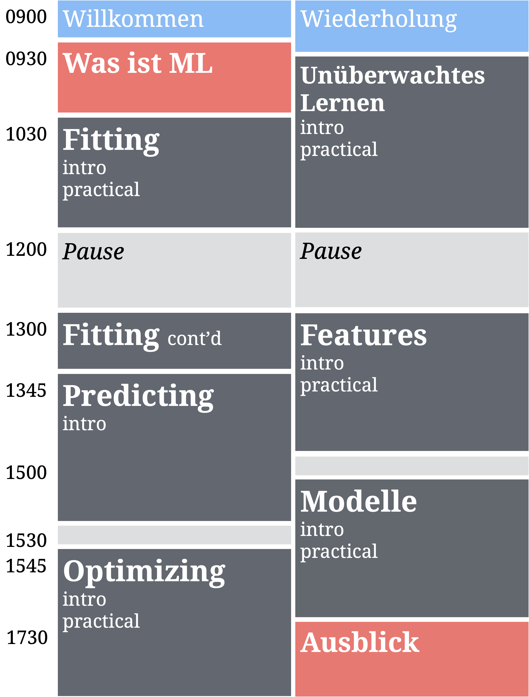

 

### Downloads

##### [**Projekt**](https://www.dropbox.com/s/jas48hijozni5gk/TheRBootcamp.zip?dl=1)

##### [**Cheatsheets**](https://www.dropbox.com/s/26kjubck26lbwnw/cheatsheets.pdf?dl=1)

 

### Materialien

|  | Tag | Tag 2 | 
|:--|:-------------|:-------------|
|0| Willkommen! [Folien](_sessions/Welcome/Welcome.html) | Wiederholung [Folien](_sessions/Recap/Recap.html)|
|1| Was ist ML? [Folien](_sessions/WhatIsML/WhatIsML.html)| Unsupervised learning  [Folien](_sessions/Unsupervised/Unsupervised.html), [Practical](_sessions/Unsupervised/Unsupervised_practical.html)|
|2| Fitting  [Folien](_sessions/Fitting/Fitting.html), [Practical](_sessions/Fitting/Fitting_practical.html) | Features  [Folien](_sessions/Features/Features.html), [Practical](_sessions/Features/Features_practical.html)|
|3| Predicting [Folien](_sessions/Prediction/Prediction.html), [Practical](_sessions/Prediction/Prediction_practical.html) | Modelle  [Folien](_sessions/Models/Models.html), [Practical](_sessions/Models/Models_practical.html) |
|4| Optimizing  [Folien](_sessions/Optimization/Optimization.html), [Practical](_sessions/Optimization/Optimization_practical.html) | Ausblick  [Folien](_sessions/LookAhead/LookAhead.html)|

 

### Schedule

 
    </a> 

<!---

<table cellspacing=0 cellpadding=0 margin=0 padding=0 class="my-table">

<col width="10%">
<col width="40%">
<col width="40%">

<tr>
  <th style="text-align:left"> &nbsp; </th>
  <th style="text-align:left">Day 1 - Basic</th>
  <th style="text-align:left">Day 2 - Advanced</th>
</tr>
  
<tr>  
   <th>9:00</th>
   <td class="td-special-blue">Welcome</td>
   <td class="td-special-blue">Recap</td>
</tr>

<tr>
  <th>9:30</th>
  <td class="td-red" rowspan = 1><e>What is ML</e></td>
  <td class="td-grey" rowspan = 5><e>Optimization</e> 
    Practical
  </td>
</tr>
 
<tr>
  <th>10:00</th>
  <td class="td-red" rowspan=4><e>R for ML</e> 
    Interactive 
  </td>
  <td> &nbsp; </td>
</tr>
  
<tr> <th>&nbsp;</th> </tr>
<tr> <th>&nbsp;</th> </tr>
<tr> <th>&nbsp;</th> </tr>
  
<tr>
  <th align="right">12:00</th>
  <td rowspan = 2 class="td-special-grey">Lunch
  <td rowspan = 2 class="td-special-grey">Lunch
</tr>

<tr>
   <th>&nbsp;</th>
</tr>

<tr>
   <th align="right">13:00</th>
   <td class="td-grey" rowspan = 5 ><e>Fitting</e> 
   Practical 
   <td class="td-grey" rowspan = 5 ><e>Models</e> 
   Practical 
</tr>

<tr> <th>&nbsp;</th> </tr>
<tr> <th>&nbsp;</th> </tr>
<tr> <th>&nbsp;</th> </tr>
<tr> <th>&nbsp;</th> </tr>

<tr>
   <th align="right">15:30</th>
   <td class="td-grey" rowspan = 5 ><e>Prediction</e> 
   Practical 
   <td class="td-grey" rowspan = 4 ><e>Features</e> 
</tr>

<tr> <th align="right">&nbsp;</th> </tr>
<tr> <th align="right">&nbsp;</th> </tr>
<tr> <th align="right">&nbsp;</th> </tr>

<tr>
   <th align="right">17:30</th>
   <td class="td-red" valign="top"><e>Looking forward</e>
</tr>

<tr>
   <th align="right">18:00</th>
   <td class="td-special-blue"> Wrap-up
   <td class="td-special-grey"> Apero</tr>
</tr>
</table>
  
--->

